# 领域总览：AI Framework / Device Runtime / Memory / Async

## 1. 范围与目标

本资料以你的履历为中心，准备以下岗位的社招高级/资深面试：

- AI Framework Runtime、Device Runtime、设备软件栈；
- 显存/内存管理、Allocator、Stream/Event、异步执行；
- AI 性能分析、通信 Runtime、集合通信和高性能网络；
- LLM 推理 Runtime、KV Cache、Serving 和高性能 IO。

### 纳入范围

```text
Framework API / Graph / Operator
  → Dispatcher / Runtime
  → Context / Stream / Event
  → Allocator / Buffer / Workspace
  → Command Submission
  → UMD / Driver / Device
  → Kernel / Collective / Result
```

同时覆盖 host 网络、RDMA/集合通信、分布式服务、推理调度、KV Cache、可观测性、容量和可靠性。

### 暂不作为主线

- 纯预训练/微调/RL 算法；
- 只考数学推导的模型算法岗；
- 只考手写 CUDA Kernel 的极致算子岗；
- 与 AI 系统无关的普通 Java CRUD 后端。

这些内容可作为相邻知识，但不是你的核心求职标签。

## 2. 个人优势如何映射

| 已有经历 | 面试中要证明的能力 | 尚需补证据 |
|---|---|---|
| MindSpore 开发约 1.5 年 | 能理解框架执行、算子/设备边界和工程协作 | 具体模块、调用链、版本和本人改动 |
| UMD/设备软件约半年 | 能理解用户态设备软件、命令提交、资源和错误边界 | UMD 全称、模块、接口、故障和性能 |
| PyTorch 显存池了解 | 能解释 block/segment、缓存、碎片和回收 | 是源码阅读、问题定位还是实现/优化 |
| 多 Stream 设计经验 | 能说明依赖、Event、可见性和生命周期 | 一个真实场景、约束、方案和结果 |
| Host 组网/网络开发 | 能分析拓扑、带宽、队列、RDMA 和通信故障 | TCP/RDMA/NUMA/NIC/协议边界 |
| 检索引擎约 1 年 | 能迁移缓存、索引、并发、低延迟和容量模型 | 具体索引结构、瓶颈和指标 |
| Java 服务端 | 能说明服务治理、并发、异常、发布和可靠性 | 是否有高并发/线上事故/性能案例 |

## 3. 先修知识

### 必须熟练

- C++ RAII、移动语义、异常安全、并发与内存模型；
- Linux 进程/线程、锁、原子操作、NUMA、内存和常用调试工具；
- CUDA 或异构设备基本执行模型：context、stream、event、kernel、同步和错误；
- Tensor shape/stride/dtype/device、host/device memory、DMA 和 pinned memory；
- 吞吐、延迟、P95/P99、带宽、占用率和容量估算。

### 第二优先级

- MindSpore 图/算子/Runtime 抽象；
- NCCL/HCCL/MPI 的 collective 语义；
- RDMA Verbs、RoCE、PFC/ECN、GPUDirect RDMA；
- vLLM/SGLang 类推理系统、Paged KV Cache 和 continuous batching。

## 4. 核心面试不变量

回答任何底层题时，优先检查这些问题：

1. **所有权**：谁创建、谁持有、谁借用、谁释放？
2. **完成点**：API 返回、命令入队、设备完成、host 可见分别是什么？
3. **依赖**：同一 Stream 顺序是否足够？跨 Stream/进程/设备如何建立 happens-before？
4. **容量**：总容量、已分配、已保留、可立即复用、碎片和延迟释放分别是多少？
5. **错误**：错误在哪里首次发生，在哪里可观察，如何传播和恢复？
6. **证据**：这是个人经历、源码事实、合理推断、设计建议还是待验证行为？
7. **指标**：优化的是 kernel latency、端到端 P99、吞吐、容量还是成本？

## 5. 典型面试链路

```mermaid
flowchart LR
    U[Framework/API 调用] --> D[Dispatcher/Graph Runtime]
    D --> C[Context/Device 选择]
    C --> S[Stream/Event 依赖]
    S --> M[Allocator/Buffer/Workspace]
    M --> Q[Command Queue/Launch]
    Q --> R[UMD/Driver]
    R --> H[Hardware/Kernel/Collective]
    H --> O[Output/Completion/Error]
    O --> V[Validation/Metric/Recovery]
```



节点表示抽象边界，不表示你的实际项目一定采用上述全部组件。MindSpore、CUDA、CANN、MUSA 和 PyTorch 的具体命名与语义必须绑定目标版本核对。

## 6. 学习结果

完成主线后，你应能：

- 用 5 分钟讲清一次异步算子从框架到设备的执行链；
- 设计一个 stream-aware GPU/NPU allocator，并说明异常路径；
- 解释“还有空闲显存却 OOM”的多种根因和最小复现；
- 分析通信/计算重叠、RDMA buffer 生命周期和 collective hang；
- 从 HBM 预算推导 KV Cache 容量并设计回收/淘汰；
- 在没有完整源码或实验结果时，清楚表达假设和待验证项；
- 将个人真实项目压缩为 1 分钟自我介绍和 3 个深挖案例。
