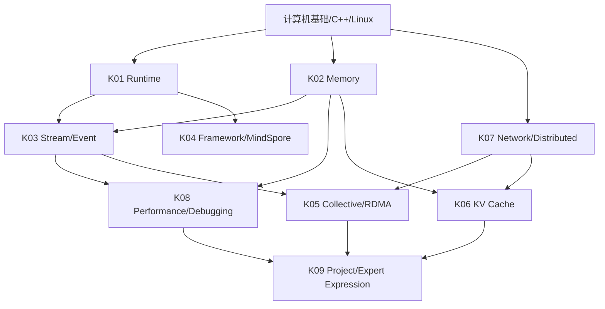

# 知识地图

## K01 Runtime 与 Device Software

- **K01.01 分层与边界**：Framework、Dispatcher、Runtime、UMD、Driver、Device 的职责和数据转换。
- **K01.02 执行对象**：device/context/stream/event/module/handle/workspace 的创建、借用和销毁。
- **K01.03 命令提交**：同步 API 与异步 queue、launch、completion、fence 和错误暴露。
- **K01.04 兼容性**：ABI、驱动/运行时/固件版本、架构能力和 feature fallback。
- **K01.05 异常安全**：初始化部分失败、取消、teardown、进程退出和资源泄漏。

先修：C++/Linux、设备执行模型。高频：高。主要覆盖：B/I/A/E。

## K02 Memory Allocator 与 Lifetime

- **K02.01 指标口径**：allocated、reserved、cached、active、busy、free、deferred release。
- **K02.02 数据结构**：segment、block、size class、free list、split/merge、coalescing。
- **K02.03 碎片**：外部碎片、内部碎片、page waste、最大可分配块和异步回收。
- **K02.04 Stream-aware 内存**：record/use stream、event 延迟复用、跨 stream 所有权。
- **K02.05 生产 allocator**：并发、锁粒度、预留、限额、统计、OOM 策略和多租户。

先修：指针/内存/并发。高频：高。主要覆盖：B/I/A/E。

## K03 Stream、Event 与异步执行

- **K03.01 顺序语义**：同一 stream 的顺序、default stream 语义和 host 返回。
- **K03.02 跨 stream 依赖**：event record/wait、显式同步和依赖图。
- **K03.03 可见性与复用**：写后读、读后写、buffer reuse、释放和 allocator 协作。
- **K03.04 并发收益**：拷贝/计算重叠、pipeline、优先级、背压和同步开销。
- **K03.05 Graph/Capture**：静态地址、shape/key、capture 约束和 fallback。

先修：设备队列和内存模型。高频：高。主要覆盖：B/I/A/E。

## K04 Framework Execution 与 MindSpore

- **K04.01 Tensor/Operator 契约**：shape、dtype、layout、device、stride、动态 shape。
- **K04.02 Eager/Graph**：算子分派、图编译、内存规划、执行器和缓存。
- **K04.03 Framework 到 Device**：算子注册、设备适配、runtime API、错误传播。
- **K04.04 PyTorch Extension 对照**：Python → binding → CUDA kernel，借用 Tensor 生命周期。
- **K04.05 版本事实**：只依据目标版本源码/官方文档，避免跨框架类比越界。

先修：深度学习框架基础。高频：高。主要覆盖：I/A/E。

## K05 Collective Communication 与 RDMA

- **K05.01 Collective 契约**：rank、顺序、buffer、dtype、shape、communicator。
- **K05.02 算法与拓扑**：ring/tree/hierarchical、NVLink/PCIe/NIC、带宽和时延。
- **K05.03 RDMA 数据路径**：MR、QP、CQ、completion、pinned memory、DMA。
- **K05.04 通信计算重叠**：双 buffer、分块、stream、event、pipeline 和背压。
- **K05.05 局部失败**：timeout、hang、rank 失联、取消、重试、communicator 重建。

先修：网络、并发、分布式系统。高频：中高。主要覆盖：I/A/E。

## K06 LLM Inference 与 KV Cache

- **K06.01 推理阶段**：prefill、decode、continuous batching、TTFT、TPOT。
- **K06.02 KV 容量**：layers、KV heads、head_dim、dtype、page/token 预算。
- **K06.03 分页池**：request row、logical index、physical K/V backing、page allocator。
- **K06.04 Cache 复用**：prefix cache、lock/ref、eviction、partial page、retraction。
- **K06.05 多级存储**：GPU/CPU/SSD/远端缓存、offload、prefetch、重算和 P99。

先修：Transformer/Attention、缓存和服务端。高频：中高。主要覆盖：I/A/E。

## K07 Network 与 Distributed Systems

- **K07.01 Host 网络**：TCP/UDP、连接、队列、拥塞、NUMA、CPU affinity。
- **K07.02 资源调度**：队列、配额、优先级、backpressure、admission。
- **K07.03 一致性与幂等**：重试、取消、重复消息、checkpoint 和恢复。
- **K07.04 服务可靠性**：SLO、熔断、降级、灰度、回滚、故障域。
- **K07.05 经验迁移**：检索引擎和 Java 服务端经验如何服务 AI Infra。

先修：分布式和服务端。高频：中。主要覆盖：I/A/E。

## K08 性能、调试与可观测性

- **K08.01 正确性优先**：reference、误差阈值、边界 shape、sanitizer。
- **K08.02 性能口径**：kernel/step/端到端 latency、吞吐、P99、带宽和成本。
- **K08.03 工具链**：日志、metrics、trace、gdb、perf、compute-sanitizer、Nsight。
- **K08.04 故障树**：构建、输入、launch、同步、内存、数值、性能和环境。
- **K08.05 实验设计**：baseline、控制变量、warmup、同步点、重复和 oracle。

先修：测试和性能分析。高频：高。主要覆盖：B/I/A/E。

## K09 项目故事与专家表达

- **K09.01 自我介绍**：13 年经历压缩成 AI Runtime 主线。
- **K09.02 技术深挖**：背景、约束、职责、方案、替代方案、结果和复盘。
- **K09.03 证据纪律**：亲自做过、参与过、读过、推断和待验证的区分。
- **K09.04 方案评审**：用不变量、指标、故障和回滚评审设计。
- **K09.05 岗位映射**：Runtime、通信、推理、云平台四类 JD 的简历变体。

先修：个人项目事实卡。高频：高。主要覆盖：I/A/E。

## 知识依赖图

## 优先级

- **第一主线**：K01 → K02 → K03 → K08；
- **框架桥接**：K04 与第一主线交叉；
- **第二主线**：K05 → K07；
- **业务切入**：K06，与 K02/K03/K07 交叉；
- **贯穿能力**：K09，所有题目都要插入个人事实边界。
