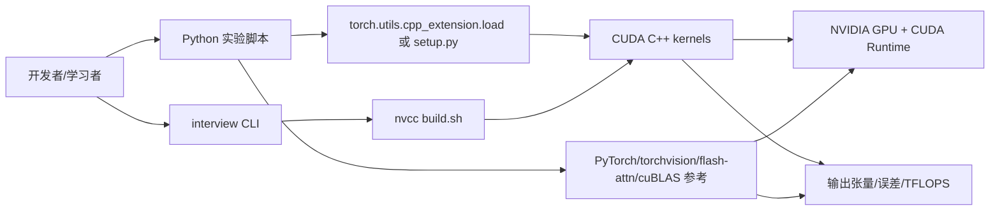
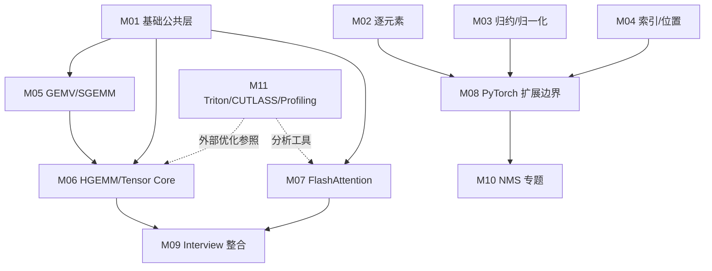
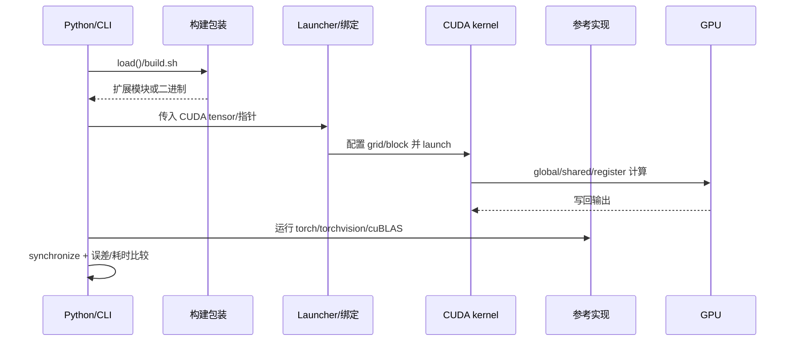

# 总体架构与模块关系

- 文档目的：建立从调用者到 CUDA kernel、参考实现和设备的全局模型。
- 适用范围：`main` / `0983c65`。
- 对应源码版本：`0983c65`。
- 证据状态：主数据流已确认；跨目录关系部分推断。
- 最后更新：2026-09-10
- 前置阅读：[项目定位](project-overview.md)
- 后续阅读：[runtime-model.md](runtime-model.md)、[模块注册表](../01-modules/module-registry.md)

## 结论摘要

仓库采用“教学专题目录 + 两种执行外壳”的结构，而不是一个统一库架构：普通模块由 Python `load()` 动态构建 PyTorch C++/CUDA 扩展；HGEMM/FlashAttention 可进一步用 `setup.py` 打包；`interview` 则把公共 `.cuh` 和测试/bench 集中进一个 `nvcc` 二进制。所有路径最终都落到 CUDA kernel，区别在于输入包装方式、构建方式、参考实现和性能测量方式。

## 系统上下文图

**图示解释**：箭头表示构建、调用或数据比较关系；`Ref` 不是所有模块都依赖，而是 benchmark/正确性路径中的外部基线。`GPU` 是实际执行边界。节点对应 `kernels/*/*.py`、`.cu/.cuh`、`kernels/interview/build.sh` 与 README 中的命令，已确认。

## 分层架构

1. **实验入口层**：每个主题的 Python 脚本或 interview CLI 生成输入、选择 kernel、预热、同步和打印结果。
2. **扩展/绑定层**：PyTorch `load()`、`CUDAExtension`、PyBind11 宏将 C++ 函数暴露给 Python；interview 路径没有 PyBind，直接调用 C++/CUDA。
3. **算子实现层**：`.cu` 的 global kernel 和 launcher，负责线程映射、边界、shared/register 使用、同步和写回。
4. **公共/优化层**：`.cuh`/utils 提供 dtype 宏、PTX/Tensor Core 辅助、布局与 swizzle；CUTLASS/CuTe 提供外部模板抽象。
5. **设备/运行时层**：CUDA driver/runtime、cuBLAS/cuDNN、PyTorch allocator/dispatcher 和 GPU 硬件。

## 模块关系图

图中实线表示源码 include/构建/运行依赖，虚线表示比较或工具关系。普通算子并不实际 include M01 的 interview 公共头，因此 M01→M02/M03 是学习概念关联而非统一编译依赖；这是需要避免的“名义层级误读”。

## 核心请求/任务时序

`torch.cuda.synchronize()` 出现在代表性 Python benchmark 中（例如 `[kernels/elementwise/elementwise.py:47-58]`），因此计时结果至少显式等待了 GPU 队列；kernel launcher 的具体同步/错误检查仍由模块决定。

## 架构取舍

- **独立脚本**降低学习和实验门槛，但重复了编译 flags、输入验证和计时逻辑。
- **源码内保留多版本 kernel**便于比较优化增量，但 API/布局契约分散在命名与注释中。
- **动态扩展**支持快速修改，不需要维护全仓库 CMake；代价是首次编译慢、缓存依赖和运行环境敏感。
- **单文件 interview**便于面试背题和发布二进制；代价是编译单元大、宏/架构条件多。

## 稳定契约与实现细节

稳定契约通常是：输入 dtype/device/shape、输出语义、命令参数和参考比较方式；block tile、warp mapping、shared-memory padding、stage 数量和具体 PTX 属于实现细节，除非 README 明确作为实验参数。修改后必须同时检查绑定函数、Python 调用和对应 README。

## 相关文档

- [runtime-model.md](runtime-model.md)
- [global-data-flow.md](global-data-flow.md)
- [dependency-map.md](dependency-map.md)
- [../90-cross-module/end-to-end-flows.md](../90-cross-module/end-to-end-flows.md)

## 源码证据摘要

- `[kernels/elementwise/elementwise.py:9-24]`：动态扩展入口。
- `[kernels/hgemm/setup.py:42-67]`：打包扩展入口。
- `[kernels/interview/build.sh:134-185]`：直接 nvcc 编译/链接。
- `[kernels/interview/README.md:6-16]`：interview 文件依赖关系。

## 未解决问题

- 普通 kernel 是否要求输入 contiguous 由每个 launcher 决定，尚无全局规范。
- 各模块是否统一使用当前 CUDA stream，需按 PyTorch 扩展 API 和实测进一步核验。

## 下一步阅读建议

先读运行模型，再读 M08 的绑定边界和目标模块的内部文档。
