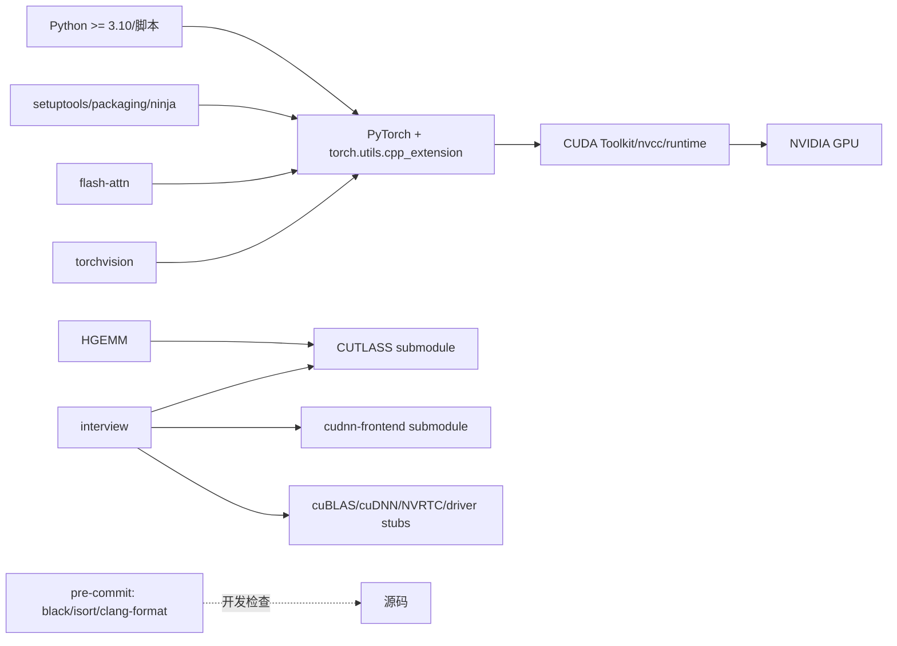

# 内部与外部依赖地图

- 文档目的：说明构建、运行、比较和开发工具的依赖方向。
- 适用范围：当前仓库非第三方源码。
- 对应源码版本：`4513b31`。
- 证据状态：配置中直接出现的依赖已确认；系统安装状态未知。
- 最后更新：2026-09-10
- 前置阅读：[architecture.md](architecture.md)
- 后续阅读：[build-and-deploy.md](build-and-deploy.md)
## 结论摘要

本页聚焦 00-overview/dependency-map.md；具体事实以正文引用的目标源码版本为准，未执行的构建、运行和硬件行为保持未验证。

## 依赖图

## 依赖分类

| 依赖 | 用途 | 证据 | 缺失时表现 |
|---|---|---|---|
| PyTorch | tensor、C++ extension、CUDA allocator | 各 Python 脚本 import | 无法加载/运行示例 |
| CUDA Toolkit/nvcc | 编译 `.cu` 和运行 CUDA | `kernels/interview/build.sh:29-43` | build.sh 明确失败或扩展编译失败 |
| torchvision | NMS 参考实现 | `kernels/nms/nms.py:4` | NMS 对拍无法执行 |
| flash-attn | FlashAttention 比较基线 | `kernels/flash-attn/README.md:106-118` | FA 对比路径不可用 |
| CUTLASS | CuTe/CUTLASS header | `.gitmodules`、setup/makefile | CuTe 相关编译失败 |
| cuDNN frontend | interview 注意力/benchmark | `build.sh:41-43`、README | 对应宏/链接路径不可用 |
| packaging/ninja | HGEMM setup build | `hgemm/setup.py:89-94` | wheel 构建失败 |
| ccache | 可选编译缓存 | `build.sh:18-27` | 仍可编译但变慢 |
| pre-commit 工具链 | 提交前格式/静态检查 | `.pre-commit-config.yaml` | 质量检查未执行/失败 |

## 依赖方向规则

- 主题 kernel 不应把测试脚本反向编译进实现。
- PyTorch binding 是边界层；`.cu` 应只依赖 CUDA/PyTorch header 和必要的专题工具。
- 第三方源码只通过 submodule/header/链接参数进入；不应复制生成物。
- 修改依赖版本时必须更新对应模块的构建文档和可验证命令。

## 已知耦合

- `interview/build.sh` 固定 `/usr/local/cuda/bin/nvcc`，比 Python extension 的 `CUDA_HOME` 更刚性。[kernels/interview/build.sh:29-33]
- `hgemm/setup.py` 根据 CUDA bare-metal version 添加 `sm_90` flag，说明编译配置受本机 toolkit 版本影响。[kernels/hgemm/setup.py:21-38]
- FlashAttention Python 脚本根据 GPU 名称加入编译宏，存在设备命名耦合。[kernels/flash-attn/flash_attn_mma.py:147-190]

## 相关文档

- [build-and-deploy.md](build-and-deploy.md)
- [../01-modules/M11-triton-cutlass-profiling/README.md](../01-modules/M11-triton-cutlass-profiling/README.md)

## 源码证据摘要

- `[.gitmodules:1-5]`。
- `[kernels/hgemm/setup.py:21-38,89-94]`。
- `[kernels/interview/build.sh:29-43,67-79]`。

## 未解决问题

- 没有仓库级 lockfile 或 CUDA/PyTorch 支持矩阵。
- 子模块当前 checkout commit 未在本批次展开记录。

## 下一步阅读建议

按目标环境阅读构建总览，并在真实机器上检查 `nvcc --version`、PyTorch CUDA 版本和 GPU compute capability。
