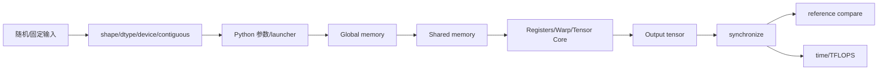

# 全局数据流与控制流

- 文档目的：解释输入张量/矩阵如何从脚本进入 kernel、如何比较输出和统计性能。
- 适用范围：普通算子、GEMM、Attention、NMS。
- 对应源码版本：`4513b31`。
- 证据状态：代表路径已确认，其他专题按同类模式推断。
- 最后更新：2026-09-10
- 前置阅读：[architecture.md](architecture.md)
- 后续阅读：[../90-cross-module/end-to-end-flows.md](../90-cross-module/end-to-end-flows.md)

## 结论摘要

典型数据流是：Python 生成/切片 CUDA tensor → launcher 根据 shape/dtype 计算 grid/block 与额外参数 → kernel 从 global memory 读取，使用 shared/register/warp primitive 计算，写回输出 → Python 同步并与 torch/torchvision/官方 attention/cuBLAS 结果比较 → 以最大误差、输出片段和耗时/TFLOPS报告。控制流由脚本参数和模块内条件分支决定，编译期宏还会裁剪架构专属路径。

## 通用数据流图

`GM/SM/R` 代表 kernel 内存层级；箭头既表示数据传输，也表示计算阶段，不表示所有路径都显式经过每一层。基础 elementwise 可以不使用 shared memory，而 GEMM/attention 通常会使用。

## 代表性控制分支

- Elementwise：二维输入且 `K / n_elements <= 1024` 时用 `grid(S), block(K/n_elements)`；否则把所有元素扁平化并使用固定 block。[kernels/elementwise/elementwise.cu:140-182]
- NMS：先 stable descending score 排序，再 Phase 1 生成 suppression bitmask，Phase 2 顺序 resolve，最后映射回原始索引。[kernels/nms/nms.cu:152-189]
- FlashAttention：命令参数选择 unfused/SDPA/flash、acc F32、layout、stages 和 head dimension 支持范围。[kernels/flash-attn/flash_attn_mma.py:22-55,316-337]
- HGEMM：CLI flags 选择 CUDA/WMMA/MMA/CuTe/cublas 族，统一 benchmark 计算 `2*M*N*K/time`。[kernels/hgemm/hgemm.py:18-177,210-328]

## 数据状态变化

| 阶段 | 状态 | 主要不变量 |
|---|---|---|
| 输入准备 | tensor/device buffer 已分配 | dtype、shape、layout 符合模块契约 |
| 排序/转置 | 可能产生 contiguous 副本 | 索引映射不丢失（NMS）/layout 与 kernel 匹配 |
| launch | grid/block/动态 smem 已决定 | 每个线程访问合法，协作同步满足 happens-before |
| 计算 | 中间值存在于寄存器/shared memory | tile 边界、padding、阶段缓冲一致 |
| 写回 | output 完整或按约定覆盖 | 输出 dtype/shape 与参考实现一致 |
| 比较/计时 | GPU 工作已同步 | 误差与性能指标来自同一输入/配置 |

## 相关文档

- [runtime-model.md](runtime-model.md)
- [global-error-model.md](global-error-model.md)
- [../90-cross-module/shared-data-and-types.md](../90-cross-module/shared-data-and-types.md)

## 源码证据摘要

- `[kernels/elementwise/elementwise.cu:140-189]`：launcher shape 分支。
- `[kernels/nms/nms.cu:152-189]`：排序、两阶段和索引映射。
- `[kernels/hgemm/hgemm.py:255-282]`：同步、计时与 TFLOPS。

## 未解决问题

- 不同模块对 NaN、空输入、越界尺寸的处理不统一，需逐模块补充实验。
- 部分 kernel 的错误输出/返回语义只由 PyTorch/CUDA 默认行为决定。

## 下一步阅读建议

按目标选择 [end-to-end-flows.md](../90-cross-module/end-to-end-flows.md) 的单算子、HGEMM 或 attention 流程。
