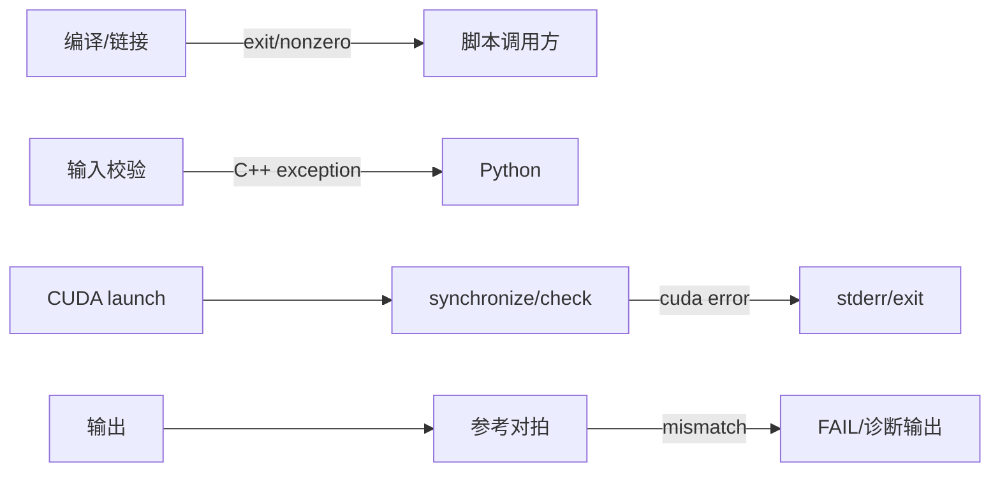

# 全局错误、重试与恢复模型

- 文档目的：说明编译、输入校验、kernel launch、数值比较和资源错误如何暴露。
- 适用范围：当前仓库各独立实验路径。
- 对应源码版本：`0983c65`。
- 证据状态：错误边界已从代表源码确认；全仓库行为不统一。
- 最后更新：2026-09-10
- 前置阅读：[runtime-model.md](runtime-model.md)
- 后续阅读：[../90-cross-module/error-boundaries.md](../90-cross-module/error-boundaries.md)

## 结论摘要

项目没有统一异常/错误码协议。错误主要分为：构建错误（shell/编译器直接退出）、PyTorch binding 输入错误（`throw`/`TORCH_CHECK`）、CUDA 异步 launch/runtime 错误（依赖 `cudaGetLastError`/同步检查）、数值正确性错误（Python/C++ 打印 FAIL 或 allclose 失败）和性能异常（指标偏低但不一定是功能错误）。恢复方式通常是修正环境/输入/编译参数后重新构建，没有自动重试或降级。

## 错误传播图

## 代表证据

- Elementwise 只检查 dtype，宏不检查 device/shape 一致性；错误通过 C++ runtime exception 暴露。[kernels/elementwise/elementwise.cu:134-146]
- NMS 额外检查 dtype、CUDA device、维度和长度，并对空输入返回空 int64 tensor。[kernels/nms/nms.cu:126-150]
- Interview 定义统一 `check(cudaError_t, msg)`，错误打印 CUDA 错误字符串并 `exit(EXIT_FAILURE)`。[kernels/interview/notes-v2.cu:92-97]
- NMS Python 先固定样例再随机 sweep，与 torchvision 元素级比较；失败打印数量/标签。[kernels/nms/nms.py:39-48,87-121]

## 分类与处理

| 类别 | 触发 | 当前处理 | 修改建议 |
|---|---|---|---|
| 环境/依赖 | nvcc/header/PyTorch 缺失 | 编译器/脚本失败 | 先记录版本和命令，不要猜测 kernel bug |
| 输入契约 | dtype/device/dim 不符 | throw/TORCH_CHECK 或未定义行为 | 统一在 binding 早校验 |
| 边界/内存 | 非整 tile、越界、动态 smem 超限 | 可能 launch/runtime 错误 | 加边界测试与 compute-sanitizer |
| 同步/竞争 | shared/global 顺序不满足 | 非确定性、偶发 mismatch | 画 happens-before，使用 sanitizer/重复运行 |
| 数值 | fast math、精度/累加类型 | max diff/allclose 失败 | 为每类 dtype 记录阈值 |
| 性能 | occupancy、bank conflict、缓存 | TFLOPS 下降 | 固定硬件/版本/迭代并 profile |

## 相关文档

- [build-and-deploy.md](build-and-deploy.md)
- [../01-modules/M10-nms/risks-and-debt.md](../01-modules/M10-nms/risks-and-debt.md)
- [../90-cross-module/error-boundaries.md](../90-cross-module/error-boundaries.md)

## 源码证据摘要

- `[kernels/nms/nms.cu:126-150]`。
- `[kernels/interview/notes-v2.cu:92-97]`。
- `[kernels/nms/nms.py:87-121]`。

## 未解决问题

- 全仓库没有统一的 `CUDA_CHECK`/`TORCH_CHECK`/logging 规范。
- 未验证异步错误在每个模块的具体暴露时点。

## 下一步阅读建议

故障定位时先按 [debugging-guide.md](../99-roadmap/debugging-guide.md) 分类，再回到模块风险表。
