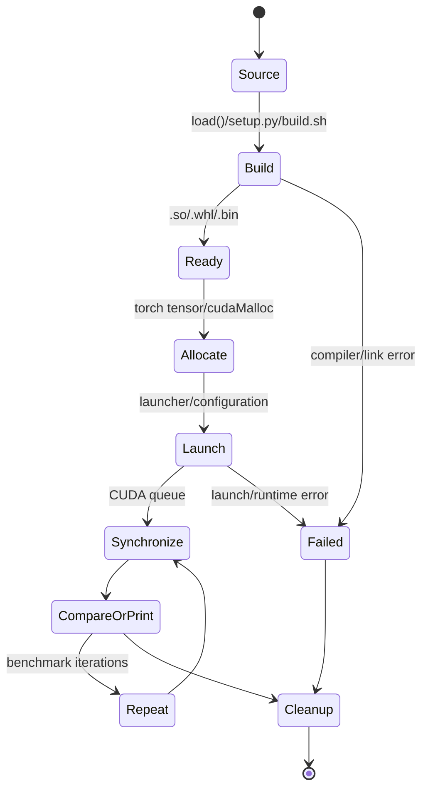

# 启动、运行与资源生命周期

- 文档目的：说明三类入口从启动到退出如何管理编译、张量、GPU 工作和输出。
- 适用范围：普通 Python 扩展、setup.py 包、interview 二进制。
- 对应源码版本：`4513b31`。
- 证据状态：主路径已确认；底层 allocator/stream 细节未知。
- 最后更新：2026-09-10
- 前置阅读：[architecture.md](architecture.md)
- 后续阅读：[build-and-deploy.md](build-and-deploy.md)

## 结论摘要

普通脚本在 Python 进程内调用 `load()`，编译生成扩展并返回模块；之后分配 CUDA tensor、调用绑定函数、同步并退出，缓存由 PyTorch/C++ extension 机制管理。setup.py 路径把同类源码编译成 wheel，安装后由 Python import。interview 路径由 shell 选择架构并生成独立 ELF，运行时初始化 CUDA/库、执行测试或 benchmark，最后释放显式分配的资源并退出。

## 生命周期图

## 资源所有权

| 资源 | 创建方 | 使用方 | 释放/回收 | 证据状态 |
|---|---|---|---|---|
| Python CUDA tensor | PyTorch | binding/kernel | Python 引用计数/allocator | 已确认为调用模式；底层回收未在仓库定义 |
| C++ 扩展 | `torch.utils.cpp_extension.load` | 当前 Python 进程 | extension cache/process lifecycle | 已确认 `[kernels/elementwise/elementwise.py:9-24]` |
| `cudaMalloc` buffer | interview test 函数 | CUDA kernel | 显式 `cudaFree` | 已确认 `[kernels/interview/notes-v2.cu:108-152]` |
| cuBLAS handle | HGEMM benchmark | cublas wrappers | `destroy_cublas_handle` | 已确认 `[kernels/hgemm/hgemm.py:242-244,319-322]` |
| shared/register memory | kernel launch | block/threads | kernel/block 生命周期 | 已确认为 CUDA 语义；大小由各 kernel 定义 |
| compiled binary artifacts | build scripts | runner | `--clean`/make clean | 已确认 `[kernels/interview/build.sh:118-126]` |

## 关键运行约束

- GPU 操作是异步排队的；benchmark 通过 `torch.cuda.synchronize()` 包围计时（例如 `[kernels/hgemm/hgemm.py:255-267]`）。
- kernel 的错误可能在 launch、同步或后续访问时暴露；interview 提供 `check(cudaError_t, msg)`，普通扩展不一定显式检查。
- 输入通常在 Python 中 `.cuda()`/`.contiguous()` 后传入；非 contiguous/错误 dtype 是否被拒绝由模块绑定决定。
- 进程退出会回收 PyTorch 与 CUDA 上下文，但长 benchmark 内循环仍需关注显式 buffer、临时张量和 cuBLAS handle。

## 关闭路径

Python：循环结束、局部对象释放、扩展缓存留在 extension cache；无统一 shutdown hook。Interview：测试函数应释放 `malloc/cudaMalloc` 对象，benchmark 结束后 `cudaDeviceSynchronize` 或进程退出。若新增资源，必须在成功和错误路径都设计释放。

## 未知与风险

- 未确认各 extension 是否始终使用当前 PyTorch stream；不能假设跨 stream 安全。
- 某些 `.cu` launcher 的 `cudaGetLastError` 检查缺失，错误可能延迟暴露。
- Python 脚本常在模块导入阶段执行 benchmark，不适合作为无副作用库 import。

## 相关文档

- [build-and-deploy.md](build-and-deploy.md)
- [global-error-model.md](global-error-model.md)
- [../01-modules/M08-pytorch-extension/runtime.md](../01-modules/M08-pytorch-extension/runtime.md)

## 源码证据摘要

- `[kernels/elementwise/elementwise.py:9-24]`。
- `[kernels/hgemm/hgemm.py:242-267,319-327]`。
- `[kernels/interview/notes-v2.cu:92-97,108-152]`。

## 未解决问题

- 全仓库没有统一资源生命周期抽象。
- 需要在真实 GPU 上用 compute-sanitizer 验证异常路径释放。

## 下一步阅读建议

阅读构建文件，然后看 M08 的动态扩展和 M09 的显式 CLI 生命周期。
