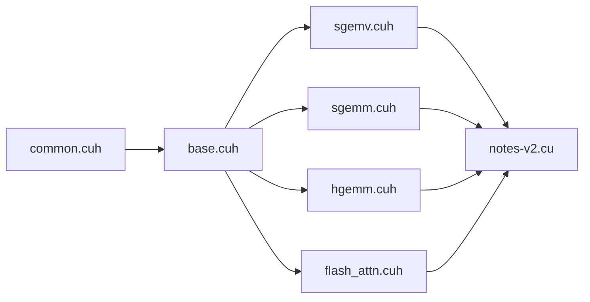

# M01 图示

```mermaid
flowchart LR
  C[common.cuh] --> B[base.cuh]
  B --> V[sgemv.cuh]
  B --> G[sgemm.cuh]
  B --> H[hgemm.cuh]
  B --> F[flash_attn.cuh]
  V --> N[notes-v2.cu]
  G --> N
  H --> N
  F --> N
```

每个节点对应 interview 中的真实文件；FFPA 及其他条件 include 尚待补充。
