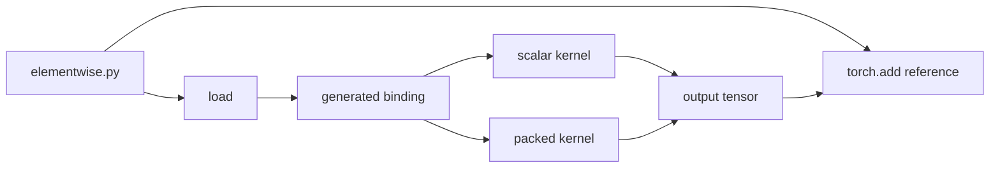

# M02 图示

```mermaid
flowchart LR
  P[elementwise.py] --> L[load]
  L --> B[generated binding]
  B --> S[scalar kernel]
  B --> V[packed kernel]
  S --> O[output tensor]
  V --> O
  P --> R[torch.add reference]
  O --> R
```

节点均对应 Python/CUDA/API 概念；具体 kernel 证据见 `elementwise.cu:22-127`。
