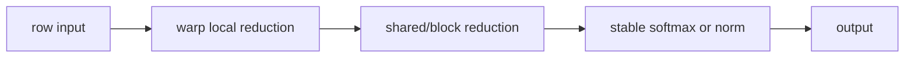

# M03 图示

```mermaid
flowchart LR
  I[row input] --> W[warp local reduction]
  W --> S[shared/block reduction]
  S --> Q[stable softmax or norm]
  Q --> O[output]
```

这是 interview/模块主题的抽象图；各具体实现的函数和 axis 仍需核验。
