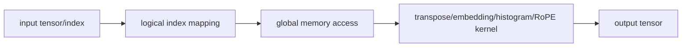

# M04 图示

```mermaid
flowchart LR
  X[input tensor/index] --> K[logical index mapping]
  K --> G[global memory access]
  G --> T[transpose/embedding/histogram/RoPE kernel]
  T --> Y[output tensor]
```

图示节点对应 M04 真实主题目录；不是统一运行时调用图。
