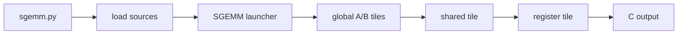

# M05 图示

```mermaid
flowchart LR
  P[sgemm.py] --> L[load sources]
  L --> K[SGEMM launcher]
  K --> A[global A/B tiles]
  A --> S[shared tile]
  S --> R[register tile]
  R --> C[C output]
```

证据：`[kernels/sgemm/sgemm.cu:36-166]`。
