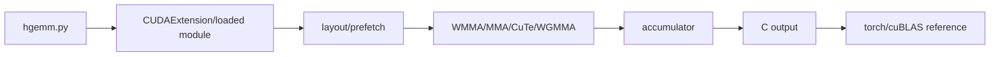

# M06 图示

```mermaid
flowchart LR
  H[hgemm.py] --> E[CUDAExtension/loaded module]
  E --> L[layout/prefetch]
  L --> W[WMMA/MMA/CuTe/WGMMA]
  W --> A[accumulator]
  A --> C[C output]
  C --> R[torch/cuBLAS reference]
```

具体实例化依赖架构和 CLI tag；节点对应真实构建/实现家族。
