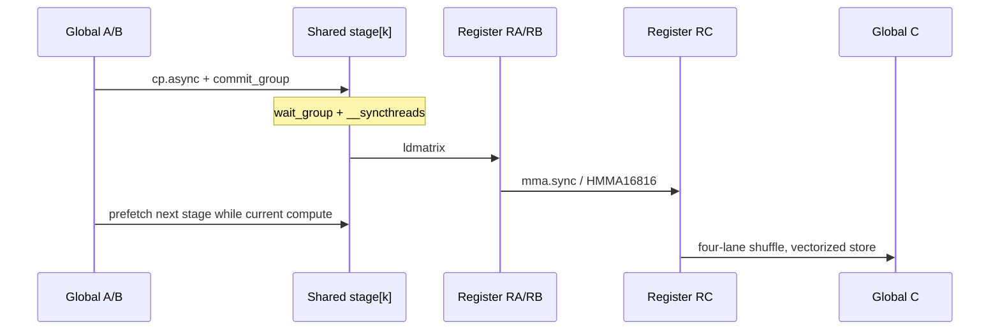

# M06 可视化导读

- 文档目的：解释 01-modules/M06-hgemm-tensorcore/visual-guide.md 的职责、证据和维护边界。
- 适用范围：本页及其直接关联的源码、测试和配置；第三方、生成物与动态结果仅在有证据时纳入。
- 对应源码版本：source/LeetCUDA HEAD 4513b31（2026-09-15 只读确认）。
- 证据状态：部分完成；静态证据优先，构建、运行和硬件行为未在本轮验证。
- 最后更新：2026-09-15
- 前置阅读：[项目入口](../../README.md)。
- 后续阅读：[分析状态](../../00-overview/analysis-state.md)。
## 结论摘要

本页聚焦 01-modules/M06-hgemm-tensorcore/visual-guide.md；具体事实以正文引用的目标源码版本为准，未执行的构建、运行和硬件行为保持未验证。


> 图中节点均对应真实实现区域；图示是源码关系的压缩表达，不是对未运行架构的保证。

## 1. 端到端数据流

```mermaid
flowchart LR
  PY["hgemm.py\nCLI + tensors"] --> BUILD["tools/utils.py\nsources/flags"]
  BUILD --> BIND["pybind/hgemm.cc\nexported variant"]
  BIND --> LAUNCH["mma stage launcher\nBM=128 BN=128"]
  LAUNCH --> CP["cp.async\nA/B → shared stages"]
  CP --> LM["ldmatrix\nshared → registers"]
  LM --> MMA["mma.sync.m16n8k16\nHMMA16816"]
  MMA --> ACC["RC accumulator\nregisters"]
  ACC --> STORE["shuffle + 128-bit store"]
  STORE --> C["global C"]
  C --> REF["torch/cuBLAS\ncorrectness + TFLOPS"]
```



证据：[kernels/hgemm/hgemm.py:210-328]、[kernels/hgemm/mma/basic/hgemm_mma_stage.cu:691-839,1850-1885]。**已确认结构；本图未表示本机已运行。**

## 2. Block/warp/tile 关系

```text
一个 block：256 threads = 8 warps
┌──────────────────────── 128 columns ────────────────────────┐
│ warp tile (warp_m=0, warp_n=0) │ ...                         │
│ ───────────────────────────────┼─────────────────────────────│ 128 rows
│ ...                            │ warp tile (warp_m=1, ...)   │
└──────────────────────────────────────────────────────────────┘
             每个 K tile: A[128×16] × B[16×128]
```

`warp_id`、`warp_m`、`warp_n` 和 A/B load coordinates 直接在 dsmem kernel 中计算。[kernels/hgemm/mma/basic/hgemm_mma_stage.cu:663-674]。**128×128/256 的代表 launcher 配置已确认；ASCII 中 warp 覆盖关系是模板参数的解释，精确 lane fragment 仍由 PTX ABI 决定。**

## 3. 片上生命周期



证据：[kernels/hgemm/mma/basic/hgemm_mma_stage.cu:691-839,1850-1885]。stage 的重叠是软件流水设计；实际吞吐需要 Nsight 验证。

## 4. Register double buffer

```text
iteration k:
  RA[reg_load_idx] / RB[reg_load_idx] --ldmatrix--> HMMA(k)
  RA[reg_store_idx] / RB[reg_store_idx]            <--准备接收/覆盖
                         ↓ xor 1
iteration k+1:
  两个 index 交换，避免当前 HMMA 读取和下一 fragment 装载使用同一槽
```

寄存器数组和 index flip 见 `[kernels/hgemm/mma/basic/hgemm_mma_stage.cu:678-686,731-735]`。这不是 CUDA stream，也不是硬件自动双缓冲。

## 5. 性能—资源三角

```text
更多 stage / padding / swizzle
       ┌──────────────┐
       │ 更好搬运/访存 │
       └──────┬───────┘
              │
   shared memory + registers ↑
              │
       occupancy / 可行性 ↓
```

launcher 设置动态 shared-memory 上限并以 stage 组合启动。[kernels/hgemm/mma/basic/hgemm_mma_stage.cu:1900-1959]。因此“更多 stage 更快”只是**推断/待 profile**，不是固定结论。

## 6. 架构边界

- MMA/PTX、WMMA、CuTe 和 WGMMA 是不同编译/运行条件；[kernels/hgemm/setup.py:42-95] 记录 setup 侧架构配置。
- sm90 `stmatrix` 分支在源码注释中标作未测试。[kernels/hgemm/mma/basic/hgemm_mma_stage.cu:536-567]
- 图中不把 `stmatrix` 画成默认路径，避免把源码分支误读为已验证能力。

## 相关文档
- [项目入口](../../README.md)
- [分析状态](../../00-overview/analysis-state.md)
- [源码证据索引](../../00-overview/evidence-index.md)

## 源码证据摘要
本页结论所需的源码路径和行号以 [源码证据索引](../../00-overview/evidence-index.md) 及正文引用为准；本页不把未执行的构建、运行或硬件行为写成已验证事实。

## 未解决问题
目标环境、动态构建/运行、硬件和外部依赖行为未在本轮执行；缺少直接证据的结论仍标记为未知或未验证。

## 下一步阅读建议
先阅读 [分析状态](../../00-overview/analysis-state.md)，再沿本页已有链接进入对应模块、Demo 或跨模块流程。
