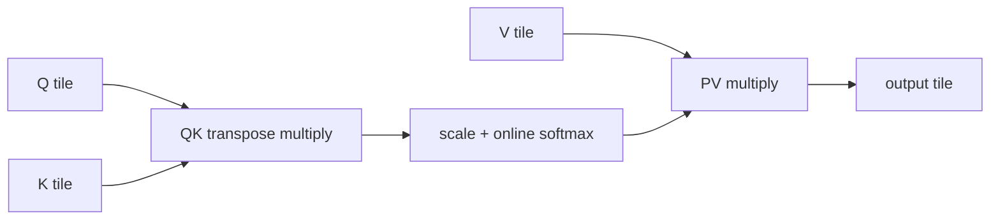

# M07 图示

```mermaid
flowchart LR
  Q[Q tile] --> M[QK transpose multiply]
  K[K tile] --> M
  M --> S[scale + online softmax]
  V[V tile] --> P[PV multiply]
  S --> P
  P --> O[output tile]
```

图中节点对应 FlashAttention 的真实计算阶段；实现 variant 由 source/tag 选择。
