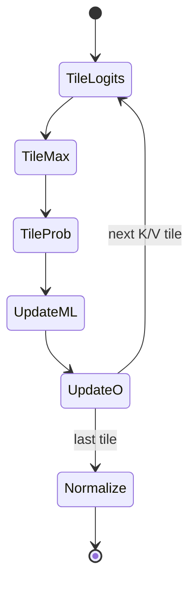

# M07 图文导读

- 文档目的：解释 01-modules/M07-flash-attention/visual-guide.md 的职责、证据和维护边界。
- 适用范围：本页及其直接关联的源码、测试和配置；第三方、生成物与动态结果仅在有证据时纳入。
- 对应源码版本：source/LeetCUDA HEAD 4513b31（2026-09-15 只读确认）。
- 证据状态：部分完成；静态证据优先，构建、运行和硬件行为未在本轮验证。
- 最后更新：2026-09-15
- 前置阅读：[项目入口](../../README.md)。
- 后续阅读：[分析状态](../../00-overview/analysis-state.md)。
## 结论摘要

本页聚焦 01-modules/M07-flash-attention/visual-guide.md；具体事实以正文引用的目标源码版本为准，未执行的构建、运行和硬件行为保持未验证。


## 1. 总体数据流

```mermaid
flowchart LR
  Q[Q global tile] --> QK[QKᵀ MMA]
  K[K global tile] --> QK
  QK --> S[scale + row max]
  S --> P[exp + row sum = P]
  V[V global tile] --> PV[P@V MMA]
  P --> PV
  PV --> ORESCALE[online O rescale]
  ORESCALE --> NORM[1/l final normalization]
  NORM --> OUT[shuffle + vectorized O store]
```

证据：[kernels/flash-attn/mma/basic/flash_attn_mma_tiling_qkv.cu:248-797]。

## 2. Q/K/V shared-memory 复用

```text
SMEM:
┌──────────────┬──────────────┐
│ Q region     │ K region     │  QK phase
└──────────────┴──────────────┘
┌──────────────┬──────────────┐
│ V reuses Q   │ K region     │  PV phase
└──────────────┴──────────────┘
```

V alias Q 的源码定义见 `[kernels/flash-attn/mma/basic/flash_attn_mma_tiling_qkv.cu:156-170]`。该图不表示可以省略同步。

## 3. Online softmax 状态



公式和源码：[kernels/flash-attn/mma/basic/flash_attn_mma_tiling_qkv.cu:401-488,537-570,708-721]。

## 4. F16/F32 accumulator

F16/F32 是模板和导出变体的一部分，影响寄存器表示、store 和误差；当前图只表达“不同状态”，不宣称某一精度一定更快或更准。证据 `[kernels/flash-attn/mma/basic/flash_attn_mma_tiling_qkv.cu:172-200,665-721]`。

## 5. 边界危险图

```text
非整 tile
   ↓
block early return ──┐
                     ├─ 协作 load / __syncthreads / shuffle
其他线程继续执行 ────┘
```

证据 `[kernels/flash-attn/mma/basic/flash_attn_mma_tiling_qkv.cu:151-154]`；行为必须通过针对性测试和 sanitizer 确认。

## 相关文档
- [项目入口](../../README.md)
- [分析状态](../../00-overview/analysis-state.md)
- [源码证据索引](../../00-overview/evidence-index.md)

## 源码证据摘要
本页结论所需的源码路径和行号以 [源码证据索引](../../00-overview/evidence-index.md) 及正文引用为准；本页不把未执行的构建、运行或硬件行为写成已验证事实。

## 未解决问题
目标环境、动态构建/运行、硬件和外部依赖行为未在本轮执行；缺少直接证据的结论仍标记为未知或未验证。

## 下一步阅读建议
先阅读 [分析状态](../../00-overview/analysis-state.md)，再沿本页已有链接进入对应模块、Demo 或跨模块流程。
