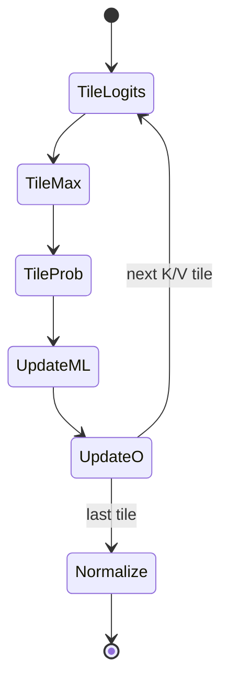

# M07 图文导读

## 1. 总体数据流

```mermaid
flowchart LR
  Q[Q global tile] --> QK[QKᵀ MMA]
  K[K global tile] --> QK
  QK --> S[scale + row max]
  S --> P[exp + row sum = P]
  V[V global tile] --> PV[P@V MMA]
  P --> PV
  PV --> ORESCALE[online O rescale]
  ORESCALE --> NORM[1/l final normalization]
  NORM --> OUT[shuffle + vectorized O store]
```

证据：[kernels/flash-attn/mma/basic/flash_attn_mma_tiling_qkv.cu:248-797]。

## 2. Q/K/V shared-memory 复用

```text
SMEM:
┌──────────────┬──────────────┐
│ Q region     │ K region     │  QK phase
└──────────────┴──────────────┘
┌──────────────┬──────────────┐
│ V reuses Q   │ K region     │  PV phase
└──────────────┴──────────────┘
```

V alias Q 的源码定义见 `[kernels/flash-attn/mma/basic/flash_attn_mma_tiling_qkv.cu:156-170]`。该图不表示可以省略同步。

## 3. Online softmax 状态



公式和源码：[kernels/flash-attn/mma/basic/flash_attn_mma_tiling_qkv.cu:401-488,537-570,708-721]。

## 4. F16/F32 accumulator

F16/F32 是模板和导出变体的一部分，影响寄存器表示、store 和误差；当前图只表达“不同状态”，不宣称某一精度一定更快或更准。证据 `[kernels/flash-attn/mma/basic/flash_attn_mma_tiling_qkv.cu:172-200,665-721]`。

## 5. 边界危险图

```text
非整 tile
   ↓
block early return ──┐
                     ├─ 协作 load / __syncthreads / shuffle
其他线程继续执行 ────┘
```

证据 `[kernels/flash-attn/mma/basic/flash_attn_mma_tiling_qkv.cu:151-154]`；行为必须通过针对性测试和 sanitizer 确认。
