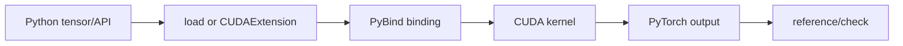

# M08 图示

```mermaid
flowchart LR
  Py[Python tensor/API] --> X[load or CUDAExtension]
  X --> B[PyBind binding]
  B --> K[CUDA kernel]
  K --> T[PyTorch output]
  T --> C[reference/check]
```

节点分别对应两种构建路径和 binding/runtime 边界。
