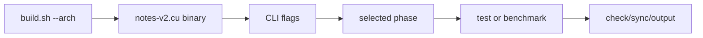

# M09 图示

```mermaid
flowchart LR
  S[build.sh --arch] --> N[notes-v2.cu binary]
  N --> C[CLI flags]
  C --> P[selected phase]
  P --> T[test or benchmark]
  T --> E[check/sync/output]
```

节点对应真实脚本、编译单元和运行阶段。
