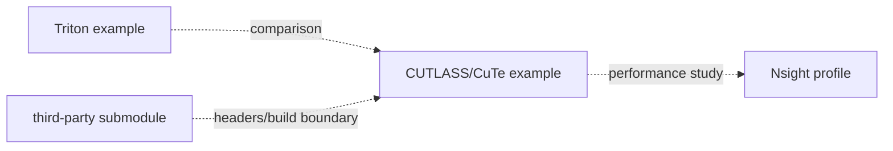

# M11 图示

```mermaid
flowchart LR
  T[Triton example] -.comparison.-> K[CUTLASS/CuTe example]
  K -.performance study.-> N[Nsight profile]
  E[third-party submodule] -.headers/build boundary.-> K
```

虚线表示比较/工具关系，不表示统一源码调用。
