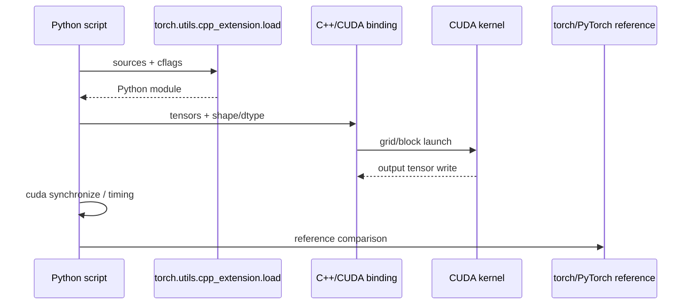

# 跨模块端到端流程

- 对应源码版本：`main` / `4513b31`。
- 证据状态：普通扩展、HGEMM、NMS、interview 主路径已确认；stream/异步细节部分未知。
- 最后更新：2026-09-10

## 流程 A：普通 PyTorch CUDA extension



证据：`kernels/elementwise/elementwise.py:9-24,27-66`；`kernels/elementwise/elementwise.cu:134-198`。

## 流程 B：HGEMM

```text
CLI -> hgemm.py 参数解析
    -> source/flag 选择与扩展加载
    -> binding/selected kernel
    -> warmup -> synchronize -> measured iterations
    -> 2*M*N*K/time -> correctness/plot
```

证据：`kernels/hgemm/hgemm.py:18-177,210-328`；`kernels/hgemm/setup.py:42-95`。

## 流程 C：NMS

```text
boxes,scores
 -> dtype/device/shape checks
 -> stable descending sort
 -> sorted boxes
 -> Phase 1 warp-per-box IoU bitmask
 -> Phase 2 one-block ordered resolve
 -> CPU keep/order mapping
 -> original int64 indices on input device
```

证据：`kernels/nms/nms.cu:126-189`。

## 流程 D：Interview standalone binary

```text
build.sh --arch
 -> nvcc compile + link
 -> notes-v2 CLI flags
 -> selected phase test/benchmark
 -> check()/synchronize/reference
 -> error/TFLOPS output
```

证据：`kernels/interview/build.sh:29-43,45-81,134-185`；`kernels/interview/notes-v2.cu:82-97`。

## 流程 E：D01 NMS Python Demo

```text
D01-S01 nms.py import/load
 -> D01-S02 dtype/device/shape/empty + stable sort
 -> D01-S03 mask kernel
 -> D01-S04 one-block resolve
 -> D01-S05 CPU keep/order mapping
 -> int64 CUDA original indices
```

证据：`kernels/nms/nms.py:8-23,39-48,87-136`；`kernels/nms/nms.cu:22-109,126-192`。完整步骤见 `[80-demos/D01-nms-python/README.md]`。

## 流程 F：D02 Interview Demo

```text
D02-S01 build.sh --arch
 -> D02-S02 notes-v2 CLI/selected phase
 -> D02-S03 host/device allocation + H2D
 -> kernel + launch check/sync/events
 -> D2H + reference/error/TFLOPS
 -> D02-S04 resource cleanup
```

代表证据：`kernels/interview/build.sh:134-185`；`kernels/interview/notes-v2.cu:510-542,2420-2579,3094-3190,3400-3497`。完整步骤见 `[80-demos/D02-interview-binary/README.md]`。


- 输入所有权通常属于调用者；kernel 借用 tensor data pointer，不负责 PyTorch tensor 生命周期。
- CUDA launch 多为异步；只有明确的 synchronize 或后续同步操作才让 benchmark/对拍可解释。
- 构建产物、extension cache 和 third-party headers 是环境相关，不属于算子 API。

## 未解决问题

各独立 kernel 使用哪个 current stream、是否支持 arbitrary stride，以及 launch error 的检查时机需逐文件和真实环境确认。
