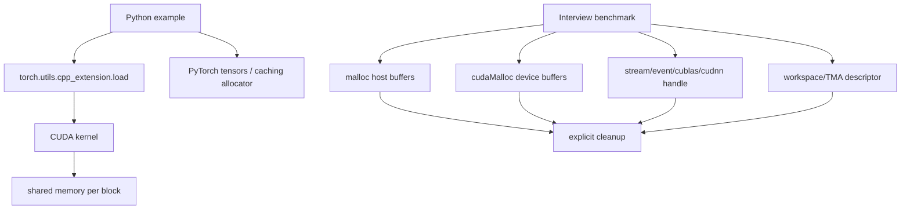

# 池化与资源管理专题

- 文档目的：说明 LeetCUDA 各独立 kernel 示例如何管理输入/输出 tensor、CUDA stream/event、shared memory 和 benchmark workspace。
- 适用范围：当前 checkout `4513b3114de21140c846171042515e17bb907e8a`。
- 对应源码版本：`main` / `4513b31`。
- 证据状态：源码静态确认；CUDA/PyTorch 运行与显存峰值未验证。
- 最后更新：2026-09-14
- 前置阅读：[项目架构](../00-overview/architecture.md)、[PyTorch 扩展模块](../01-modules/M08-pytorch-extension/README.md)
- 后续阅读：[M06 Tensor Core](../01-modules/M06-hgemm-tensorcore/README.md)、[M07 FlashAttention](../01-modules/M07-flash-attention/README.md)

## 结论摘要

LeetCUDA 不是提供统一内存池的运行时库。每个 kernel 示例都独立创建输入/输出 tensor 或 device pointer；Python 示例依赖 PyTorch allocator，interview benchmark 则显式 `malloc/cudaMalloc`，并在单次测试结束时 `free/cudaFree`。所谓“复用”主要是同一个 benchmark 在不同 kernel 间复用预分配 tensor，而不是跨程序的池化服务。[source/LeetCUDA/kernels/sgemm/sgemm.py:10-30] [source/LeetCUDA/kernels/sgemm/sgemm.py:127-145] [source/LeetCUDA/kernels/interview/bench_sgemm.cu:108-125] [source/LeetCUDA/kernels/interview/bench_sgemm.cu:206-211]

资源分析应分为四类：

1. host/device 输入输出 buffer；
2. kernel 内静态或动态 shared memory（block 生命周期）；
3. stream/event/库 handle 等异步执行资源；
4. cuDNN workspace、TMA descriptor 等临时辅助资源。

## 资源分层图

节点分别对应 Python launcher、`.cu` benchmark 和 kernel 实现；shared memory 不需要 host 释放，但其容量受 launch 配置和架构限制。[source/LeetCUDA/kernels/sgemm/sgemm.py:10-30] [source/LeetCUDA/kernels/interview/bench_sgemm.cu:41-72] [source/LeetCUDA/kernels/interview/bench_attn.cu:108-137]

## Python 扩展路径：由 PyTorch 管理 tensor

普通示例调用 `load(name, sources, extra_cuda_cflags)` 生成扩展模块；输入通常通过 `torch.randn/zeros` 创建，输出可显式传入 `out` 以避免每次 kernel 调用重新申请 tensor。SGEMM benchmark 预先创建最大尺寸 A/B/C，再通过 contiguous slice 复用同一 backing storage，降低 shape sweep 的分配噪声。[source/LeetCUDA/kernels/elementwise/elementwise.py:9-24] [source/LeetCUDA/kernels/sgemm/sgemm.py:10-30] [source/LeetCUDA/kernels/sgemm/sgemm.py:127-145]

`run_benchmark` 在 warmup 和 repeat 间调用 `torch.cuda.synchronize()`，但没有显式 destroy stream 或清空 allocator cache；tensor 生命周期由 Python 引用和 PyTorch caching allocator 决定。因此 benchmark 的进程内“空闲显存”不能直接解释为 kernel 自己泄漏。[source/LeetCUDA/kernels/sgemm/sgemm.py:35-124]

PyBind wrapper 只校验 dtype、维度并把 `data_ptr()` 传给 kernel；它不取得 tensor 所有权，调用方必须保证 tensor 在异步 kernel 完成前仍存活。Elementwise wrapper 的二维/非二维分支和 block/grid 选择见：[source/LeetCUDA/kernels/elementwise/elementwise.cu:141-183]。

## Interview benchmark：显式资源闭环

### SGEMM

`run_test` 按矩阵尺寸一次性分配 host A/B/C/reference 和 device A/B/C，随后在同一组 device buffer 上运行 cuBLAS、naive、Vec4、TF32 等 kernel，最后 destroy cuBLAS handle、释放 device/host 内存。[source/LeetCUDA/kernels/interview/bench_sgemm.cu:108-125] [source/LeetCUDA/kernels/interview/bench_sgemm.cu:137-210]

每个 kernel benchmark 使用 warmup 后创建 start/stop event；event 在计算完成并取出 elapsed time 后销毁。`CUDA_CHECK` 在同步点发现错误时直接 `exit(EXIT_FAILURE)`，因此错误退出可能跳过后续 cleanup，不能把该工具当作异常安全的通用 RAII 封装。[source/LeetCUDA/kernels/interview/bench_sgemm.cu:14-22] [source/LeetCUDA/kernels/interview/bench_sgemm.cu:41-72]

### FlashAttention/cuDNN

attention benchmark 额外管理 cuDNN workspace：先查询 workspace 大小，非零时 `cudaMalloc`，graph execute 和 event 计时结束后 `cudaFree`；stream/event 在 split-D、async 分支中单独创建并销毁。主测试还显式创建 Q/K/V/O、CPU reference，fallback 到 CPU reference 时再申请 `ref_o`。[source/LeetCUDA/kernels/interview/bench_attn.cu:100-137] [source/LeetCUDA/kernels/interview/bench_attn.cu:620-710]

TMA 路径的 `allocate_and_create_tensor_map` 把 `CUtensorMap` 放在 device memory，复制 host descriptor 后返回裸指针；当前调用约定需要调用者在对应 benchmark 结束时显式 `cudaFree`，该 helper 本身不提供析构。[source/LeetCUDA/kernels/interview/common.cuh:734-771]

## Kernel 内资源：shared memory 与寄存器

SGEMM sliced-K kernel 使用静态 `__shared__` A/B tile；每个 block 负责一个 tile，`__syncthreads` 把 load/compute 阶段隔开。它没有跨 block 或跨调用的 shared-memory pool，block 结束后硬件回收该段存储。[source/LeetCUDA/kernels/sgemm/sgemm.cu:37-87]

FlashAttention 的 staged MMA/TMA 变体把 Q/K/V tile、online softmax state 和 accumulator 放在寄存器/shared memory，并通过 stage 索引复用槽位；这属于 kernel 内存时序，不是可由 host 观察的分配器。修改 stage 数或 dynamic shared memory 时必须同时检查 launch 资源上限和所有 `__syncthreads` 对称性。[source/LeetCUDA/kernels/interview/flash_attn.cuh:1150-1335] [source/LeetCUDA/kernels/interview/bench_attn.cu:141-154]

## 所有权与清理表

| 资源 | owner | 借用者 | 清理点 | 主要风险 |
|---|---|---|---|---|
| Python input/output tensor | Python/PyTorch | extension wrapper/kernel | 引用计数归零 | 异步 kernel 前提前释放/复用 |
| device pointer | benchmark `run_test` | kernel/cuBLAS/cuDNN | `cudaFree` | 错误路径跳过释放 |
| host buffer | benchmark | H2D/D2H/CPU reference | `free` | 分支新增 buffer 未配对 |
| CUDA event/stream | benchmark 函数 | kernel timing | `cudaEventDestroy`/`cudaStreamDestroy` | 计时前未同步或异常泄漏 |
| cuBLAS/cuDNN handle | benchmark | library execute | `cublasDestroy`/`cudnnDestroy` | handle 与 stream 绑定错误 |
| workspace/TMA map | graph/descriptor helper | cuDNN/TMA | `cudaFree`（调用方） | helper 返回裸指针无 owner 标记 |
| shared memory/register | CUDA block/thread | 单个 kernel launch | block/launch 结束 | 动态 SMEM 超限或 barrier 不对称 |

## 失败路径和验证建议

- Python 扩展编译失败时，`load()` 可能在 torch extensions cache 留下构建产物；应区分编译缓存与 device tensor 生命周期，使用独立 TORCH_EXTENSIONS_DIR 做实验。
- `CUDA_CHECK` 失败会直接退出，建议将 benchmark 改造成小型 RAII wrapper 后再做 fault injection；当前文档只确认正常 cleanup 分支。[source/LeetCUDA/kernels/interview/bench_sgemm.cu:14-22]
- 非法 shape、非 contiguous tensor、tail tile 和动态 shared memory 超限应分别测试；许多 kernel 的边界检查并不统一，不能从一个模块推广到全仓库。
- 运行 benchmark 前后记录 `cudaMemGetInfo`、stream synchronize 和 event 状态，才能判断是 caching allocator 保留还是实际泄漏。

## 适用边界：Graph 与 CPU pool

当前 LeetCUDA 没有统一的 CUDA Graph runtime、graph pool 或跨 kernel capture/replay 调度器；interview benchmark 中的 graph 若出现，属于单个库/实验路径，不能推广为全仓架构。CPU 侧也没有项目自有 arena/slab allocator，host buffer 由 `malloc/free` 或 PyTorch host/runtime 管理。因此本专题只审计示例级 GPU buffer/workspace 和 kernel 内 shared memory，不声称存在统一 CPU/GPU memory pool。

## 设计取舍与风险

| 取舍/风险 | 影响 | 控制方法 |
|---|---|---|
| 无统一池化层 | 示例简单、便于教学；重复分配成本和噪声由调用方承担 | benchmark 预分配最大 tensor；生产场景使用 PyTorch/CUDA allocator |
| 裸 `cudaMalloc`/`free` | 所有权直观但异常安全弱 | 按函数建立 cleanup 表；逐步改 RAII |
| event/stream 手工生命周期 | 可精确测异步 kernel | 每条创建路径配对 destroy，并在 destroy 前同步必要事件 |
| 动态 shared memory 依赖架构 | SMEM 不足时 launch 失败 | 从 `cudaFuncGetAttributes`/目标 SM 复核，不伪造支持矩阵 |
| helper 返回裸 TMA map | 调用灵活但容易泄漏 | 封装 descriptor owner 或在调用点记录 free 责任 |

## 相关文档

- [M08 PyTorch 扩展](../01-modules/M08-pytorch-extension/README.md)
- [M09 Interview benchmark](../01-modules/M09-interview-benchmark/README.md)
- [M06 Tensor Core](../01-modules/M06-hgemm-tensorcore/README.md)
- [M07 FlashAttention](../01-modules/M07-flash-attention/README.md)
- [D02 Interview Demo](../80-demos/D02-interview-binary/README.md)

## 源码证据摘要

Python 扩展与预分配：[source/LeetCUDA/kernels/sgemm/sgemm.py:10-30,127-145]；PyBind 入口：[source/LeetCUDA/kernels/elementwise/elementwise.cu:141-199]；SGEMM 显式资源：[source/LeetCUDA/kernels/interview/bench_sgemm.cu:14-22,41-72,108-210]；attention workspace/cleanup：[source/LeetCUDA/kernels/interview/bench_attn.cu:100-137,620-710]；TMA descriptor：[source/LeetCUDA/kernels/interview/common.cuh:734-771]。

## 未解决问题

- PyTorch caching allocator、extension build cache 和 CUDA driver allocator 的真实峰值未在当前环境测量。
- 各 kernel 对非 contiguous、空输入、尾部 tile、stream 语义和错误检查的完整契约仍需逐模块运行验证。
- cutlass/cudnn-frontend 子模块版本和外部 workspace 约束需要目标 GPU 环境确认。

## 下一步阅读建议

先阅读本页所有权表，再跟踪 `bench_sgemm::run_test` 的 buffer 创建—复用—释放，最后对比 Python `run_benchmark` 的 PyTorch allocator 行为。
