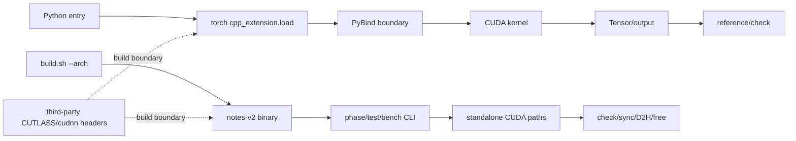

# 跨模块系统接线图

## 1. 依赖类型

| 依赖类型 | 示例 | 是否统一 runtime |
|---|---|---|
| 编译/链接 | PyTorch extension loader、CUDAExtension、nvcc、CUTLASS/cudnn headers | 否 |
| 静态源码 | `notes-v2.cu` include `common/base/sgemv/sgemm/hgemm/flash_attn` | 仅 Interview 内 |
| 运行时控制 | Python script、PyBind、CUDA launch、standalone CLI | 各模块独立 |
| 数据 | PyTorch tensor、raw CUDA pointer、host/device buffer | 契约不统一 |
| 生命周期 | PyTorch allocator、CUDA allocation、events/streams/handles/TMA map | 由入口决定 |

## 2. 真实接线

节点对应 `kernels/*` 的真实入口或外部子模块边界；虚线不表示运行时调用。

## 3. D01/D02 关系

D01 代表 Python/PyTorch ownership 和 dynamic extension；D02 代表 standalone explicit ownership 和 architecture-specific binary。两者共享 CUDA execution concepts，但没有共享的统一 runtime 或调用关系。

## 4. 配置传递

- `TORCH_CUDA_ARCH_LIST`/PyTorch loader：影响普通 extension 编译目标；
- HGEMM stage/swizzle/variant：影响模板、SMEM 和 grid；
- FlashAttention device macro/head dimension：影响 sources/dispatch/tile；
- Interview `--arch`：影响 gencode、宏、库和输出 binary。

配置影响应分别沿 build-time、compile-time、run-time 追踪，不能只记录 CLI 名字。

## 5. 当前状态

系统 wiring 的入口和代表终点已完成；所有小算子和每个 Tensor Core 变体未形成统一 call graph，状态为部分完成。GPU 执行未验证。
