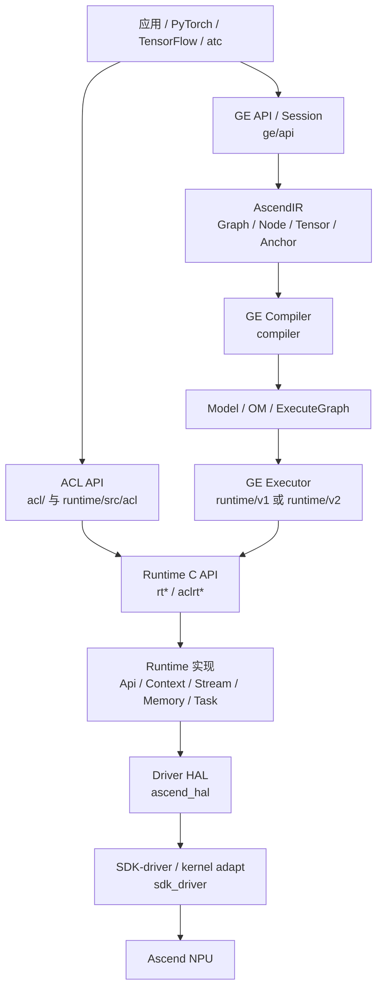

# 总体架构

- 文档目的：建立 GE、ACL、Runtime、Driver 的分层、控制流和数据流模型
- 适用范围：四个子仓库与其公共边界
- 对应源码版本：见 `analysis-state.md`
- 证据状态：已确认的目录/构建关系 + 部分跨仓推断
- 最后更新：2026-09-10
- 前置阅读：project-overview.md
- 后续阅读：四个模块 design.md 与 cross-module 文档

## 结论摘要

系统采取“公开 API/框架接入—图编译与模型执行—运行时资源—硬件驱动”的纵向分层。GE 不是 Runtime 的替代品：GE 负责把图和模型组织成可执行计划，Runtime 负责执行所需的设备、内存、流、事件和任务接口，Driver 负责硬件接入。

## 分层架构

**节点证据**：GE 的目录职责见 `[ge/AGENTS.md:8-19]`；GE 的编译器/执行器职责见 `[ge/docs/zh/design/architecture.md:35-52]`；Runtime 的源代码子组件见 `[runtime/src/CMakeLists.txt:13-32]`；Driver 的 HAL/SDK 构建分支见 `[driver/src/CMakeLists.txt:9-30]`。

**箭头含义**：U→A/GAPI 是公开 API 调用；GAPI→IR→C→M 是图数据和编译控制流；M→X 是模型加载/执行；A/X→RAPI 是运行时调用；RAPI→RI→H→S 是 ABI/API 调用与硬件请求传递；S→N 是设备/内核模块边界。跨仓箭头除构建依赖明确部分外，标记为推断。

## 两条执行形态

### 图/模型形态（GE）

模型文件或框架图进入 GE API/Session，形成 AscendIR。Compiler 进行图优化、算子编译、流分配和内存规划，生成 Model/OM；Executor 加载并运行模型。GE 架构文档确认 AscendIR 是统一编译入口 `[ge/docs/zh/design/architecture.md:54-74]`，静态图由 Graph、Node、Tensor、Anchor 等元素构成 `[ge/docs/zh/design/architecture.md:76-93]`。

### 直接运行时形态（ACL/Runtime）

应用直接创建设备、Context、Stream、Event 和内存，调用 `aclrt*`；ACL 实现校验参数和转换错误码，Runtime `rt*` 门面取得 `Api::Instance()` 并委托内部对象，随后进入 Driver。Runtime API 示例见 `[runtime/src/runtime/api/api_c_device.cc:49-95]`；ACL 设备包装见 `[runtime/src/acl/aclrt_impl/device.cpp:47-59]`。

## 生命周期

初始化通常先由应用调用 ACL/Runtime 或 GE 初始化入口，随后建立全局/线程局部状态和设备上下文。GE `GEInitialize` 通过 `GEInitializeV2` 初始化并创建 `SessionManager` `[ge/api/session/client/ge_api.cc:199-239]`；GE Session 构造 `InnerSession` 并注册到 Registry，析构时注销并 Finalize `[ge/api/session/session/ge_session_impl.cc:34-71]`。Runtime/Driver 的完整进程退出顺序仍需结合内部 `RuntimeKeeper` 和模块 init/fini 继续确认。

## 设计优势与代价

- 优势：图优化与硬件资源管理解耦；四仓可独立构建和发布；C API/头文件便于多语言框架接入；V1/V2 Executor 可并行演进。
- 代价：跨仓版本配套和 ABI 兼容要求高；错误码、头文件和二进制符号需要同步；没有设备时只能做有限验证；调用链跨越多个仓库，定位问题需要同时查看日志和版本。

## 相关文档

- [dependency-map.md](dependency-map.md)
- [global-data-flow.md](global-data-flow.md)
- [../90-cross-module/cross-module-call-chains.md](../90-cross-module/cross-module-call-chains.md)

## 源码证据摘要

- `[ge/CMakeLists.txt:30-47]`：GE 支持分包构建。
- `[acl/CMakeLists.txt:110-126]`：ACL 查找 Runtime、HAL、MetaDef 等包。
- `[runtime/src/CMakeLists.txt:21-32]`：Runtime 子组件组织。
- `[driver/src/CMakeLists.txt:9-30]`：HAL 与 SDK-driver 组织。

## 未解决问题

Runtime `Api::SetDevice` 到具体 Driver 符号的完整静态路径尚未全部展开。

## 下一步阅读建议

阅读 [global-data-flow.md](global-data-flow.md)，然后查看 M03 的运行时 API 调用链。
