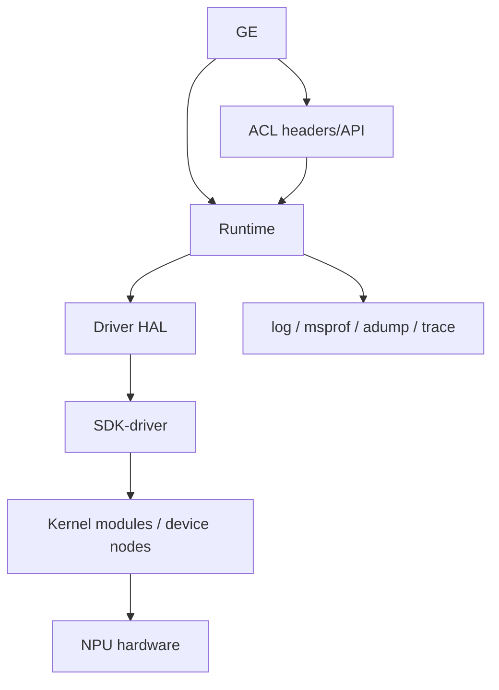

# 总览：依赖地图

- 文档目的：解释 00-overview/dependency-map.md 的职责、证据和维护边界。
- 适用范围：本页及其直接关联的源码、测试和配置；第三方、生成物与动态结果仅在有证据时纳入。
- 对应源码版本：source/cann HEAD 39d4a83（2026-09-15 只读确认）。
- 证据状态：构建层依赖已确认；运行时动态加载和闭源依赖部分未知
- 最后更新：2026-09-15
- 前置阅读：[项目入口](../README.md)。
- 后续阅读：[分析状态](analysis-state.md)。
## 结论摘要

本页聚焦 00-overview/dependency-map.md；具体事实以正文引用的目标源码版本为准，未执行的构建、运行和硬件行为保持未验证。

## 构建证据

| 仓库 | 直接依赖/子目录 | 证据 |
|---|---|---|
| GE | compiler、executor、dflow，依赖安装路径和第三方库 | `[ge/CMakeLists.txt:30-68]` |
| ACL | runtime、ascend_hal、metadef、adump、msprof、tdt 等 | `[acl/CMakeLists.txt:110-126]` |
| Runtime | scheduler、DFX、platform、runtime、ACL runtime、TDT、tprt | `[runtime/src/CMakeLists.txt:13-32]` |
| Driver | ascend_hal、sdk_driver、可选 custom | `[driver/src/CMakeLists.txt:9-30]` |

## 内存后端边界

普通 `rtMalloc` 的 Runtime policy 最终进入 Driver HAL；满足属性条件时，Driver 再进入产品对应的 ordinary cache：`ascend910B`/`ascend910_93` 为 V2，`ascend950` 为 V3。该 cache 与 Runtime KernelMemoryPool、SOMA 是不同对象和 API 家族；当前产物和设备侧物理行为未验证。

公共头文件、导出符号、错误码、CMake `find_*` 模块、共享库和安装包共同构成跨仓契约。具体符号版本、符号可见性、SONAME 和包文件清单尚未逐项盘点，标记为未知。

## 兼容矩阵原则

GE、ACL、Runtime、Driver、Firmware、Toolkit、算子包和模型格式应按同一 CANN 发布线组合；只替换单个仓库可能导致编译、加载或运行时 ABI 不兼容 `[runtime/README.md:16-19]`。

## 相关文档
- [项目入口](../README.md)
- [分析状态](analysis-state.md)
- [源码证据索引](evidence-index.md)

## 源码证据摘要
本页结论所需的源码路径和行号以 [源码证据索引](evidence-index.md) 及正文引用为准；本页不把未执行的构建、运行或硬件行为写成已验证事实。

## 未解决问题
目标环境、动态构建/运行、硬件和外部依赖行为未在本轮执行；缺少直接证据的结论仍标记为未知或未验证。

## 下一步阅读建议
先阅读 [分析状态](analysis-state.md)，再沿本页已有链接进入对应模块、Demo 或跨模块流程。
