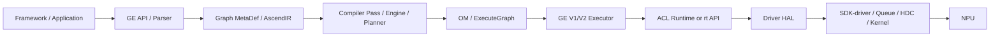

# 总览：全局数据流

- 文档目的：解释 00-overview/global-data-flow.md 的职责、证据和维护边界。
- 适用范围：本页及其直接关联的源码、测试和配置；第三方、生成物与动态结果仅在有证据时纳入。
- 对应源码版本：source/cann HEAD 39d4a83（2026-09-15 只读确认）。
- 证据状态：主路径已确认；跨仓具体 ABI 和设备命令部分推断
- 最后更新：2026-09-15
- 前置阅读：[项目入口](../README.md)。
- 后续阅读：[分析状态](analysis-state.md)。
## 结论摘要

本页聚焦 00-overview/global-data-flow.md；具体事实以正文引用的目标源码版本为准，未执行的构建、运行和硬件行为保持未验证。

## 图模型路径



GE 架构文档确认前端、Compiler、Executor 和 AscendIR 的职责 `[ge/docs/zh/design/architecture.md:11-74]`；GE V2 在执行阶段将用户 Tensor 和 stream 资源写入执行数据 `[ge/runtime/v2/core/model_v2_executor.cc:260-305]`。

## 内存数据流

```text
rtMalloc
  -> Runtime policy/alignment
  -> halMemAlloc
  -> Driver ordinary cache (V2 heap 或 V3 range/area)
       -> hit: split/reuse
       -> miss: normal backing/heap 扩展
  -> free: cache 保留或 threshold shrink
```

这条 ordinary cache 路径不经过 Runtime SOMA `SegmentManager`；是否命中取决于 flag、size、align、NUMA、产品和当前 cache 状态。[`docs/project-understanding/01-modules/M04-driver/driver-memory-pool-analysis.md`](../01-modules/M04-driver/driver-memory-pool-analysis.md)


```text
aclrtSetDevice
  -> aclrtSetDeviceImpl
  -> rtSetDevice
  -> Api::Instance()->SetDevice
  -> Driver/HAL (具体符号待确认)
```

前两层源码已确认 `[acl/runtime/device.cpp:47-59]`，Runtime C API 门面已确认 `[runtime/src/runtime/api/api_c_device.cc:74-84]`；最后一跳标为推断，不能据此声称已完成设备验证。

## 数据类别

- **元数据**：Graph/Node/Tensor/Attribute/Shape，在 GE 内部和模型序列化之间流动。
- **执行参数**：Tensor 地址、shape、data buffer、kernel 参数，通过 Runtime API 进入 Stream。
- **控制信息**：设备 ID、Context、Stream、Event、资源限制和同步状态。
- **诊断信息**：日志、错误码、profiling/dump/adump 数据，在各层旁路传播。

## 关键转换

1. 前端模型 → AscendIR：解析和图构建。
2. AscendIR → OM/ExecuteGraph：编译、规划和序列化。
3. 用户 Tensor → Runtime 执行数据：V2 `SpecifyInputs/Outputs` 等步骤。
4. Runtime 错误 → ACL/GE 公共错误：包装层映射和日志。

## 相关文档
- [项目入口](../README.md)
- [分析状态](analysis-state.md)
- [源码证据索引](evidence-index.md)

## 源码证据摘要
本页结论所需的源码路径和行号以 [源码证据索引](evidence-index.md) 及正文引用为准；本页不把未执行的构建、运行或硬件行为写成已验证事实。

## 未解决问题
目标环境、动态构建/运行、硬件和外部依赖行为未在本轮执行；缺少直接证据的结论仍标记为未知或未验证。

## 下一步阅读建议
先阅读 [分析状态](analysis-state.md)，再沿本页已有链接进入对应模块、Demo 或跨模块流程。
