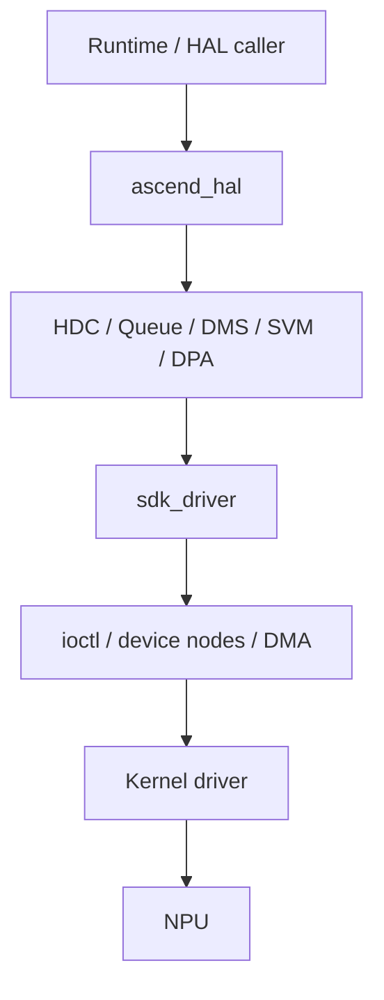
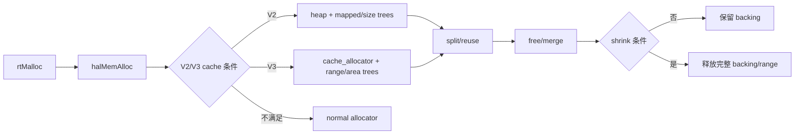
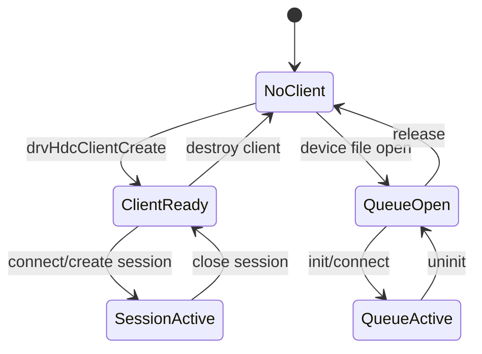

# M04 Driver 图示

- 文档目的：解释 01-modules/M04-driver/diagrams.md 的职责、证据和维护边界。
- 适用范围：本页及其直接关联的源码、测试和配置；第三方、生成物与动态结果仅在有证据时纳入。
- 对应源码版本：source/cann HEAD 39d4a83（2026-09-15 只读确认）。
- 证据状态：主要边界已确认
- 最后更新：2026-09-15
- 前置阅读：[项目入口](../../README.md)。
- 后续阅读：[分析状态](../../00-overview/analysis-state.md)。
## 结论摘要

本页聚焦 01-modules/M04-driver/diagrams.md；具体事实以正文引用的目标源码版本为准，未执行的构建、运行和硬件行为保持未验证。

## 普通内存 cache

图示表达用户态源码边界；底层物理页和设备完成时序仍未验证。

## HDC/Queue 生命周期

销毁 client 的活动 session 检查和 queue 的 file 生命周期分别由 HDC/queue 源码确认；图中连接名称为概念化表示。

## 相关文档
- [项目入口](../../README.md)
- [分析状态](../../00-overview/analysis-state.md)
- [源码证据索引](../../00-overview/evidence-index.md)

## 源码证据摘要
本页结论所需的源码路径和行号以 [源码证据索引](../../00-overview/evidence-index.md) 及正文引用为准；本页不把未执行的构建、运行或硬件行为写成已验证事实。

## 未解决问题
目标环境、动态构建/运行、硬件和外部依赖行为未在本轮执行；缺少直接证据的结论仍标记为未知或未验证。

## 下一步阅读建议
先阅读 [分析状态](../../00-overview/analysis-state.md)，再沿本页已有链接进入对应模块、Demo 或跨模块流程。
