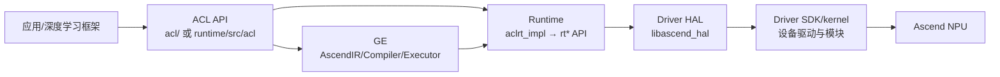

# CANN GE / ACL / Runtime / Driver 项目理解知识库

- 文档目的：解释 README.md 的职责、证据和维护边界。
- 适用范围：本页及其直接关联的源码、测试和配置；第三方、生成物与动态结果仅在有证据时纳入。
- 对应源码版本：见 [00-overview/analysis-state.md](00-overview/analysis-state.md)
- 证据状态：部分完成；静态证据优先，构建、运行和硬件行为未在本轮验证。
- 最后更新：2026-09-15
- 前置阅读：[项目入口](README.md)。
- 后续阅读：[分析状态](00-overview/analysis-state.md)。
## 结论摘要

本页聚焦 README.md；具体事实以正文引用的目标源码版本为准，未执行的构建、运行和硬件行为保持未验证。

- 项目路径：`/home/mtuser/workspace/cann`
- 文档语言：中文
- 分析范围：`ge/`、`acl/`、`runtime/`、`driver/` 四个独立 Git 仓库及其跨仓调用关系
- 证据规则：文档中的源码引用均采用 `[相对路径:起始行-结束行]`；“已确认/推断/未知”严格区分
- 当前状态：第一批（仓库盘点、模块划分、总览层与模块入口）已完成；细节文档持续增量补充

## 5 分钟快速理解

CANN 的典型执行链为：应用或框架 → ACL 公共 API → GE 图编译/图执行或 Runtime 资源执行 → Driver HAL/SDK → NPU。四个目录不是一个统一构建工程，而是四个独立仓库：GE 负责 AscendIR 图表示、编译优化和模型执行；ACL 负责面向应用的模型、算子、数据和运行时 API；Runtime 负责 `aclrt*`/`rt*` 的设备、Context、Stream、Event、内存、任务调度和维测能力；Driver 提供主机/设备通信、队列、事件调度、设备管理、SVM、RoCE 等硬件接入能力。

- 已确认：四个子目录各自有 `.git`，且根目录没有统一 `.git`；版本分别记录在 `analysis-state.md`。
- 推断：跨仓 ABI/API 契约主要通过 Runtime/Driver 公共头文件、GE 的运行时声明和 ACL 的 `Find*.cmake` 查找模块维持。
- 未知：没有真实 Ascend 设备和配套闭源依赖时，无法在本环境验证完整安装、硬件执行和端到端性能。

## 模块摘要

| ID | 模块 | 一句话职责 | 入口/核心边界 |
|---|---|---|---|
| M01 | GE | 将模型/前端图转换为 AscendIR，优化、编译并执行模型 | `ge::GEInitialize`、`GeSession::Impl`、`ModelV2Executor` |
| M02 | ACL | 提供应用侧模型、算子、设备和数据处理 API | `inc/external/acl`、`runtime/`、`model/`、`single_op/` |
| M03 | Runtime | 实现 `aclrt`/`rt` 运行时资源和任务管理及维测 | `src/acl/aclrt_impl`、`src/runtime/api`、`src/runtime/core` |
| M04 | Driver | 提供 HAL 与 SDK-driver，连接用户态运行时和设备/内核 | `pkg_inc/`、`src/ascend_hal`、`src/sdk_driver` |

详细模块入口：
- [M01-GE](01-modules/M01-ge/README.md)
- [M02-ACL](01-modules/M02-acl/README.md)
- [M03-Runtime](01-modules/M03-runtime/README.md)
- [M04-Driver](01-modules/M04-driver/README.md)，以及 [Driver ordinary memory V2/V3 cache 深度分析](01-modules/M04-driver/driver-memory-pool-analysis.md)
- [池化与资源管理专题](90-cross-module/pooling-and-resource-management.md)：Runtime/SOMA、Driver cache、GE 图内存复用和 SHMEM heap 的跨仓闭环。

## 三条最重要的端到端流程

1. **图编译/模型执行**：前端或模型文件 → GE API/Session → AscendIR/Compiler → Model/OM → GE Executor → Runtime → Driver。
2. **ACL 设备操作**：应用 → ACL 实现（例如 `aclrtSetDeviceImpl`）→ Runtime `rtSetDevice` → `Api::SetDevice`（实现位于 Runtime 内部）→ Driver HAL/设备管理。
3. **运行时队列/任务下发**：ACL/GE 组织 Stream、Event、输入输出和执行图 → Runtime `rt*` API → Driver 队列/HDC/esched → 设备侧调度与执行。

## 构建和运行入口

各仓库独立构建，真实命令和硬件限制见 [00-overview/build-and-deploy.md](00-overview/build-and-deploy.md)。

## 按角色阅读

- 初级 C/C++ 开发者：本 README → `architecture.md` → 四个模块 README → `90-cross-module/end-to-end-flows.md`。
- GE 编译/图优化开发者：M01 的 `design.md`、GE 架构文档、Compiler/Graph/MetaDef 源码地图。
- Runtime/ACL API 开发者：M02、M03 的 `interfaces.md` 与 `call-chains.md`，再读 M04 的 HAL 接口。
- Driver 开发者：M04 的 HAL/SDK 分层、IOCTL/HDC/Queue 调用链及硬件环境说明。
- 故障定位：`99-roadmap/debugging-guide.md` → `90-cross-module/error-boundaries.md`。

## 文档状态与覆盖范围

- 已覆盖：四仓库定位、顶层目录、构建入口、版本、主要边界、GE 初始化/Session/模型执行、ACL 运行时包装、Runtime C API 门面、Driver HAL/SDK 构建组织、初步跨模块链路。
- 待补充：完整源码地图、所有关键数据结构生命周期、GE V1/V2 细节、ACL 模型/单算子子模块、Runtime 线程与内存实现、Driver 各设备适配、测试覆盖、行级分析和变更影响矩阵。
- 所有未执行的构建/测试均标记为“未验证”，不将 README 命令当作成功执行结果。

## 总览文档

- [项目定位](00-overview/project-overview.md)
- [总体架构](00-overview/architecture.md)
- [设计原则](00-overview/design-principles.md)
- [运行时模型](00-overview/runtime-model.md)
- [全局数据流](00-overview/global-data-flow.md)
- [依赖地图](00-overview/dependency-map.md)
- [全局错误模型](00-overview/global-error-model.md)
- [构建与部署](00-overview/build-and-deploy.md)
- [术语表](00-overview/glossary.md)
- [源码证据索引](00-overview/evidence-index.md)
- [决策记录](00-overview/decision-log.md)
- [分析状态](00-overview/analysis-state.md)

## 关联层

- [端到端流程](90-cross-module/end-to-end-flows.md)
- [跨模块调用链](90-cross-module/cross-module-call-chains.md)
- [共享数据与类型](90-cross-module/shared-data-and-types.md)
- [配置影响](90-cross-module/configuration-impact-map.md)
- [错误边界](90-cross-module/error-boundaries.md)
- [变更影响](90-cross-module/change-impact-map.md)
- [性能关键路径](90-cross-module/performance-critical-paths.md)
- [池化与资源管理](90-cross-module/pooling-and-resource-management.md)

## 实践层

- [快速上手](99-roadmap/quick-start.md)
- [阅读指南](99-roadmap/reading-guide.md)
- [调试指南](99-roadmap/debugging-guide.md)
- [功能开发配方](99-roadmap/feature-development-recipes.md)
- [测试配方](99-roadmap/testing-recipes.md)
- [性能指南](99-roadmap/performance-guide.md)
- [项目风险登记](99-roadmap/risk-register.md)
- [技术债务](99-roadmap/technical-debt.md)
- [后续路线](99-roadmap/next-steps.md)

## 文档元数据（规范补充）

- 文档目的：说明 `README.md` 的源码分析范围、结论和维护入口。
- 适用范围：当前项目对应模块/入口的静态源码与测试分析。
- 对应源码版本：以本项目 `00-overview/analysis-state.md` 或同页版本字段为准。
- 证据状态：静态源码证据；未执行的构建、测试、GPU、网络或多进程行为保持“未验证”。
- 最后更新：2026-09-15
- 前置阅读：本项目根 README 与 `00-overview/analysis-state.md`。
- 后续阅读：本模块/示例的实现、测试和风险页面。

## Demo 适用性说明

当前知识库没有登记独立的 `80-demos/` Demo：四个 CANN 源码仓库需要 Ascend SDK、驱动、固件和设备才能形成可运行的端到端样例，本地 checkout 仅支持静态源码分析。按照 `project-prompt.md`，该缺口标记为“不适用/受环境阻塞”，不把构建命令或样例路径伪装成已运行 Demo。

## 全文档索引

### 00-overview
- [00-overview/analysis-state.md](00-overview/analysis-state.md)
- [00-overview/architecture.md](00-overview/architecture.md)
- [00-overview/build-and-deploy.md](00-overview/build-and-deploy.md)
- [00-overview/decision-log.md](00-overview/decision-log.md)
- [00-overview/dependency-map.md](00-overview/dependency-map.md)
- [00-overview/design-principles.md](00-overview/design-principles.md)
- [00-overview/evidence-index.md](00-overview/evidence-index.md)
- [00-overview/global-data-flow.md](00-overview/global-data-flow.md)
- [00-overview/global-error-model.md](00-overview/global-error-model.md)
- [00-overview/glossary.md](00-overview/glossary.md)
- [00-overview/project-overview.md](00-overview/project-overview.md)
- [00-overview/runtime-model.md](00-overview/runtime-model.md)

### 01-modules
- [01-modules/M01-ge/README.md](01-modules/M01-ge/README.md)
- [01-modules/M01-ge/call-chains.md](01-modules/M01-ge/call-chains.md)
- [01-modules/M01-ge/data-structures.md](01-modules/M01-ge/data-structures.md)
- [01-modules/M01-ge/design.md](01-modules/M01-ge/design.md)
- [01-modules/M01-ge/development-guide.md](01-modules/M01-ge/development-guide.md)
- [01-modules/M01-ge/diagrams.md](01-modules/M01-ge/diagrams.md)
- [01-modules/M01-ge/examples.md](01-modules/M01-ge/examples.md)
- [01-modules/M01-ge/interfaces.md](01-modules/M01-ge/interfaces.md)
- [01-modules/M01-ge/line-level-analysis.md](01-modules/M01-ge/line-level-analysis.md)
- [01-modules/M01-ge/risks-and-debt.md](01-modules/M01-ge/risks-and-debt.md)
- [01-modules/M01-ge/source-map.md](01-modules/M01-ge/source-map.md)
- [01-modules/M01-ge/testing.md](01-modules/M01-ge/testing.md)
- [01-modules/M02-acl/README.md](01-modules/M02-acl/README.md)
- [01-modules/M02-acl/call-chains.md](01-modules/M02-acl/call-chains.md)
- [01-modules/M02-acl/data-structures.md](01-modules/M02-acl/data-structures.md)
- [01-modules/M02-acl/design.md](01-modules/M02-acl/design.md)
- [01-modules/M02-acl/development-guide.md](01-modules/M02-acl/development-guide.md)
- [01-modules/M02-acl/diagrams.md](01-modules/M02-acl/diagrams.md)
- [01-modules/M02-acl/examples.md](01-modules/M02-acl/examples.md)
- [01-modules/M02-acl/interfaces.md](01-modules/M02-acl/interfaces.md)
- [01-modules/M02-acl/line-level-analysis.md](01-modules/M02-acl/line-level-analysis.md)
- [01-modules/M02-acl/risks-and-debt.md](01-modules/M02-acl/risks-and-debt.md)
- [01-modules/M02-acl/source-map.md](01-modules/M02-acl/source-map.md)
- [01-modules/M02-acl/testing.md](01-modules/M02-acl/testing.md)
- [01-modules/M03-runtime/README.md](01-modules/M03-runtime/README.md)
- [01-modules/M03-runtime/call-chains.md](01-modules/M03-runtime/call-chains.md)
- [01-modules/M03-runtime/data-structures.md](01-modules/M03-runtime/data-structures.md)
- [01-modules/M03-runtime/design.md](01-modules/M03-runtime/design.md)
- [01-modules/M03-runtime/development-guide.md](01-modules/M03-runtime/development-guide.md)
- [01-modules/M03-runtime/diagrams.md](01-modules/M03-runtime/diagrams.md)
- [01-modules/M03-runtime/examples.md](01-modules/M03-runtime/examples.md)
- [01-modules/M03-runtime/interfaces.md](01-modules/M03-runtime/interfaces.md)
- [01-modules/M03-runtime/line-level-analysis.md](01-modules/M03-runtime/line-level-analysis.md)
- [01-modules/M03-runtime/memory-pool-analysis.md](01-modules/M03-runtime/memory-pool-analysis.md)
- [01-modules/M03-runtime/risks-and-debt.md](01-modules/M03-runtime/risks-and-debt.md)
- [01-modules/M03-runtime/source-map.md](01-modules/M03-runtime/source-map.md)
- [01-modules/M03-runtime/testing.md](01-modules/M03-runtime/testing.md)
- [01-modules/M04-driver/README.md](01-modules/M04-driver/README.md)
- [01-modules/M04-driver/call-chains.md](01-modules/M04-driver/call-chains.md)
- [01-modules/M04-driver/data-structures.md](01-modules/M04-driver/data-structures.md)
- [01-modules/M04-driver/design.md](01-modules/M04-driver/design.md)
- [01-modules/M04-driver/development-guide.md](01-modules/M04-driver/development-guide.md)
- [01-modules/M04-driver/diagrams.md](01-modules/M04-driver/diagrams.md)
- [01-modules/M04-driver/driver-memory-pool-analysis.md](01-modules/M04-driver/driver-memory-pool-analysis.md)
- [01-modules/M04-driver/examples.md](01-modules/M04-driver/examples.md)
- [01-modules/M04-driver/interfaces.md](01-modules/M04-driver/interfaces.md)
- [01-modules/M04-driver/line-level-analysis.md](01-modules/M04-driver/line-level-analysis.md)
- [01-modules/M04-driver/risks-and-debt.md](01-modules/M04-driver/risks-and-debt.md)
- [01-modules/M04-driver/source-map.md](01-modules/M04-driver/source-map.md)
- [01-modules/M04-driver/testing.md](01-modules/M04-driver/testing.md)
- [01-modules/module-registry.md](01-modules/module-registry.md)

### 80-demos

### 90-cross-module
- [90-cross-module/change-impact-map.md](90-cross-module/change-impact-map.md)
- [90-cross-module/configuration-impact-map.md](90-cross-module/configuration-impact-map.md)
- [90-cross-module/cross-module-call-chains.md](90-cross-module/cross-module-call-chains.md)
- [90-cross-module/end-to-end-flows.md](90-cross-module/end-to-end-flows.md)
- [90-cross-module/error-boundaries.md](90-cross-module/error-boundaries.md)
- [90-cross-module/interface-contracts.md](90-cross-module/interface-contracts.md)
- [90-cross-module/memory-and-resource-lifecycle.md](90-cross-module/memory-and-resource-lifecycle.md)
- [90-cross-module/performance-critical-paths.md](90-cross-module/performance-critical-paths.md)
- [90-cross-module/pooling-and-resource-management.md](90-cross-module/pooling-and-resource-management.md)
- [90-cross-module/runtime-trace.md](90-cross-module/runtime-trace.md)
- [90-cross-module/shared-data-and-types.md](90-cross-module/shared-data-and-types.md)
- [90-cross-module/system-wiring.md](90-cross-module/system-wiring.md)

### 99-roadmap
- [99-roadmap/debugging-guide.md](99-roadmap/debugging-guide.md)
- [99-roadmap/feature-development-recipes.md](99-roadmap/feature-development-recipes.md)
- [99-roadmap/next-steps.md](99-roadmap/next-steps.md)
- [99-roadmap/performance-guide.md](99-roadmap/performance-guide.md)
- [99-roadmap/project-risks.md](99-roadmap/project-risks.md)
- [99-roadmap/quick-start.md](99-roadmap/quick-start.md)
- [99-roadmap/reading-guide.md](99-roadmap/reading-guide.md)
- [99-roadmap/risk-register.md](99-roadmap/risk-register.md)
- [99-roadmap/technical-debt.md](99-roadmap/technical-debt.md)
- [99-roadmap/testing-recipes.md](99-roadmap/testing-recipes.md)

## 深度审计

| 分析对象 | 入口落地 | 正常路径 | 分支 | 异常 | 清理 | 数据生命周期 | 执行上下文 | 行级证据 | Demo 映射 | 状态/缺口 |
|---|---|---|---|---|---|---|---|---|---|---|
| `README.md` | 已完成 | 部分完成 | 部分完成 | 部分完成 | 部分完成 | 部分完成 | 部分完成 | 部分完成 | 已映射或不适用 | 部分完成：动态行为、边界或专用变体仍需验证 |

## 相关文档

- [GE 官方仓库 README](../../../source/cann/ge/README.md)
- [ACL API（位于 Runtime 仓库）](../../../source/cann/runtime/README.md)
- [Runtime 官方仓库 README](../../../source/cann/runtime/README.md)
- [Driver 官方仓库 README](../../../source/cann/driver/README.md)

## 源码证据摘要

- `[ge/README.md:10-13]`：GE 是面向昇腾的图编译器和执行器。
- `[acl/README.md:20-41]`：ACL API 能力与目录。
- `[runtime/README.md:7-14]`：Runtime 和维测组件职责。
- `[driver/README.md:9-16]`：Driver、DCMI/HAL/SDK-driver 分层。
- `[ge/CMakeLists.txt:30-47]`：GE 的分包构建目标。
- `[acl/CMakeLists.txt:167-190]`：ACL 运行时实现库源文件组成。
- `[runtime/CMakeLists.txt:45-70]`：Runtime 依赖检查、源码和测试构建入口。
- `[driver/CMakeLists.txt:10-57]`：Driver HAL/SDK 源码和打包入口。

## 未解决问题

- 四个仓库之间是否由某一版本发布仓库强制绑定，需结合 release-management 的版本矩阵确认。
- Runtime `Api` 内部各设备/平台实现的完整动态分发路径，需继续分析 `src/runtime/core`。
- Driver 用户态 HAL 到 SDK-driver/kernel 的每类请求的精确映射，需按功能（设备、内存、队列、HDC）分别追踪。
- 无硬件环境下不能确认运行时行为、设备错误码映射和性能指标。

## 下一步阅读建议

先读 `00-overview/architecture.md` 和 `90-cross-module/end-to-end-flows.md`，再按实际任务进入 M01/M02/M03/M04；修改公共 API 或 ABI 前必须同时阅读对应接口、错误模型、测试和变更影响文档。
