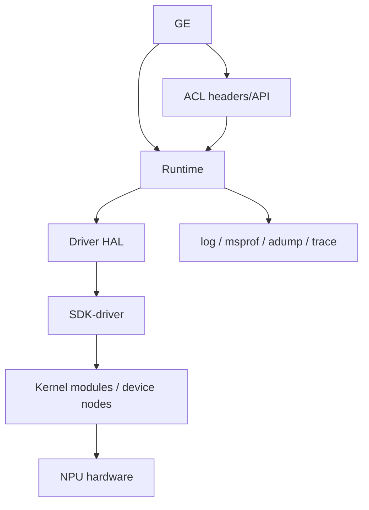

# 总览：依赖地图

- 证据状态：构建层依赖已确认；运行时动态加载和闭源依赖部分未知

## 构建证据

| 仓库 | 直接依赖/子目录 | 证据 |
|---|---|---|
| GE | compiler、executor、dflow，依赖安装路径和第三方库 | `[ge/CMakeLists.txt:30-68]` |
| ACL | runtime、ascend_hal、metadef、adump、msprof、tdt 等 | `[acl/CMakeLists.txt:110-126]` |
| Runtime | scheduler、DFX、platform、runtime、ACL runtime、TDT、tprt | `[runtime/src/CMakeLists.txt:13-32]` |
| Driver | ascend_hal、sdk_driver、可选 custom | `[driver/src/CMakeLists.txt:9-30]` |

## ABI 边界

公共头文件、导出符号、错误码、CMake `find_*` 模块、共享库和安装包共同构成跨仓契约。具体符号版本、符号可见性、SONAME 和包文件清单尚未逐项盘点，标记为未知。

## 兼容矩阵原则

GE、ACL、Runtime、Driver、Firmware、Toolkit、算子包和模型格式应按同一 CANN 发布线组合；只替换单个仓库可能导致编译、加载或运行时 ABI 不兼容 `[runtime/README.md:16-19]`。
