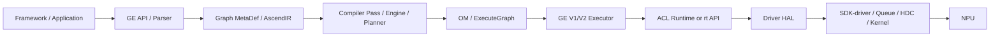

# 总览：全局数据流

- 证据状态：主路径已确认；跨仓具体 ABI 和设备命令部分推断

## 图模型路径



GE 架构文档确认前端、Compiler、Executor 和 AscendIR 的职责 `[ge/docs/zh/design/architecture.md:11-74]`；GE V2 在执行阶段将用户 Tensor 和 stream 资源写入执行数据 `[ge/runtime/v2/core/model_v2_executor.cc:260-305]`。

## 直接 Runtime 路径

```text
aclrtSetDevice
  -> aclrtSetDeviceImpl
  -> rtSetDevice
  -> Api::Instance()->SetDevice
  -> Driver/HAL (具体符号待确认)
```

前两层源码已确认 `[acl/runtime/device.cpp:47-59]`，Runtime C API 门面已确认 `[runtime/src/runtime/api/api_c_device.cc:74-84]`；最后一跳标为推断，不能据此声称已完成设备验证。

## 数据类别

- **元数据**：Graph/Node/Tensor/Attribute/Shape，在 GE 内部和模型序列化之间流动。
- **执行参数**：Tensor 地址、shape、data buffer、kernel 参数，通过 Runtime API 进入 Stream。
- **控制信息**：设备 ID、Context、Stream、Event、资源限制和同步状态。
- **诊断信息**：日志、错误码、profiling/dump/adump 数据，在各层旁路传播。

## 关键转换

1. 前端模型 → AscendIR：解析和图构建。
2. AscendIR → OM/ExecuteGraph：编译、规划和序列化。
3. 用户 Tensor → Runtime 执行数据：V2 `SpecifyInputs/Outputs` 等步骤。
4. Runtime 错误 → ACL/GE 公共错误：包装层映射和日志。

