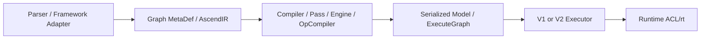

# M01 GE 设计

- 文档目的：解释 GE 的内部分层、状态和取舍
- 适用范围：GE 编译/执行主路径
- 对应源码版本：`47020afc8`
- 证据状态：架构文档与关键实现已确认；部分动机为推断
- 最后更新：2026-09-10
- 前置阅读：README.md
- 后续阅读：call-chains.md

## 结论摘要

GE 以 AscendIR 为统一中间边界，把“图语义”与“硬件执行资源”隔离。Session 管理用户图和编译状态；Compiler 做全图变换与计划；Executor 将计划转换为 Runtime 调用。V2 使用 ExecuteGraph 和显式的 Loaded/Init 状态，支持动态 shape、资源分配和订阅者。

## 内部分层

Parser 目录明确支持 ONNX 等前端解析 `[ge/AGENTS.md:16-18]`；Compiler、Graph MetaDef、Runtime 由 GE CMake 分层加入 `[ge/AGENTS.md:11-18]`。

## 生命周期与状态

GE 初始化 → Session 创建/注册 → AddGraph → CompileGraph → LoadGraph → RunGraph/RunGraphAsync → UnLoad/RemoveGraph → Session Finalize → GEFinalize。V2 Executor 的局部状态是 Init → Load（初始化图执行、主图加载）→ Loaded → Execute → UnLoad（主图卸载、反初始化图执行）→ Init `[ge/runtime/v2/core/model_v2_executor.cc:201-257]`。

## 并发、所有权和错误

- Session 由 `shared_ptr` 持有 `InnerSession`，Registry 负责 GEFinalize 时清理 `[ge/api/session/session/ge_session_impl.cc:34-71]`。
- V2 执行前校验输入/输出数量和空指针；可绑定流资源限制，并通过 guard 在返回时解除绑定 `[ge/runtime/v2/core/model_v2_executor.cc:260-305]`。
- 异步回调在 GE API 层记录失败并转换输出 Tensor `[ge/api/session/client/ge_api.cc:87-101]`。
- 线程安全：GE 释放相关全局互斥锁存在于 API 层 `[ge/api/session/client/ge_api.cc:105-106]`；更细粒度锁需按组件分析。

## 设计取舍

已确认的收益是统一 IR、全图优化、模型下沉和 V1/V2 并行；代价是编译状态复杂、插件/算子/Runtime 版本必须兼容、错误跨层传播难定位。为什么具体选择每个 Pass 的顺序，需查对应 feature 设计文档，不能由本摘要臆断。

## 相关文档

- [source-map.md](source-map.md) · [interfaces.md](interfaces.md) · [call-chains.md](call-chains.md)

## 源码证据摘要

见正文引用。

## 未解决问题

完整的 Memory Planner、Stream Allocator、EnginePartitioner 数据结构和锁模型待补充。

## 下一步阅读建议

调试编译问题读 `compiler/graph`；调试模型执行读 `runtime/v1`/`runtime/v2`。
