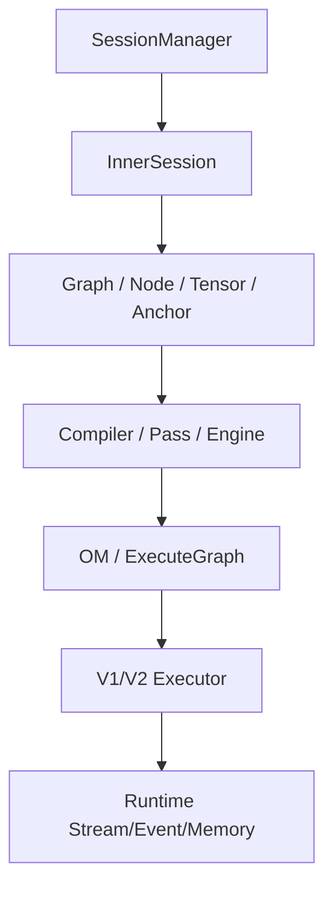
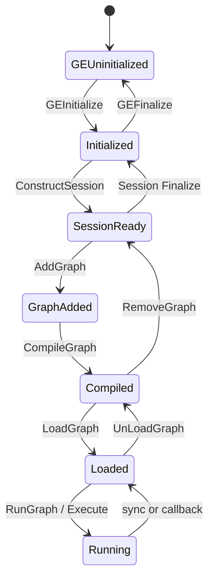

# M01 GE 图示

- 证据状态：主要分层和 V2 状态已确认

```mermaid
flowchart TB
  S[SessionManager] --> I[InnerSession]
  I --> G[Graph / Node / Tensor / Anchor]
  G --> C[Compiler / Pass / Engine]
  C --> M[OM / ExecuteGraph]
  M --> X[V1/V2 Executor]
  X --> R[Runtime Stream/Event/Memory]
```

```mermaid
stateDiagram-v2
  [*] --> GEUninitialized
  GEUninitialized --> Initialized: GEInitialize
  Initialized --> SessionReady: ConstructSession
  SessionReady --> GraphAdded: AddGraph
  GraphAdded --> Compiled: CompileGraph
  Compiled --> Loaded: LoadGraph
  Loaded --> Running: RunGraph / Execute
  Running --> Loaded: sync or callback
  Loaded --> Compiled: UnLoadGraph
  Compiled --> SessionReady: RemoveGraph
  SessionReady --> Initialized: Session Finalize
  Initialized --> GEUninitialized: GEFinalize
```

V2 Executor 局部状态 Init/Loaded/Execute/UnLoad 的源码依据为 `[ge/runtime/v2/core/model_v2_executor.cc:201-318]`；整体 Session 状态图是对 GE API 生命周期的概括。
