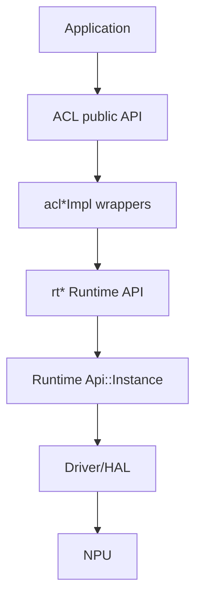
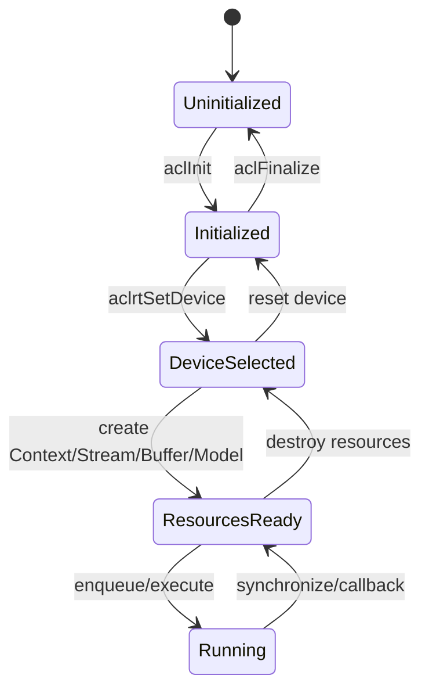

# M02 ACL 图示

- 证据状态：边界图已由构建和关键源码确认

## API 分层

```mermaid
flowchart TB
  App[Application] --> A[ACL public API]
  A --> W[acl*Impl wrappers]
  W --> R[rt* Runtime API]
  R --> I[Runtime Api::Instance]
  I --> D[Driver/HAL]
  D --> N[NPU]
```

## 资源生命周期

```mermaid
stateDiagram-v2
  [*] --> Uninitialized
  Uninitialized --> Initialized: aclInit
  Initialized --> DeviceSelected: aclrtSetDevice
  DeviceSelected --> ResourcesReady: create Context/Stream/Buffer/Model
  ResourcesReady --> Running: enqueue/execute
  Running --> ResourcesReady: synchronize/callback
  ResourcesReady --> DeviceSelected: destroy resources
  DeviceSelected --> Initialized: reset device
  Initialized --> Uninitialized: aclFinalize
```

状态图表示典型契约，不代表所有 API 都必须经过完全相同的状态；具体例外以公共头文件和实现为准。
