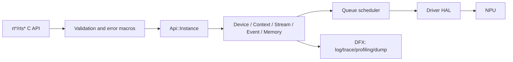
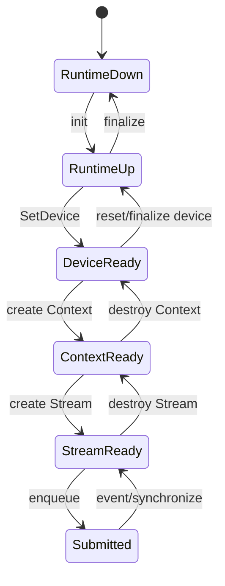

# M03 Runtime 图示

- 证据状态：逻辑边界已确认，内部类名和设备命令部分待补

```mermaid
flowchart LR
  C[rt*/rts* C API] --> V[Validation and error macros]
  V --> A[Api::Instance]
  A --> O[Device / Context / Stream / Event / Memory]
  O --> Q[Queue scheduler]
  Q --> H[Driver HAL]
  H --> N[NPU]
  O --> X[DFX: log/trace/profiling/dump]
```

```mermaid
stateDiagram-v2
  [*] --> RuntimeDown
  RuntimeDown --> RuntimeUp: init
  RuntimeUp --> DeviceReady: SetDevice
  DeviceReady --> ContextReady: create Context
  ContextReady --> StreamReady: create Stream
  StreamReady --> Submitted: enqueue
  Submitted --> StreamReady: event/synchronize
  StreamReady --> ContextReady: destroy Stream
  ContextReady --> DeviceReady: destroy Context
  DeviceReady --> RuntimeUp: reset/finalize device
  RuntimeUp --> RuntimeDown: finalize
```
