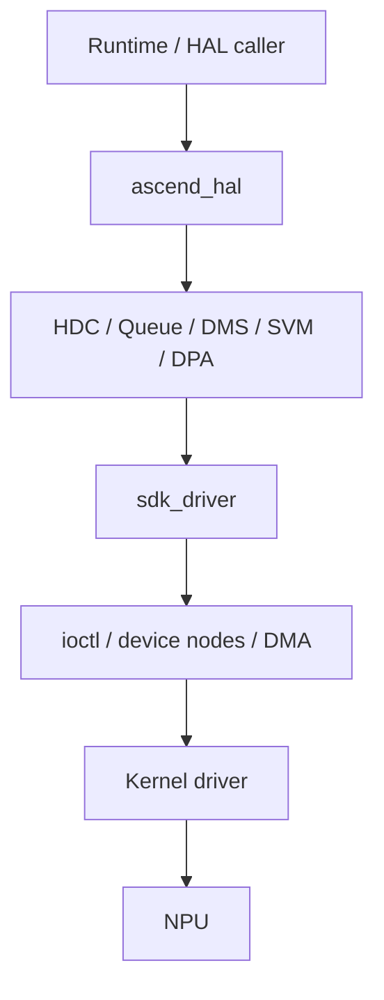
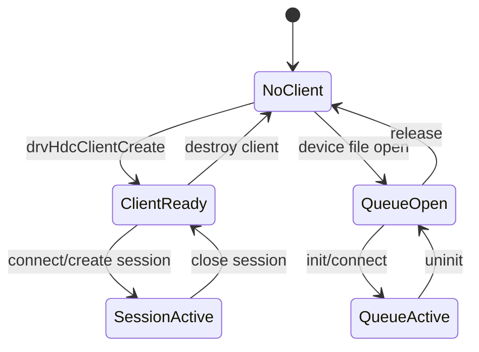

# M04 Driver 图示

- 证据状态：主要边界已确认

```mermaid
flowchart TB
  R[Runtime / HAL caller] --> H[ascend_hal]
  H --> C[HDC / Queue / DMS / SVM / DPA]
  C --> S[sdk_driver]
  S --> I[ioctl / device nodes / DMA]
  I --> K[Kernel driver]
  K --> N[NPU]
```

```mermaid
stateDiagram-v2
  [*] --> NoClient
  NoClient --> ClientReady: drvHdcClientCreate
  ClientReady --> SessionActive: connect/create session
  SessionActive --> ClientReady: close session
  ClientReady --> NoClient: destroy client
  NoClient --> QueueOpen: device file open
  QueueOpen --> QueueActive: init/connect
  QueueActive --> QueueOpen: uninit
  QueueOpen --> NoClient: release
```

销毁 client 的活动 session 检查和 queue 的 file 生命周期分别由 HDC/queue 源码确认；图中连接名称为概念化表示。
