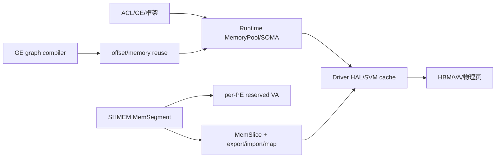

# CANN 池化与资源管理专题

- 文档目的：按 Runtime、Driver、GE、SHMEM 四仓库串联内存池、图内存复用、虚拟地址/物理页和跨进程共享资源。
- 适用范围：当前 checkout：Runtime `50be4c922e7baec5ea9da0c8618092a1c838decc`；Driver `9773369137cc075eba90c5118a49c2260318e7f9`；GE `8ee1b040ac5a5adfd1960fad0c2047eb334fe350`；SHMEM `ea981bdc567dbed8d4ff9431bfdde7807c20b98f`。
- 证据状态：静态源码已确认；Ascend 设备、Driver 固件、HCCL/RDMA 和产品构建未验证。
- 最后更新：2026-09-14
- 前置阅读：[CANN 架构](../00-overview/architecture.md)、[已有资源生命周期](memory-and-resource-lifecycle.md)
- 后续阅读：[M03 Runtime](../01-modules/M03-runtime/README.md)、[M04 Driver](../01-modules/M04-driver/README.md)

## 结论摘要

CANN 不是一条单一 allocator 链，而是四种不同粒度的资源管理叠加：

1. Runtime `MemoryPool/MemoryList`：固定 2 MiB device backing 上做 first-fit 分割，面向小型 kernel/参数资源；
2. Runtime SOMA：以 `Segment` 状态和 stream/event 依赖管理异步内存池，支持 cached/free/busy、split/merge/trim；
3. Driver SVM cache：按设备和 flag 建立普通内存 cache allocator，以红黑树管理 size/地址区间，支持 exact/upper-bound 复用和 shrink；
4. GE/SHMEM：GE 在编译期为图 tensor 分配可复用 offset，SHMEM 在运行期保留每个 PE 的虚拟地址窗口并映射可共享的物理 memory slice。

## 跨仓资源图

实线代表调用或资源依赖；GE 的 offset 复用发生在执行前，Runtime/Driver/SHMEM 的 segment/cache 复用发生在运行期。

## 1. Runtime 固定 backing 池

`MemoryPool::Init` 从 Driver 一次申请 2 MiB HBM backing，再创建 `MemoryList` 并登记整块空闲区。`Allocate` 从链表取满足大小的块，必要时只向前移动地址和减少剩余 size；`Release` 把释放块重新挂回链表并更新 `usedSize_`。析构时先调用 Driver `DevMemFree` 再删除 `MemoryList`。[source/cann/runtime/src/runtime/core/src/pool/memory_pool.hpp:22-64] [source/cann/runtime/src/runtime/core/src/pool/memory_pool.cc:16-74]

`MemoryList::GetBlock` 是 first-fit，整块命中时删除节点，部分命中时切割前缀；源码未显示释放相邻块的合并，因此碎片会随请求顺序累积。链表节点本身由 host `new` 创建，节点分配失败有显式回滚。[source/cann/runtime/src/runtime/core/src/pool/memory_list.cc:29-104]

这里的“GPU 池”仅指 Runtime 预留的 HBM backing；`MemoryList` 是 host 链表元数据，first-fit 分割不等于设备物理页池。超过 2 MiB 或不满足 KernelMemoryPool 条件的请求会进入普通 Runtime→Driver/HAL 路径，不能用固定池的 `usedSize_` 推断全局 HBM 可用量。

这条路径适合固定小资源，不等价于大块通用 allocator：超过池容量或池未初始化时必须回到上层/Driver 的普通分配路径；并发访问的加锁责任由 `MemoryPoolManager` 等调用者承担。[source/cann/runtime/src/runtime/core/src/pool/memory_list.hpp:32-48]

## 2. Runtime BufferAllocator：固定 ID 池

`BufferAllocator` 用 Bitmap 保存 item id 到连续 backing 数组的占用状态。`LINEAR` 策略按 `initCount` 增长，`EXPONENTIAL` 按 2 倍增长；策略只决定扩容节奏，不是地址区间的 best-fit。`FreeById/FreeByItem` 归还 bitmap id，`MemsetBuffers` 可批量清空已分配项。[source/cann/runtime/src/runtime/core/src/pool/buffer_allocator.hpp:23-125]

因此 SQ address、copy/event 等固定槽资源的“池化”是 ID/对象槽复用，而不是动态字节内存回收。修改 `initCount/maxCount` 会改变资源上限、扩容次数和 host/device backing 分配压力。

## 3. Runtime SOMA：stream-ordered segment pool

### 状态和所有权

`Segment` 记录 base/size、prev/next、streamId、graphId、eventId、seqId 和 `FREE/CACHED/BUSY` 状态；`SegmentManager` 同时维护 `allocedMap_`、按 size 排序的 `cachedSegs_` 和 `freeSegs_`，并记录 busy/reserved/high-watermark。[source/cann/runtime/src/runtime/feature/soma/stream_mem_pool.hpp:38-76] [source/cann/runtime/src/runtime/feature/soma/stream_mem_pool.hpp:122-170]

### 分配、释放和 trim

`SegmentAlloc` 在 mutex 内先尝试 `TryToReuse`，失败后从 `freeSegs_` `lower_bound` 取最小满足块，左切割后标记 BUSY 并加入 `allocedMap_`；当前 checkout 的 `TryToReuse` 直接返回 nullptr，same-stream/event/internal 复用函数尚未接入统一入口。[source/cann/runtime/src/runtime/feature/soma/stream_mem_pool.cc:140-195] [source/cann/runtime/src/runtime/feature/soma/stream_mem_pool.cc:245-334]

`SegmentFree(forceFree=false)` 从 map 删除并减少 busy；默认进入 CACHED，按 stream sequence 记录依赖并与相邻同状态/同 stream/同 graph/event/seq 的 segment 合并。`forceFree=true` 才直接进入 FREE 集合。[source/cann/runtime/src/runtime/feature/soma/stream_mem_pool.cc:198-244]

`TrimTo(minBytesToKeep)` 禁止小于 busy size，随后从 cached 集合拆分或整体移入 free，直到 reserved size 不高于阈值；`minBytesToKeep > pool size` 和 `< busy size` 都返回错误。[source/cann/runtime/src/runtime/feature/soma/stream_mem_pool.cc:383-435]

PoolRegistry 用 `poolOwnership_` 保存 `shared_ptr<SegmentManager>`，并通过 stream/event callback 更新 sequence/event map；删除 stream/event 时会清理依赖 metadata。[source/cann/runtime/src/runtime/feature/soma/stream_mem_pool.cc:528-575] [source/cann/runtime/src/runtime/feature/soma/stream_mem_pool.cc:672-759]

## 4. Driver SVM 普通内存 cache

Driver V3 `cache_allocator` 按 `(devid, flag)` 建立全局 allocator 表；策略从页大小推导 alloc threshold、shrink threshold、2 MiB expand granularity 和 page alignment。allocator 以 `svm_ga_inst` 管理 backing range，destroy 时先销毁 rwlock/GA instance 再 free host 对象。[source/cann/driver/src/ascend_hal/svm/v3/assign/cache_malloc/cache_allocator.c:24-107]

`cache_init` 根据 host/device、P2P、huge-page 组合创建多类 allocator；设备反初始化前先 `svm_cache_shrink`，再销毁 allocator。初始化失败会反向销毁已经创建的 flag，CRIU reset/restore 通过 recycle range 重新登记。[source/cann/driver/src/ascend_hal/svm/v3/assign/cache_malloc/cache_init.c:24-83] [source/cann/driver/src/ascend_hal/svm/v3/assign/cache_malloc/cache_init.c:117-153]

底层 `gen_allocator` 维护 range 地址红黑树和 area size 多红黑树；按 size 选择 exact 或 upper-bound 空闲 area，分配时 slice，释放时 merge 相邻 area。`ga_try_slice_area` 在 host 内存不足时可能留下已从树摘出的 area，调用方必须检查 create 结果。[source/cann/driver/src/ascend_hal/svm/v3/assign/gen_allocator/gen_allocator.c:19-43] [source/cann/driver/src/ascend_hal/svm/v3/assign/gen_allocator/gen_allocator.c:163-177] [source/cann/driver/src/ascend_hal/svm/v3/assign/gen_allocator/gen_allocator.c:219-253]

Driver 另用 `cache_recycle_seg` 全局区间红黑树记录“异步释放但暂不能立即复用”的 VA 段；释放时先从树删除，再转回 normal free；按设备清空用于 CRIU reset/设备卸载。[source/cann/driver/src/ascend_hal/svm/v3/assign/cache_malloc/cache_recycle_seg.c:20-110] [source/cann/driver/src/ascend_hal/svm/v3/assign/cache_malloc/cache_recycle_seg.c:149-181]

## 5. GE 编译期内存复用

GE 的 `MemoryAssigner::AssignMemory` 依次执行 graph memory assign、重分配、zero-copy、reference memory、continuous memory、atomic clean 和 offset check；它输出的是 tensor offset/size 计划，不直接持有运行期 HBM 指针。[source/cann/ge/compiler/graph/build/memory/memory_assigner.cc:25-63]

`BufferPoolMemAssigner` 按 batch label/pool id 收集节点，校验统一 memory type，对 pool size 做对齐并计算 offset base；每个 buffer-pool node 的预计算 size 必须与当前 output size 相等，然后写回 output offset。该机制把多个图节点放进预留 buffer，不代表节点可在任意 stream 上重叠执行。[source/cann/ge/compiler/graph/build/memory/buffer_pool_mem_assigner.cc:29-115] [source/cann/ge/compiler/graph/build/memory/buffer_pool_mem_assigner.cc:158-238]

`MemReuseStrategy` 根据 thread scope、stream id、引用节点和跨 stream 拓扑分析是否可复用；跨 stream 的复用必须由 event/internal dependency 证明，不能只按 tensor size 判断。[source/cann/ge/compiler/graph/build/memory/mem_reuse_strategy.cc:28-159] [source/cann/ge/compiler/graph/build/memory/mem_reuse_strategy.cc:233-312]

GE 的 graph memory reuse 只产出 offset/size 与依赖约束；Runtime/Driver 在执行期是否按该 offset 建立并保持 backing，仍需沿 executor→Runtime memory API 验证。不要把编译期复用率写成运行期显存节省或 Graph capture 结果。

## 6. SHMEM：每 PE 虚拟窗口与可共享 slice

`MemSegment` 是 SHMEM heap 抽象，提供 Reserve/UnReserve、AllocLocal/Register、ReleaseSlice、Export/Import、Mmap/Unmap 和地址范围检查接口；具体实现按 SoC/GVA 版本选择 `MemSegmentDevice` 或 `HybmVmmBasedSegment`。[source/cann/shmem/src/host/mem/heap/hybm_mem_segment.h:26-127] [source/cann/shmem/src/host/mem/heap/hybm_mem_segment.cpp:34-87]

VMM 实现按 `rankCnt * aligned segment size` 保留全局 VA，每个 PE 获得固定窗口；`AllocLocalMemory` 在大页和容量约束通过后调用 `HalMemCreate`，创建 `MemSlice`、导出 fabric handle 并 `HalMemMap` 到本地 VA。释放按 Unmap → HalMemRelease → erase slice 顺序执行。[source/cann/shmem/src/host/mem/heap/hybm_vmm_based_segment.cpp:109-203] [source/cann/shmem/src/host/mem/heap/hybm_vmm_based_segment.cpp:214-235]

SHMEM init backend 还为 P2P/RDMA/SDMA 建立 host/device heap base 指针数组；remove_heap 释放这些数组并 unmap，release_heap 先 unreserve VA 再 destroy entity。任一步失败都可能留下部分状态，调用方依赖 firstError 和 collective status gate 保持各 rank 一致。[source/cann/shmem/src/host/init/backends/shmem_init_backend.cpp:735-789] [source/cann/shmem/src/host/init/backends/shmem_init_backend.cpp:792-908]

## 资源所有权矩阵

| 层 | 资源 | owner | 复用/释放 | 关键边界 |
|---|---|---|---|---|
| Runtime | 2 MiB MemoryPool backing | `MemoryPool` | 内部 first-fit；析构 Driver free | 链表无邻接合并证据 |
| Runtime | SOMA Segment | `SegmentManager`/`PoolRegistry` | CACHED/BUSY/FREE；trim | stream/event sequence |
| Driver | ordinary cache range/area | `cache_allocator`/GA | exact/upper-bound、split/merge/shrink | device+flag 全局表 |
| GE | tensor offset | graph memory assigner | 编译期复用 | stream/ref/atomic clean 约束 |
| SHMEM | VA window + MemSlice | `MemSegment`/entity state | map/export/import；unmap/release | rank/PE 对称性、fabric handle |

## 失败路径与验证建议

- Runtime MemoryPool：注入 backing 分配失败、MemoryList 节点分配失败和碎片化请求，检查 used size 与链表是否闭合。
- SOMA：覆盖 reuse miss、split/merge、trim 小于 busy、stream/event callback 顺序和 `CanDelete=false` pool 销毁。
- Driver：覆盖 allocator 重复 init、GA area create 失败、cache shrink、recycle segment 未找到和 CRIU restore。
- GE：覆盖 buffer pool size/type mismatch、reference node、zero-copy/atomic clean offset 冲突。
- SHMEM：覆盖 rank 不对称、HalMemMap/Release 失败、部分 entity 初始化失败和 collective gate。

## 风险与取舍

| 风险 | 影响 | 控制方法 |
|---|---|---|
| Runtime first-fit 不合并邻接块 | 长时间小块请求碎片化 | 观察 `usedSize_`/失败率；评估合并策略 |
| SOMA reuse 入口当前 no-op | 释放后 segment 仍需重新分配或 cached 驻留 | 分开记录设计接口与当前实现；不要声称已启用跨 stream 复用 |
| Driver cache 多树状态不一致 | double free、VA 重叠、缓存泄漏 | 保留 rwlock，增加 range/area 一致性检查 |
| GE offset 复用忽略 stream/event | 并发写覆盖 | 以 MemReuseStrategy 和 atomic clean checker 为准 |
| SHMEM 对称性/映射失败 | 某些 PE heap unmapped，RDMA/SDMA 错误 | 初始化/释放采用 collective gate，记录 rank 状态 |
| 闭源固件和设备差异 | 静态链路无法证明物理页行为 | 目标 SoC/Driver 环境执行 smoke、压力和 CRIU 测试 |

## 相关文档

- [M03 Runtime 内存池专题](../01-modules/M03-runtime/memory-pool-analysis.md)
- [M04 Driver 内存池专题](../01-modules/M04-driver/driver-memory-pool-analysis.md)
- [跨模块资源生命周期](memory-and-resource-lifecycle.md)
- [跨模块调用链](cross-module-call-chains.md)
- [构建与部署](../00-overview/build-and-deploy.md)

## 源码证据摘要

Runtime MemoryPool：[source/cann/runtime/src/runtime/core/src/pool/memory_pool.cc:16-105]；SOMA：[source/cann/runtime/src/runtime/feature/soma/stream_mem_pool.hpp:38-170]、[source/cann/runtime/src/runtime/feature/soma/stream_mem_pool.cc:140-435]；Driver V3 cache：[source/cann/driver/src/ascend_hal/svm/v3/assign/cache_malloc/cache_allocator.c:24-173]、[source/cann/driver/src/ascend_hal/svm/v3/assign/gen_allocator/gen_allocator.c:19-253]；GE：[source/cann/ge/compiler/graph/build/memory/memory_assigner.cc:25-63]、[source/cann/ge/compiler/graph/build/memory/buffer_pool_mem_assigner.cc:29-238]；SHMEM：[source/cann/shmem/src/host/mem/heap/hybm_vmm_based_segment.cpp:109-235]。

## 未解决问题

- Runtime/Driver 产品编译宏选择的真实 allocator 组合仍需构建矩阵确认。
- SOMA async AICPU kernel、Driver V3 VMM backing 和硬件 event 完成语义未在设备上验证。
- GE graph memory reuse 与 Runtime/SOMA 实际执行地址的完整端到端符号链仍需继续补证。
- SHMEM 多节点 fabric handle、RDMA backend 和异常 rank 回滚需硬件/网络实验。

## 下一步阅读建议

先读 Runtime SOMA 的 Segment 状态机，再读 Driver V3 的 range/area 红黑树，最后沿 GE offset 与 SHMEM MemSlice 对照同一块设备内存的编译期和运行期生命周期。
