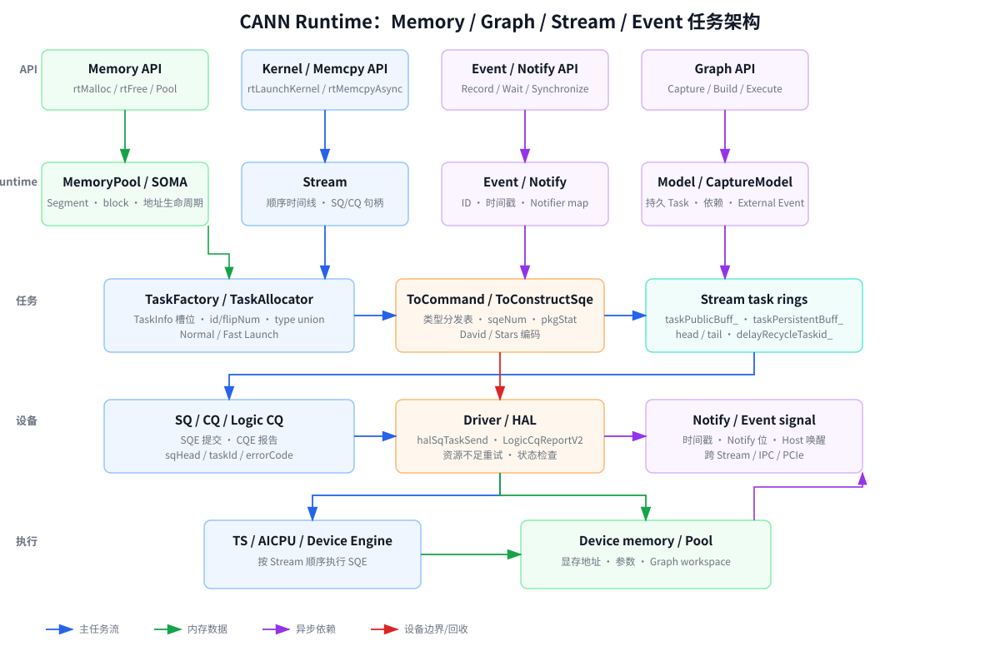
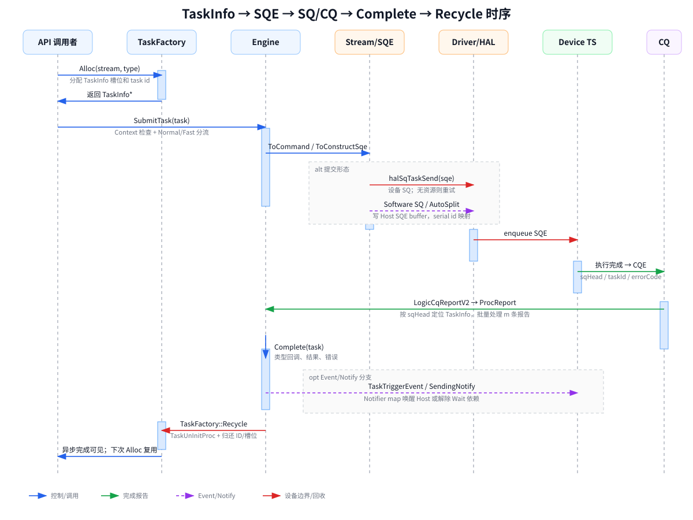

# CANN Memory API 与 Graph 设计、实现和性能分析

本文以当前工作区中的 runtime/ 为主，结合 ACL 包装层、Runtime 核心层和 Driver/HAL 适配层，说明：

1. CANN 的 Memory API 如何设计和实现；
2. CANN 的 Graph（ACL Graph / Model Running Instance）如何设计和实现；
3. 两者如何利用 Stream、SQ/CQ、Event、Notify 和设备内存达到高性能。

源码分析采用“逐行语义解释”：重点解释有独立行为的语句、状态转换、资源分配和错误回滚，不机械复制每一行日志。Driver 内核态的真实物理页分配不在当前源码中，本文只分析到 HAL 契约。

---

## 一、功能的基本设计

### 1.1 Runtime 的分层模型

Runtime 架构文档把系统分为接口层、特性/核心层和 Driver 适配层。[architecture.md](/home/mtuser/workspace/cann/runtime/docs/zh/design/architecture.md:5)

~~~text
AI 框架 / 应用
    │  ACL API、Runtime API
    ▼
接口层
    │  参数校验、句柄转换、错误码、Profiling
    ▼
核心层与特性层
    │  Context、Device、Stream、Task、Model、MemoryPool
    ▼
Driver 适配层
    │  芯片/运行模式选择、HAL flag 转换
    ▼
Ascend HAL / Driver / NPU
~~~

典型调用链是：

~~~text
C ABI
  → ApiErrorDecorator
  → ApiImpl
  → Context / Device / Stream / Model
  → NpuDriver
  → HAL
~~~

公开接口使用不透明句柄（rtStream_t、rtModel_t、rtMemPool_t），内部再转换为 C++ 对象。这样可以保持 C ABI 稳定，同时让内部实现持续扩展。

### 1.2 Memory API 的设计目标

Memory API 将请求拆成三类信息：

- 内存类型：HBM、DDR、P2P、TS、SVM、Host；
- 分配策略：大页优先、只用大页、只用普通页、1GB 大页、P2P；
- 扩展属性：moduleId、deviceId、只读、UVA、Cached 等。

旧接口 rtMalloc 直接接收组合后的 rtMemType_t；新接口 rtMemAlloc/rtsMalloc 使用 policy、advise、cfg 分开表达。最终都由 Runtime 转换成 Driver flag，再调用 halMemAlloc。

普通分配和 SOMA 异步内存池是两条路径：

~~~text
rtMalloc
  → 每次向 Driver 申请一块内存

rtMemPoolMallocAsync
  → 从大池元数据切出 segment
  → 在 Stream 上提交异步池操作
~~~

### 1.3 Graph API 的设计目标

Graph 有两种构建方式：

1. 隐式捕获：rtStreamBeginCapture/EndCapture 或 aclmdlRICaptureBegin/End；
2. 显式构建：rtModelCreate → rtModelBindStream → 下发任务 → rtEndGraph → rtModelLoadComplete。

两种方式最终都形成 Model。CaptureModel 继承 Model，用于保存捕获期间的 Stream、Task、Event 和依赖关系。

Graph 的核心目标是把重复的任务准备和下发前移：

~~~text
构建阶段：创建模型、绑定 Stream、生成 TaskInfo/SQE、准备设备资源
执行阶段：提交一个模型执行入口，在设备侧按原顺序运行任务
~~~

这样可以降低 Host 与 Driver/TS 之间的调用次数，并支持异步执行、任务更新、跨 Stream 依赖和条件分支。

### 1.4 Memory 与 Graph 的关系

Graph 自身也需要内存：

- AICPU model info；
- Stream/task/queue info；
- endGraph 和 active stream 字符串；
- label/count 设备地址；
- 条件句柄对应的 device pointer；
- 外部 Event refresh 表；
- SQE/SQ/CQ 和参数缓冲。

所以 Graph 生命周期同时也是资源生命周期：

~~~text
ModelCreate
  → Setup 分配模型元数据和设备内存
Capture/Build
  → 保存任务、参数、Stream 和 Event 关系
LoadComplete
  → 打包设备模型信息，准备 SQ/CQ
Execute
  → 在执行 Stream 提交模型任务
Destroy
  → 解绑 Stream，释放 Notify、SQ/CQ、设备内存和 Model ID
~~~

---

## 二、核心的数据结构

### 2.1 Memory 类型编码

rtMemType_t 同时保存类型、策略和属性，定义见 [rt_external_mem.h](/home/mtuser/workspace/cann/runtime/pkg_inc/runtime/rt_external_mem.h:26)。

~~~text
低位（MEM_ALLOC_TYPE_BIT = 0x3FF）
  RT_MEMORY_HBM
  RT_MEMORY_DDR
  RT_MEMORY_P2P_HBM
  RT_MEMORY_P2P_DDR
  RT_MEMORY_TS
  RT_MEMORY_SVM

高位
  RT_MEMORY_POLICY_HUGE_PAGE_FIRST
  RT_MEMORY_POLICY_HUGE_PAGE_ONLY
  RT_MEMORY_POLICY_DEFAULT_PAGE_ONLY
  RT_MEMORY_POLICY_*_P2P
  RT_MEMORY_POLICY_HUGE1G_PAGE_ONLY
  RT_MEMORY_ATTRIBUTE_READONLY
~~~

这种设计兼容旧 ABI，但扩展时必须严格维护掩码，避免类型 bit 与策略 bit 冲突。

### 2.2 Segment：池内的基本块

Segment 定义在 [stream_mem_pool.hpp](/home/mtuser/workspace/cann/runtime/src/runtime/feature/soma/stream_mem_pool.hpp:51)：

~~~text
Segment
├── basePtr       起始虚拟地址
├── size          segment 大小
├── prev/next     地址相邻的前后节点
├── streamId      最近使用的 Stream
├── graphId       所属 Graph
├── eventId       关联 Event
├── seqId         Stream 序列号
└── state         FREE / CACHED / BUSY
~~~

prev/next 是地址顺序的侵入式双向链表，用于 O(1) 找邻居、切分和合并。

状态含义：

- FREE：可以直接重新分配；
- BUSY：已返回给用户；
- CACHED：逻辑上释放，但需要等待 Stream/Event 依赖。

### 2.3 SegmentManager：一个池的本地分配器

SegmentManager 维护三个互补索引：

~~~text
allocedMap_ : unordered_map<basePtr, Segment*>
freeSegs_   : set<Segment*, (size, basePtr)>
cachedSegs_ : set<Segment*, (size, basePtr)>

Segment 链表：按地址关系组织
free/cached set：按大小组织
allocedMap：按用户地址组织
~~~

各索引的职责：

| 索引 | 用途 |
|---|---|
| allocedMap_ | 通过精确地址找到已分配 segment |
| freeSegs_ | 按大小做 best-fit |
| cachedSegs_ | 按 Stream/Event 条件寻找可复用块 |
| prev/next | 相邻块合并和切分 |

统计字段包括 busySize_、reserveSize_、maxBusySize_ 和 maxReservedSize_。其中 size_ 是整个池的 VA 范围，reserveSize_ 是已经提交/保留的 segment 总量，不一定等于整个 VA 范围。

### 2.4 PoolRegistry：多个池的全局目录

PoolRegistry 定义见 [stream_mem_pool.hpp](/home/mtuser/workspace/cann/runtime/src/runtime/feature/soma/stream_mem_pool.hpp:180)：

~~~text
entries_        : set<SegmentManager*>，按池起始地址排序
poolOwnership_  : unordered_map<SegmentManager*, shared_ptr<SegmentManager>>
eventsMap_      : eventId → (streamId, seqId)
sequenceMap_    : (consumerStream, producerStream) → seqId
streamSeqId_    : streamId → 当前序列号
~~~

entries_ 负责地址范围查找；poolOwnership_ 负责对象生命周期；三个 HashMap 负责跨 Stream/Event 的顺序关系。

### 2.5 Model：Graph 的通用模型对象

Model 定义在 [model.hpp](/home/mtuser/workspace/cann/runtime/src/runtime/core/inc/model/model.hpp:64)：

~~~text
Model
├── id_ / name_             Model 标识
├── context_                所属 Context
├── streams_                绑定 Stream 列表
├── headStreams_            头 Stream 列表
├── exeStream_              执行 Stream
├── modelType_              NORMAL / CAPTURE_MODEL
├── mapAicpuTask_           AICPU task 信息
├── aicpuModelInfo_         设备侧模型描述
├── streamInfoPtr_          设备侧 Stream 信息
├── aicpuTaskInfoPtr_       设备侧 task 信息
├── queueInfoPtr_           设备侧 queue 信息
├── modeID_                 设备侧 Model ID
├── endGraphName_           EndGraph 字符串
├── activeStreamName_       ActiveStream 字符串
├── labelMap_               Label 关系
├── labelAllocator_         Label 分配器
└── Notify/Queue/SQ-CQ      执行同步与设备资源
~~~

Model 并不只包含一个 Node 数组。ModelGetNodes 会遍历 streams_，累加 Stream 的延迟回收 SQE 数量。[model_aclgraph.cc](/home/mtuser/workspace/cann/runtime/src/runtime/feature/aclgraph/model_aclgraph.cc:21)

### 2.6 CaptureModel：捕获状态和附加资源

CaptureModel 继承 Model，定义见 [capture_model.hpp](/home/mtuser/workspace/cann/runtime/src/runtime/core/inc/model/capture_model.hpp:82)。

~~~text
captureModelStatus_
  NONE → CAPTURE_ACTIVE → READY
                    └→ CAPTURE_INVALIDATED / FAULT
                    └→ UPDATING → READY

captureEvents_                 捕获期间的 Event
singleOperEvents_              单算子流 Event
singleOperStmIdAndCapture...   原始流到隐藏捕获流的映射
addStreamMap_                  用户 Stream 到内部 Stream 的映射
taskGroupList_                 可更新任务组
taskGroupStmIds_               尚未结束任务组的 Stream
condHandleTaskMap_             条件任务和子模型
logicSqs_                      本模型拥有的逻辑 SQ
external*EventItems_           外部 Event 占位任务
externalEventRefresh*          replay 刷新表
cachedAllSubModels_            根模型缓存的子模型
~~~

### 2.7 Stream、TaskInfo 和 LogicSq

Stream 是按顺序执行的一串任务，定义在 [stream.hpp](/home/mtuser/workspace/cann/runtime/src/runtime/core/src/stream/stream.hpp:171)。

~~~text
Stream
├── model_              绑定的 Model
├── captureStream_      原始 Stream 对应的隐藏捕获 Stream
├── captureStatus       NONE / ACTIVE / INVALIDATED
├── captureLock_        捕获状态锁
├── taskResMang_        任务资源管理器
├── currentTaskGroup    当前任务组
├── sqId/cqId           硬件 SQ/CQ
└── Task/SQE buffers    任务和 SQE 缓冲
~~~

TaskInfo 是一次待提交任务。捕获期间任务被写入隐藏 capture Stream，而不是立即按普通路径发送。

LogicSq 为 Graph 准备逻辑 SQ，拥有 Host SQE 缓冲，也可以按任务数量延迟申请 Device SQE 地址。见 [logic_sq.cc](/home/mtuser/workspace/cann/runtime/src/runtime/feature/aclgraph/logic_sq.cc:46)。

---

## 三、举例说明过程

### 3.1 Memory：ACL 设备内存分配

用户代码：

~~~cpp
void* dev = nullptr;
aclrtMalloc(&dev, 10 * 1024 * 1024, ACL_MEM_MALLOC_HUGE_FIRST);
aclrtMemcpy(dev, size, host, size, ACL_MEMCPY_HOST_TO_DEVICE);
aclrtFree(dev);
~~~

调用链：

~~~text
aclrtMalloc
  → aclrtMallocImpl
  → ACL 参数检查和对齐
  → policy 转 RT_MEMORY_POLICY_*
  → rtMalloc
  → ApiErrorDecorator::DevMalloc
  → ApiImpl::DevMalloc
  → Context/Device 的 Driver
  → NpuDriver::DevMemAlloc
  → Online/Offline 分流
  → halMemAlloc
~~~

关键行为：

1. ACL 检查输出指针和 size；
2. ACL 可能按产品增加额外 padding；
3. Runtime 至少按 32B 对齐；
4. Huge-first 在大块内存上优先尝试大页；
5. rtMemcpy 将 ACL copy kind 转成 Runtime kind；
6. rtFree 最终调用 halMemFree，默认不做 Device 同步。

### 3.2 Memory：SOMA 池分配

创建一个 64MB 池，按 2MB 粒度分配：

~~~text
初始：
[ FREE 64MB ]

Stream 7 申请 8MB：
[ BUSY 8MB, s7 ][ FREE 56MB ]

Stream 7 申请 4MB：
[ BUSY 8MB, s7 ][ BUSY 4MB, s7 ][ FREE 52MB ]

异步释放前一个 8MB：
[ CACHED 8MB, s7 ][ BUSY 4MB, s7 ][ FREE 52MB ]
~~~

CACHED 不能立即当作普通 FREE，因为设备可能仍有任务访问它。设计上要等同一 Stream、Event 或内部依赖允许后再复用。

### 3.3 Graph：隐式捕获

用户代码：

~~~cpp
aclmdlRICaptureBegin(stream, ACL_MODEL_RI_CAPTURE_MODE_THREAD_LOCAL);
aclrtMemcpyAsync(dst, dstMax, src, count, ACL_MEMCPY_HOST_TO_DEVICE, stream);
aclrtLaunchKernel(..., stream);
aclrtRecordEvent(event, stream);

aclmdlRI model = nullptr;
aclmdlRICaptureEnd(stream, &model);
aclmdlRIExecuteAsync(model, stream);
aclmdlRIDestroy(model);
~~~

过程：

~~~text
CaptureBegin
  → 创建 CaptureModel
  → 创建隐藏 capture Stream
  → 原始 Stream 记录 captureStream_
  → Stream 状态变为 ACTIVE

任务下发
  → Stream::AllocCaptureTaskImpl
  → 任务写入隐藏 capture Stream
  → TaskInfo 和 SQE 归属于 CaptureModel
  → 不按普通路径立即执行

CaptureEnd
  → 检查线程、状态、子模型和 Event 依赖
  → 添加 Notify 和 EndGraph task
  → 生成 external Event refresh 表
  → LoadComplete
  → 状态变为 READY

ExecuteAsync
  → ExecuteCommon
  → 执行前准备 Notify/SQ/CQ/refresh
  → 提交 Model 执行任务
  → 执行后提交 Notify

Destroy
  → 解绑并销毁隐藏 Stream
  → 释放 Event/Notify/SQ/CQ/设备内存/Model ID
~~~

### 3.4 Graph：显式构建

~~~cpp
aclmdlRI model = nullptr;
aclmdlRIBuildBegin(&model, 0);
aclmdlRIBindStream(model, stream, 0);

aclrtLaunchKernel(..., stream);
aclrtMemcpyAsync(..., stream);

aclmdlRIEndTask(model, stream);
aclmdlRIBuildEnd(model, nullptr);
aclmdlRIExecuteAsync(model, stream);
~~~

显式模式由用户明确管理 Model 与 Stream 的关系，BuildEnd 之后任务作为模型整体执行。

### 3.5 Graph：跨 Stream 和条件分支

跨 Stream Event 等待时，Runtime 检查两个 Stream 是否属于同一 CaptureModel，必要时创建级联 capture Stream。相关辅助逻辑在 [capture_model_utils.cc](/home/mtuser/workspace/cann/runtime/src/runtime/feature/aclgraph/capture_model_utils.cc:140)。

条件 Graph 使用 CondHandle：

~~~text
CondHandleCreate
  → 分配 device condition pointer
CondHandleGetCondPtr
  → 用户/设备写入条件值
AddCondTask
  → 把 IF/WHILE/SWITCH 任务写入模型
Execute
  → Device 根据条件值选择子模型
~~~

---

## 四、Memory 源码的逐行/分段分析

### 4.1 rtMalloc 入口

入口在 [api_c_memory.cc](/home/mtuser/workspace/cann/runtime/src/runtime/api/api_c_memory.cc:64)：

1. GLOBAL_STATE_WAIT_IF_LOCKED：等待 Runtime 全局锁定状态解除；
2. Api::Instance：取得当前 Runtime API 对象；
3. 空指针宏：实例不存在则返回错误；
4. TIMESTAMP_BEGIN/END：记录调用耗时；
5. 调用 DevMalloc；
6. 失败时保存扩展错误码；
7. 成功统一返回 Runtime 成功码。

它不直接知道 HBM、DDR 或页类型，这些决策被留给 ApiImpl 和 Driver。

### 4.2 ApiImpl::DevMalloc

普通实现位于 [api_impl.cc](/home/mtuser/workspace/cann/runtime/src/runtime/api/impl/api_impl.cc:2428)：

1. CurrentContext 获取线程当前 Context；
2. Context 无效返回 RT_ERROR_CONTEXT_NULL；
3. 将 size 向上按 32B 对齐；
4. 获取 Context 对应 Driver；
5. 第一次调用 DevMemAlloc；
6. 失败时调用 MemPoolTrimImplicit；
7. Trim 后重试一次；
8. 第二次失败才返回错误。

这是一种“分配失败时回收缓存再重试”的设计，但当前 MemPoolTrimImplicit 在源码中是临时空实现。

### 4.3 新策略接口

带 policy、advise、cfg 的实现位于 [api_impl_memory.cc](/home/mtuser/workspace/cann/runtime/src/runtime/api/impl/api_impl_memory.cc:765)：

1. 获取当前 Context；
2. 设置默认 type、moduleId 和 deviceId；
3. 读取 policy 中的低/高带宽位，映射为 DDR/HBM；
4. 识别只读属性；
5. 截取 page policy；
6. 将 HugeFirst、HugeOnly、NormalOnly、P2P 和 Huge1G 转成内部 memory flag；
7. 解析 cfg，重复属性取最后一个；
8. 将用户 deviceId 转成物理 deviceId，并要求与当前 Context 一致；
9. 按 32B 对齐；
10. TS advise 追加 TS 类型；
11. DVPP advise 进入 DevDvppMemAlloc；
12. 其他请求进入 DevMemAlloc。

新接口扩展的是参数表达方式，最终仍复用同一个 Driver 分配后端。

### 4.4 Driver 分流

NpuDriver::DevMemAlloc 位于 [npu_driver_mem.cc](/home/mtuser/workspace/cann/runtime/src/runtime/driver/npu_driver_mem.cc:1302)：

1. 读取运行模式；
2. Online 调用 DevMemAllocOnline；
3. Offline/AICPU 调度调用 DevMemAllocOffline；
4. 不支持的 Offline P2P 类型直接返回 Feature Not Support。

Online 路径位于 [npu_driver_mem.cc](/home/mtuser/workspace/cann/runtime/src/runtime/driver/npu_driver_mem.cc:1026)：

1. 用 MEM_ALLOC_TYPE_BIT 分离类型和策略；
2. P2P 策略通过 transMemAttribute 转换 HBM/DDR 类型；
3. TS 类型按照芯片属性选择实际 TS 内存；
4. 大块默认分配先尝试 HugePage；
5. HugePage 失败后可回退到 Managed；
6. HugeOnly 不回退；
7. Huge1G 走单独能力检查；
8. 最后拼装 Driver flag 并调用 halMemAlloc。

### 4.5 Host 和 Managed 内存

HostMemAlloc 使用 MEM_HOST 或 MEM_HOST_UVA，并附加对齐和 moduleId。[npu_driver_mem.cc](/home/mtuser/workspace/cann/runtime/src/runtime/driver/npu_driver_mem.cc:843)

ManagedMemAlloc 根据 flag 选择：

- 小块 SPM；
- DDR non-cache；
- UVM/Attach Global；
- Managed SVM。

实现位于 [api_impl_memory.cc](/home/mtuser/workspace/cann/runtime/src/runtime/api/impl/api_impl_memory.cc:282)。大块 Managed 内存会优先尝试 Huge SVM，失败后回退 Normal SVM。

### 4.6 Memory Pool 创建

SomaApi::StreamMemPoolCreate 位于 [soma.cc](/home/mtuser/workspace/cann/runtime/src/runtime/feature/soma/soma.cc:63)：

1. 初始化 PoolRegistry callback；
2. 复制并转换 pool properties；
3. 查询 HBM free/total；
4. 查询推荐 allocation granularity；
5. 对 maxSize 对齐并做容量检查；
6. 创建 SegmentManager；
7. 调用 Driver 创建底层池；
8. 用返回 VA 和 size 建立初始 Segment；
9. 注册到 PoolRegistry；
10. 返回不透明 rtMemPool_t。

Driver 侧先调用 halMemAddressReserve，再以 HBM HugePage 属性调用 halMemPoolCreate，见 [npu_driver_standard_soc.cc](/home/mtuser/workspace/cann/runtime/src/runtime/driver/npu_driver_standard_soc.cc:658)。

### 4.7 Memory Pool 分配与释放

SegmentManager::SegmentAlloc 位于 [stream_mem_pool.cc](/home/mtuser/workspace/cann/runtime/src/runtime/feature/soma/stream_mem_pool.cc:150)：

1. 检查初始 Segment；
2. 检查 IPC pool；
3. 获取 manager mutex；
4. 调用 TryToReuse；
5. 复用失败则调用 AllocFromFreeSegs；
6. 标记 BUSY；
7. 写入 streamId；
8. 插入 allocedMap_；
9. 更新 reserve/busy 统计；
10. 若复用 cached 块，则从 cached set 删除并切分。

AllocFromFreeSegs 使用 freeSegs_.lower_bound，找到 size 不小于请求的最小块，再调用 SplitLeft。[stream_mem_pool.cc](/home/mtuser/workspace/cann/runtime/src/runtime/feature/soma/stream_mem_pool.cc:346)

SegmentFree 位于 [stream_mem_pool.cc](/home/mtuser/workspace/cann/runtime/src/runtime/feature/soma/stream_mem_pool.cc:198)：

1. 锁住 manager；
2. 按精确 basePtr 查找 allocedMap_；
3. 删除分配记录；
4. 减少 busySize；
5. forceFree=true：进入 FREE 并合并 freeSegs_；
6. forceFree=false：记录 stream 序列号，进入 CACHED 并合并 cachedSegs_。

CheckMergeRules 要求 state、streamId、graphId、eventId 和 seqId 都一致，见 [stream_mem_pool.cc](/home/mtuser/workspace/cann/runtime/src/runtime/feature/soma/stream_mem_pool.cc:336)。这保护了异步依赖信息。

### 4.8 SOMA 异步调用

ApiImplSoma::MemPoolMallocAsync 位于 [api_impl_soma.cc](/home/mtuser/workspace/cann/runtime/src/runtime/api/impl/api_impl_soma.cc:65)：

1. 校验 devPtr、poolId、Stream；
2. 按 2MB 对齐；
3. 查询池；
4. 调用 SegmentAlloc；
5. 调用 halMemPoolAsyncConfig(..., false)；
6. 构造 AicpuPoolCtxArgs；
7. 在目标 Stream 提交 SomaMemMng/MALLOC；
8. 下发失败时回滚软件 Segment。

FreeAsync 对池内指针先更新池元数据，再提交 SomaMemMng/FREE；对非池内指针则在 Stream 上注册 Host Callback，最终调用普通 DevFree。

AICPU 侧在 [hwts_kernel_soma.cpp](/home/mtuser/workspace/cann/runtime/src/aicpu_sched/aicpu_schedule/core/hwts_kernel/hwts_kernel_soma.cpp:26) 根据操作类型调用 halMemPoolMalloc 或 halMemPoolFree。

---

## 五、Graph 源码的逐行/分段分析

### 5.1 ACL 包装到 Runtime

ACL 的 aclmdlRI* 实现位于 [model_ri.cpp](/home/mtuser/workspace/cann/runtime/src/acl/aclrt_impl/model_ri.cpp:47)：

1. ACL_REQUIRES_* 宏检查参数；
2. 将 aclmdlRI、aclrtStream 转成 rtModel_t、rtStream_t；
3. 调用对应 rt*/rts* API；
4. ACL_GET_ERRCODE_RTS 或 ACL_REQUIRES_RTS_OK 转换错误码；
5. 记录 Profiling。

例如：

~~~text
aclmdlRICaptureBegin → rtStreamBeginCapture
aclmdlRICaptureEnd   → rtStreamEndCapture
aclmdlRIBuildBegin   → rtsModelCreate
aclmdlRIBindStream    → rtsModelBindStream
aclmdlRIExecuteAsync  → rtModelExecute
~~~

ACL 层因此是兼容和校验层，不重新实现 Graph 调度。

### 5.2 rtStreamBeginCapture

Context::StreamBeginCapture 位于 [context_aclgraph.cc](/home/mtuser/workspace/cann/runtime/src/runtime/feature/aclgraph/context_aclgraph.cc:300)：

1. 打开捕获期间需要的大块缓冲；
2. 获取 Context captureLock；
3. 检查传入 Model 是否已经被捕获；
4. 检查原始 Stream 必须处于 NONE；
5. 没有 Model 时创建 CaptureModel；
6. 检查软件 SQ、动态绑定等芯片能力；
7. 创建并绑定隐藏 capture Stream；
8. 设置线程和 Context 的捕获模式；
9. 让原始 Stream 的 capture status 变为 ACTIVE。

隐藏 Stream 的意义是：用户仍对原始 Stream 调用 API，但真正的 TaskInfo/SQE 进入模型专属的 Stream，普通任务下发路径不被破坏。

### 5.3 Stream::AllocCaptureTaskImpl

位于 [stream_capture.cc](/home/mtuser/workspace/cann/runtime/src/runtime/feature/aclgraph/stream_capture.cc:72)：

1. 获取原始 Stream captureLock；
2. 取出 captureStream；
3. 捕获流不存在则返回 capture exit；
4. 任务组被打断则记录错误；
5. SQE 快满时创建级联 capture Stream；
6. 没有 taskResMang 时从 TaskFactory 分配 TaskInfo；
7. 增加捕获 SQE 计数；
8. 分配 task sequence number；
9. 保存任务公共信息；
10. 有任务资源管理器时从资源池分配；
11. 失败时将 CaptureModel 标记为 invalidated。

这条路径把捕获从“保存用户函数调用”转化为“保存已经构造好的任务和 SQE”。

### 5.4 Stream::EnterCapture / ExitCapture

EnterCapture 位于 [stream_capture.cc](/home/mtuser/workspace/cann/runtime/src/runtime/feature/aclgraph/stream_capture.cc:130)：

1. 通知 CaptureModel 原始 Stream 进入捕获；
2. 设置 captureStream_；
3. 设置 Stream 状态 ACTIVE；
4. 同步模型的 cache-op 开关。

ExitCapture：

1. 找到隐藏 capture Stream；
2. 通知 CaptureModel 结束；
3. 清除模型 cache-op 状态；
4. 清空 captureStream_；
5. 恢复 Stream 状态 NONE。

### 5.5 rtStreamEndCapture

Context::StreamEndCapture 位于 [context_aclgraph.cc](/home/mtuser/workspace/cann/runtime/src/runtime/feature/aclgraph/context_aclgraph.cc:532)：

1. 清空输出 Model；
2. 获取 captureLock；
3. 检查 Stream 正处于捕获；
4. 检查必须由原始捕获 Stream 结束；
5. 检查结束线程；
6. 退出捕获模式；
7. 检查 CaptureModel 是否 invalidated；
8. 检查子模型是否都结束；
9. 检查跨 Stream Event Record/Wait；
10. 为加入的 Stream 创建 Notify；
11. 为执行阶段创建 Notify；
12. 调用 ModelEndGraph 添加 EndGraph task；
13. 运行芯片相关的 EndCaptureAdapterProc；
14. 非软件 SQ 模式调用 LoadComplete；
15. 退出 Stream 捕获状态；
16. 返回 CaptureModel。

结束捕获实际上是一次模型合法性检查、设备资源编排和状态提交。

### 5.6 Model::Setup

Model::Setup 位于 [model.cc](/home/mtuser/workspace/cann/runtime/src/runtime/feature/model/model.cc:133)：

1. 保存 Context；
2. 从 Driver 分配 Model ID；
3. 申请 AICPU model info 设备内存；
4. 申请保存 Model ID 的设备值；
5. 申请 endGraph 字符串；
6. 申请 activeEntryStream 字符串；
7. 创建 Notifier；
8. 创建 LabelAllocator；
9. Stars 平台额外申请 label count 设备内存；
10. 初始化嵌入式句柄。

因此创建一个 Graph Model 已经会消耗显存、通知资源和 Model ID。

### 5.7 Model::BindStream / LoadComplete

BindStream 位于 [model.cc](/home/mtuser/workspace/cann/runtime/src/runtime/feature/model/model.cc:501)：

1. 检查 Stream 和 Model 属于同一 Context；
2. 将 Stream 加入 streams_；
3. 头 Stream 加入 headStreams_；
4. AICPU Stream 只建立对象关系；
5. 普通 Stream 进入绑定任务路径；
6. 设置 Stream 的 Model 和 bind flag；
7. 将 Stream 插入缓存。

LoadComplete 位于 [model.cc](/home/mtuser/workspace/cann/runtime/src/runtime/feature/model/model.cc:931)：

1. 自动切分 SQ 模式先建立 SQ/CQ；
2. 打包 AICPU Model、Stream、Task、Queue 信息；
3. 根据平台选择控制 SQ、默认 Stream 或 AICPU Stream；
4. 添加 Model load complete task；
5. 必要时同步或查询 SQ tail；
6. 将 Model 标记为已加载。

### 5.8 CaptureModel::ExecuteCommon

位于 [capture_model.cc](/home/mtuser/workspace/cann/runtime/src/runtime/feature/aclgraph/capture_model.cc:507)：

1. CheckExecuteReady 要求状态 READY；
2. 创建本轮 ExternalEventRefreshInfo；
3. PreModelExecute 设置执行前 Notify、构建 SQ/CQ、准备外部 Event；
4. ExecuteModel 调用 Model::Execute 或 ExecuteAsync；
5. PostModelExecute 设置执行后 Notify；
6. 任一步失败都做外部 Event 资源回滚。

三段式结构把执行前准备、实际执行和执行后依赖收尾隔离开，便于支持同步/异步、外部 Event 和子模型。

### 5.9 Model::Execute

Model::Execute 位于 [model.cc](/home/mtuser/workspace/cann/runtime/src/runtime/feature/model/model.cc:1413)：

1. 检查执行 Stream 的 Context；
2. 防止 AICPU Model 重复执行；
3. 根据 Stream flag 选择同步或异步；
4. 同步调用 GetStreamToSyncExecute；
5. 异步调用 GetStreamToAsyncExecute。

ExecuteSync 等待执行完成；ExecuteAsync 只把模型任务放入 Stream，让 Host 继续运行。

### 5.10 TaskGroup 和 ModelUpdate

任务更新流程：

1. StreamBeginTaskGrp 创建 TaskGroup；
2. 组内保存 streamId/taskId；
3. StreamEndTaskGrp 将任务组放入 taskGroupList_；
4. StreamBeginTaskUpdate 校验只能由一个 Stream 更新；
5. 更新任务参数；
6. StreamEndTaskUpdate 结束更新；
7. ModelUpdate 检查 CaptureModel 状态为 UPDATING；
8. CaptureModel::Update 成功后恢复 READY。

ModelUpdate 的状态逻辑见 [api_impl.cc](/home/mtuser/workspace/cann/runtime/src/runtime/api/impl/api_impl.cc:7500)。

### 5.11 Model 销毁

Model 析构会解绑 Stream、清除 Label、释放 ArgLoader 记录、释放设备内存并归还 Model ID。CaptureModel 析构还会释放：

- external refresh 表；
- capture Event；
- Jetty；
- SQ/CQ；
- 隐藏 Stream；
- Notify；
- TaskGroup；
- CondHandle；
- LogicSq。

因此 Model 是一个资源所有者，而不只是任务容器。

---

## 六、Stream 和 Event 的实现分析

### 6.1 Stream 的基本设计

Stream 可以理解为“设备任务的有序时间线”。用户把 Kernel、Memcpy、Memset、Event Record/Wait 等操作放入同一个 Stream，Runtime 保证它们按提交顺序进入对应的 SQ（Submission Queue），设备通过 CQ（Completion Queue）反馈完成情况。

Stream 不是一个简单的队列句柄，它同时拥有：

- Driver 分配的 Stream ID；
- SQ/CQ 和逻辑 CQ；
- Host 侧任务 ID 环形缓冲；
- SQE 位置到 Task ID 的映射；
- pending/recycle 状态；
- 当前绑定 Model 和隐藏 capture stream；
- 参数加载、持久化任务、异步回收和错误状态。

因此 Stream 既是执行顺序抽象，也是资源所有者和回收边界。

### 6.2 Stream 的核心数据结构

Stream 的关键字段分散在 [stream.hpp](/home/mtuser/workspace/cann/runtime/src/runtime/core/src/stream/stream.hpp:1024) 附近：

~~~text
Stream
├── streamId_                 Driver/Runtime 可见 ID
├── sqId_ / cqId_             硬件提交/完成队列
├── taskPublicBuff_           普通任务 ID 环形缓冲
├── taskHead_ / taskTail_     普通任务读写位置
├── taskPersistentBuff_       Model 绑定后的持久化任务环
├── taskPersistentHead/Tail   持久化任务位置
├── davinciTaskList_          异步回收场景的任务 ID 队列
├── posToTaskIdMap_           SQ 位置到 Task ID 的数组
├── delayRecycleTaskid_       延迟回收任务列表
├── pendingNum_               尚未完成任务数
├── captureStream_            原始 Stream 对应隐藏 capture Stream
├── captureStatus_            NONE/ACTIVE/INVALIDATED
├── model_                    绑定的 Model
└── 多把 mutex                 提交、回收、捕获、事件任务、参数等
~~~

这里同时存在数组、环形队列、链表和映射表：

| 结构 | 作用 | 典型复杂度 |
|---|---|---:|
| taskPublicBuff_ | 普通任务 ID FIFO | 入队/出队 O(1) |
| taskPersistentBuff_ | Graph/Model 持久任务 | 入队/出队 O(1) |
| davinciTaskList_ | 异步回收任务 ID | 入队/出队 O(1) |
| posToTaskIdMap_ | SQ 位置反查任务 | O(1) |
| delayRecycleTaskid_ | 延迟回收记录 | 追加 O(1)，扫描 O(n) |
| streams_（Model 内） | 模型关联 Stream | 遍历 O(s) |

环形缓冲使用 head/tail 和取模判断满/空，避免每次任务提交移动数组元素。

### 6.3 Stream 创建调用过程

用户调用：

~~~cpp
rtStream_t stream = nullptr;
rtStreamCreate(&stream, RT_STREAM_PRIORITY_DEFAULT);
~~~

调用链：

~~~text
rtStreamCreate
  → rtStreamCreateWithFlags
  → Api::StreamCreate
  → ApiImpl::StreamCreate
  → Context::StreamCreate
  → StreamFactory::CreateStream
  → DavidStream/CoprocessorStream::Setup
~~~

入口 [api_c_stream.cc](/home/mtuser/workspace/cann/runtime/src/runtime/api/api_c_stream.cc:44) 只做 API 计时、句柄解包和错误转换。

ApiImpl::StreamCreate [api_impl.cc](/home/mtuser/workspace/cann/runtime/src/runtime/api/impl/api_impl.cc:1459) 的关键逻辑：

1. AICPU Stream 创建前确保 AICPU 服务已启动；
2. 检查协处理器 Stream 与设备故障模式是否兼容；
3. 检查 Host、TS、Driver 是否支持自动切分 SQ；
4. 将 auto-split 选择传给 Context；
5. 创建完成后设置 Stream failure mode；
6. 设置失败时销毁刚创建的 Stream。

Context::StreamCreate [context.cc](/home/mtuser/workspace/cann/runtime/src/runtime/core/src/context/context.cc:1574)：

1. 检查协处理器 Stream 的 MC2/HCCL 能力；
2. 通过 StreamFactory 创建具体派生类；
3. 保存 Context 指针；
4. 根据模式选择 SetupForAutoSplit、SetupWithoutBindSq 或普通 Setup；
5. Setup 失败时回收对象；
6. 非 forbidden-default Stream 插入 Context 的 streams_ 列表；
7. 返回 Stream 对象并由外层导出为不透明句柄。

### 6.4 Stream::Setup 逐段分析

普通初始化在 [stream.cc](/home/mtuser/workspace/cann/runtime/src/runtime/core/src/stream/stream.cc:625)：

1. 根据 RT_STREAM_HUGE 和设备属性确定 SQ 深度；
2. 非分离回收模式分配 taskPublicBuff_；
3. 支持异步回收时分配 davinciTaskList_；
4. 分配 posToTaskIdMap_，长度等于 SQ 深度；
5. 用 memset_s 初始化位置映射为无效值；
6. 分配并初始化 write-record queue；
7. 检查 Stream 所属 Group；
8. forbidden-default Stream 使用特殊 ID，不分配 Driver SQ/CQ；
9. AICPU Stream 使用 Runtime 的 AICPU Stream ID，不参与普通调度；
10. 普通 Stream 从 Driver 分配 Stream ID；
11. 分配 executed-times SVM；
12. 从 StreamSqCqManage 分配 SQ/CQ；
13. SQ/CQ 资源不足时尝试回收 CaptureModel 资源和 Driver 池资源后重试；
14. 保存 sqId_ 和 cqId_；
15. 分配逻辑 CQ；
16. Stars 平台获取 SQ 寄存器虚拟地址并传给设备；
17. 创建 Stream Task Resource 和参数资源；
18. 设置最大 Task ID、异步回收列表和流控状态；
19. 非 Stars 平台提交 create-stream task；
20. 建立 esched 管理；
21. 初始化嵌入式句柄并发送 Stream 创建回调。

这解释了为什么创建 Stream 比创建普通 C++ 对象昂贵：它可能包含多次 Host 分配、Driver 资源申请、SQ/CQ 初始化、设备任务提交和调度订阅。

### 6.5 Stream 任务入队

普通任务的入队在 [stream.cc](/home/mtuser/workspace/cann/runtime/src/runtime/core/src/stream/stream.cc:2268)：

1. 如果支持异步回收且任务不需要后处理，写入 davinciTaskList_；
2. 否则写入 taskPublicBuff_；
3. 两条路径分别使用 davinciTaskMutex_ 和 publicTaskMutex_；
4. 通过 (tail + 1) % size == head 判断队列是否已满；
5. 记录任务 ID 后只移动 tail。

AddTaskToStream [stream.cc](/home/mtuser/workspace/cann/runtime/src/runtime/core/src/stream/stream.cc:2294) 进一步区分：

- bindFlag=true：写入 taskPersistentBuff_，放入 delayRecycleTaskid_，用于 Model/Graph 持久任务；
- bindFlag=false：进入普通任务列表；
- 最后更新 lastTaskId_。

这使普通任务可以尽快回收，而模型任务保留到 Model 生命周期或显式解绑。

### 6.6 Stream 同步、查询和销毁

rtStreamSynchronize [api_c_stream.cc](/home/mtuser/workspace/cann/runtime/src/runtime/api/api_c_stream.cc:151) 进入 ApiImpl::StreamSynchronize [api_impl.cc](/home/mtuser/workspace/cann/runtime/src/runtime/api/impl/api_impl.cc:1676)：

1. 空 Stream 映射到 Default Stream；
2. 必要时把当前 Context 临时切换到 Stream 所属 Context；
3. 检查 Context 状态；
4. 调用 Stream::Synchronize；
5. 将超时、Abort、Overflow 等内部错误转换为对外错误；
6. 恢复原 Context；
7. 触发隐式内存池 Trim。

Stream::Synchronize [stream.cc](/home/mtuser/workspace/cann/runtime/src/runtime/core/src/stream/stream.cc:2080) 按平台分流：

- Stars + 普通/绑定 Stream：等待指定 Task；
- Stars + 分离发送回收：调用 SynchronizeImpl；
- DisableThread 模式：直接 WaitForTask；
- 传统线程模式：创建一个内部同步 Event，Record 到当前 Stream，再等待 Event 完成。

最后一种设计很重要：Stream 同步复用了 Event 的完成通知机制，而不是另造一套等待协议。

rtStreamQuery 不等待设备，只调用 Stream::Query；任务未完成时返回 RT_ERROR_STREAM_NOT_COMPLETE。[api_c_stream.cc](/home/mtuser/workspace/cann/runtime/src/runtime/api/api_c_stream.cc:197)

销毁入口 [context.cc](/home/mtuser/workspace/cann/runtime/src/runtime/core/src/context/context.cc:1629) 先从 Context 所有列表移除 Stream，再调用 Stream::TearDown。TearDown 需要处理 pending task、强制回收、SQ head/tail、异步回收线程、参数资源、SQ/CQ 和 Driver Stream ID，因此销毁也可能是阻塞操作。

### 6.7 Event 的基本设计

Event 是“某个 Stream 时间点的可观察标记”。它由两部分组成：

1. Host 侧状态和资源管理；
2. 设备侧 Record/Wait Task。

Event Record 把一个时间点写入 Stream；Event Wait 把依赖插入另一个 Stream；Event Synchronize 则让 Host 等待 Record 对应的任务完成。

### 6.8 Event 的核心数据结构

Event 定义在 [event.hpp](/home/mtuser/workspace/cann/runtime/src/runtime/core/inc/event/event.hpp:59)：

~~~text
Event
├── eventId_ / freeEventId_  当前和待回收的设备 Event ID
├── eventFlag_               DEFAULT/TIMELINE/EXTERNAL/IPC/MC2
├── latestRecord_            最近 Record 的 stream/task/state
├── timestamp_ / timeline_   设备时间戳或软件 timeline
├── waitTaskMap_             Wait Task → (Stream, Task ID)
├── recordResetMap_          Record/Reset Task → (Stream, Task ID)
├── idMap_                   Event ID 引用计数
├── notifierMap_             (streamId, taskId) → Notifier
├── captureEvent_            单算子 Event 对应的捕获 Event
├── captureStream_           捕获 Event 所在的隐藏 Stream
├── waitTskStreamList_       捕获期间使用该 Event 的 Stream 集合
├── eventAddr_               Software Event 的设备地址
├── eventOwner_              USER/INNER
├── isHardwareMode_          Hardware/Software Event 模式
└── 多把 mutex                record、state、task map、ID、capture
~~~

Event 自己的逻辑状态只有三个：

~~~text
INIT → RECORDING → RECORDED
~~~

此外还通过 hasRecord_、hasReset_、isNeedDestroy_ 和 ID 引用计数描述更细的生命周期。

### 6.9 Event 创建和 ID 分配

rtsEventCreate [api_c_event.cc](/home/mtuser/workspace/cann/runtime/src/runtime/api/api_c_event.cc:34)：

1. 校验 flag 只能包含合法位；
2. RT_EVENT_FLAG_DEFAULT 归一化为 RT_EVENT_DEFAULT；
3. 调用 Api::EventCreate；
4. 导出嵌入式 Event 句柄。

ApiImpl::EventCreate [api_impl.cc](/home/mtuser/workspace/cann/runtime/src/runtime/api/impl/api_impl.cc:2198)：

1. 检查 Context 和 Device；
2. MC2 Event 先检查芯片能力；
3. 创建 Event 对象；
4. 非默认 flag 调用 GenEventId；
5. 初始化内部句柄；
6. 放入 Device 的 Event 列表。

Event::GenEventId [event.cc](/home/mtuser/workspace/cann/runtime/src/runtime/core/src/event/event.cc:473) 会根据 flag 决定是否需要 Driver ID。Timeline/Stream Mark 在部分 Stars 平台不需要普通 Event ID；需要时调用 Driver 的 EventIdAlloc。

Record 过程中如果没有可用 Event ID，AllocEventIdResource 会尝试回收任务并重试，直到设备状态异常或达到重试限制。这是“资源耗尽时主动回收再分配”的策略，但也可能增加尾延迟。

### 6.10 Event Record：从 API 到 TaskInfo

用户调用：

~~~cpp
rtEvent_t event = nullptr;
rtEventCreate(&event);
rtEventRecord(event, streamA);
~~~

Event::Record [event.cc](/home/mtuser/workspace/cann/runtime/src/runtime/core/src/event/event.cc:531)：

1. 检查 Stream；
2. 获取 eventLockForRecord_，防止并发 Record；
3. Software Event 直接走 RecordSoftwareEvent；
4. 从 TaskFactory 分配 TS_TASK_TYPE_EVENT_RECORD；
5. 根据 Event 模式决定复用已有 ID 或申请新 ID；
6. 在 eventLock_ 下调用 EventRecordTaskInit；
7. 为 Timeline 获取 timeline buffer；
8. 调用 Device::SubmitTask；
9. 成功后把 TaskInfo 放入 Stream 的 Event Task 列表；
10. 如果是 API 调用，更新线程最近 Task/Stream 记录并通知 EventStateCallbackManager；
11. 失败时删除 task map、减少 ID 引用计数、恢复旧状态并回收 TaskInfo。

EventRecordTaskInit [event_task.cc](/home/mtuser/workspace/cann/runtime/src/runtime/core/src/task/task_info/event/event_task.cc:48)：

1. 初始化公共 TaskInfo；
2. 设置任务类型为 EVENT_RECORD；
3. 标记需要后处理；
4. 保存 Event 指针、新 Event ID、时间戳和 Timeline 参数；
5. 增加 Event ID 引用计数；
6. 在线程模式下把 Event 状态更新为 RECORDING；
7. Stars + Timeline/Stream Sync 时标记 CQ 是否需要关注。

Task 完成后，TaskTriggerEvent 查找 notifierMap_，触发等待 Host 的 Notifier；完成回调再把 Event 状态推进到 RECORDED 并释放旧 ID/资源。

### 6.11 Event Wait：跨 Stream 依赖

Event::Wait [event.cc](/home/mtuser/workspace/cann/runtime/src/runtime/core/src/event/event.cc:725)：

1. 调用 WaitSendCheck，判断是否真的需要下发 Wait；
2. 没有 Record 的普通 Event 返回 Invalid Value；
3. 对远端 Device 调用 CrossDeviceEventWait；
4. 同设备时从 TaskFactory 分配 TS_TASK_TYPE_STREAM_WAIT_EVENT；
5. 用 EventWaitTaskInit 填入 Event ID 和 timeout；
6. 提交到目标 Stream；
7. 成功后记录线程 Task/Stream 并通知 EventStateCallbackManager；
8. 失败时删除 Wait map、减少 ID 引用计数、回收 TaskInfo。

EventWaitTaskInit [event_task.cc](/home/mtuser/workspace/cann/runtime/src/runtime/core/src/task/task_info/event/event_task.cc:363) 保存 Event、ID、超时和 wait flag；生成设备命令时把 Event ID、timeout 和 isNotify 写入 SQE，并把 Wait Task 插入 Event 的 waitTaskMap_。

一次跨 Stream 依赖最终表现为：

~~~text
Stream A: ... Work ... EventRecord(eventId=12)
                         │
                         └── device Event 12
Stream B: EventWait(eventId=12, timeout)
           ... Consumer ...
~~~

设备侧只看到 Record/Wait 两类任务和 Event ID；Host 侧用 map 保存这些 TaskInfo 的生命周期。

### 6.12 Event Query、Synchronize 和 ElapsedTime

Event::Query [event.cc](/home/mtuser/workspace/cann/runtime/src/runtime/core/src/event/event.cc:1190)：

- 线程模式下依据 latestRecord_.state 返回 Not Complete 或 Success；
- DisableThread 模式先回收/查询底层任务。

QueryEventStatus 在没有 Record 时区分新旧模式；有 Record 时，线程模式直接依据 RECORDING/RECORDED，DisableThread 模式进一步根据 Stream CQ 位置确认。

Event::Synchronize [event.cc](/home/mtuser/workspace/cann/runtime/src/runtime/core/src/event/event.cc:1097)：

1. 没有 Record 直接成功；
2. DisableThread 模式调用 WaitTask；
3. 线程模式读取最近 Record 的 Stream/Task；
4. 创建临时 Notifier 并写入 notifierMap_；
5. 以报告超时为周期等待 Notifier；
6. 每次超时检查设备状态和用户 timeout；
7. 最后从 notifierMap_ 删除临时 Notifier。

这是一种“设备异步完成 + Host Notifier 等待”的设计，比直接忙轮询更省 CPU，但每次同步仍可能创建一个临时 Notifier。

Event::ElapsedTime 检查两个 Event 都已 Record，然后读取 timestamp 或 timeline，除以芯片频率得到时间间隔。[event.cc](/home/mtuser/workspace/cann/runtime/src/runtime/core/src/event/event.cc:1263)

### 6.13 Event Destroy、Reset 和 ID 引用计数

ApiImpl::EventDestroy [api_impl.cc](/home/mtuser/workspace/cann/runtime/src/runtime/api/impl/api_impl.cc:2249)：

1. 重置嵌入式句柄；
2. 触发 EventStateCallbackManager 的销毁通知；
3. IPC Event 走独立销毁路径；
4. 普通 Event 调用 TryToFreeEventIdAndDestroyEvent。

Event 不一定在用户调用 Destroy 时立刻 delete，因为仍可能有 Record/Wait/Reset Task 持有它。idMap_ 记录每个 Event ID 的引用数，计数归零后才释放 Driver ID 或 Software Event 资源。

Event::Reset 会创建 EVENT_RESET Task，并把 hasReset_ 设为 true；旧 Event 模式的 Reset 会影响下一次 Record 的 ID 和状态。Graph 捕获模式则转到 CaptureEventReset，把 Reset 作为模型任务处理。

### 6.14 Event 与 Graph Capture

ApiImpl::EventRecord / StreamWaitEvent 在捕获状态下不会直接执行普通 Event 操作，而会：

1. 检查 Stream 是否支持 Capture；
2. 拒绝默认 Stream 或不支持的 Event flag；
3. 获取 Context captureLock；
4. 调用 CaptureEventRecord / CaptureEventWait；
5. 出错时调用 TerminateCapture 使 CaptureModel invalidated。

跨 Stream Event 可能触发级联捕获。GetCaptureStream 会从 Event 的 captureEvent_ 找到其隐藏 capture Stream 和 CaptureModel，必要时为当前 Stream 创建新的捕获流并加入模型。[capture_model_utils.cc](/home/mtuser/workspace/cann/runtime/src/runtime/feature/aclgraph/capture_model_utils.cc:140)

External Event 使用占位任务和 refresh 表：CaptureEnd 时保存布局，Replay 前刷新 Host buffer/Device 表，Replay 后把 EventResource 挂到 EndGraph Notify 生命周期。这样 Graph 可以重复执行而不必每次重新分配所有外部 Event。

### 6.15 Stream/Event 复杂度

设：

- q：单个 Stream 的任务队列容量；
- t：Stream 当前 Task 数；
- e：一个 Event 的 Wait/Record Task 数；
- p：pending task 数；
- r：回收/同步实际处理的任务数。

| 操作 | 复杂度/主要代价 |
|---|---:|
| Stream 环形入队 | O(1) |
| Stream 位置到 Task ID 查询 | O(1) |
| Stream 创建 | O(q + Driver/SQ-CQ 资源申请) |
| Stream 销毁 | O(t + 回收任务数 + Driver 释放) |
| Stream Query | 通常 O(1)，依赖底层 head/tail 查询 |
| Stream Synchronize | 逻辑上 O(r)，实际受设备执行时间/timeout 影响 |
| Event 创建 | O(1) 加对象/设备 ID 申请 |
| Event Record/Wait | 平均 O(1) Host 元数据操作 + Task 提交 |
| Event Query | 线程模式 O(1)，DisableThread 可能查询 CQ |
| Event Synchronize | O(e) 资源清理，等待时间由设备任务决定 |
| Event Wait 状态查询 | O(e)，遍历 waitTaskMap_ |
| Event Destroy | O(e + ID 引用释放 + 设备资源回收) |
| Capture 中 Event 传播 | 通常 O(1)，级联 Stream/依赖检查可能 O(s + e) |

这些是 Host 侧复杂度；SQ/CQ 提交、AICPU、Driver 和设备执行时间不属于标准 C++ 渐进复杂度。

## 七、复杂度和性能综合考量

### 7.1 Memory 复杂度

符号：

- n：池内 Segment 总数；
- f：freeSegs_ 数量；
- c：cachedSegs_ 数量；
- a：allocedMap_ 数量；
- p：池数量；
- q：sequenceMap 条目数；
- s：streamSeqId 条目数；
- k：一次合并涉及的相邻节点数。

| 操作 | 复杂度 |
|---|---:|
| Segment Split/Merge | O(1) |
| FREE best-fit | O(log f) |
| FREE 分配 | 平均 O(log f) |
| allocedMap 查找 | 平均 O(1)，最坏 O(a) |
| 强制释放 | O(k log n) |
| 普通异步释放 | O(s + k log n) |
| cached 复用设计 | O(c) |
| Event 复用设计 | O(q + c) |
| Trim | 最坏 O(c log n) |
| PoolRegistry 地址查询 | O(log p) |
| Registry 枚举 | O(p) |
| SegmentManager 析构 | O(n) |

cached 复用函数使用通用 std::lower_bound 作用于 std::set 的双向迭代器，迭代器移动和候选过滤仍是线性的，不能简单按 O(log c) 估计。

### 7.2 Graph 复杂度

符号：

- t：模型任务数；
- s：绑定 Stream 数；
- e：Event 数；
- g：TaskGroup 数；
- m：子模型数；
- r：需要分配的 SQE 数。

| 操作 | 复杂度/主要成本 |
|---|---:|
| Capture 状态切换 | O(1)，但持有锁 |
| 单任务捕获 | 平均 O(1)，受 TaskFactory/资源池影响 |
| Stream 加入 Model | list 插入 O(1)，校验可能 O(s) |
| ModelGetNodes | O(s) |
| CaptureEnd | 约 O(s + e)，还包含资源申请 |
| LoadComplete | 约 O(t + s + r) |
| Model Execute | Host 提交近似 O(1)，设备执行与 t 成正比 |
| TaskGroup 查找 | 线性扫描，约 O(g × groupTaskCount) |
| 子模型遍历 | O(m)，结果可缓存 |
| Model Destroy | O(s + t + m + resourceCount) |

Graph 的主要成本通常不是容器查找，而是设备资源分配、SQ/CQ 准备、参数拷贝、Notify/Event 编排、AICPU/TS 提交以及第一次执行的同步。

### 7.3 Memory 的性能机制

1. 大池减少 Driver 分配/映射次数；
2. HugePage 降低页表和映射开销；
3. best-fit 减少外部碎片；
4. cached segment 为 Stream-order 复用提供基础；
5. 32B/2MB 对齐满足硬件访问和池粒度；
6. 芯片能力决定 halMemcpy、halSdmaCopy、异步 HAL 等路径；
7. Trim 在压力下回收缓存；
8. moduleId/high-water mark 支持按模块统计。

### 7.4 Graph 的性能机制

1. 构建阶段准备任务和参数；
2. Execute 阶段只提交模型入口；
3. SQE、TaskInfo、AICPU model info 可复用；
4. Notify/Event 只表达必要的跨 Stream 依赖；
5. ExecuteAsync 让 Host 和 Device 并行；
6. LogicSq/SQ/CQ 支持批量任务；
7. TaskGroup 只更新变化的任务；
8. External Event refresh 表只刷新动态字段；
9. 条件分支在 Device 侧选择，减少 Host 往返。

### 7.5 Stream/Event 性能和复杂度补充

Stream 的热路径设计重点是固定容量数组和 head/tail 指针：普通任务入队、持久化任务入队以及 SQ 位置反查都可以做到 O(1)，避免动态容器在每个任务上搬移元素。代价是队列容量有限，满队列必须等待回收或返回 Stream Full。

Event 的 Record/Wait 在 Host 侧主要是 TaskFactory 分配、HashMap 插入和一次设备任务提交，平均接近 O(1)。但 Event ID 不足时会触发 TaskReclaim 重试；Event Synchronize 需要创建临时 Notifier 并等待设备完成，真实延迟由设备任务链长度决定。

Stream 和 Event 的性能边界可以概括为：

~~~text
Stream 入队                 Host O(1)
Event Record/Wait           Host O(1) + SQE/Driver 提交
Stream Query                读 head/tail，通常 O(1)
Stream/Event Synchronize    等待设备进度，不是固定 CPU 复杂度
Graph 中跨流 Event          额外 Notify、隐藏 Stream 和依赖检查
~~~

### 7.6 并发和锁

SegmentManager 的分配、释放、Trim、属性访问都使用同一把 mutex_，因此同一个池内操作串行。

PoolRegistry 还有全局 mutex_，保护池集合、ownership、Event 和 Stream 序列。SegmentFree 的普通路径会在持有 manager mutex 的情况下获取 Stream 序列副本，形成 manager → registry 的锁关系。

Graph 的 Context::StreamBeginCapture、StreamEndCapture 持有 captureLock；Stream::AllocCaptureTaskImpl 也持有 captureLock。多线程捕获和大批量任务构建会在锁上排队。

---

## 八、潜在问题和优化点

### 8.1 Memory 问题

#### TryToReuse 未接通

当前 TryToReuse 直接返回 nullptr，而 SegmentFree(false) 会把内存放入 cachedSegs_：

~~~text
异步释放 → CACHED
再次分配 → TryToReuse 返回 nullptr
只尝试 freeSegs_
FREE 耗尽 → 可能返回 RT_ERROR_MEM_POOL_ALLOC
~~~

这很可能是当前分支尚未完成的实现，必须先确认是否存在其他平台替代版本。

#### cached 索引不足

cachedSegs_ 只按大小排序，Stream/Event 仍需扫描。可以增加：

- streamId → cached segment；
- size class + stream 二级索引；
- Event/sequence 可复用队列；
- 按依赖类别拆分的集合。

#### map 全量复制

GetSequenceMap 和 GetStreamSeqId 返回整个 map 副本，会把近似 O(1) 的查询变成 O(q)/O(s)。建议提供单 key 查询或版本化只读快照。

#### 单池锁竞争

可按 device、size class 或 Stream 分片，或者将只读属性访问改为读写锁。

#### 2MB 粒度导致小对象浪费

大量小对象会产生内部碎片，可增加小块 size class，或在 Runtime 上层提供更细粒度 suballocator。

### 8.2 Graph 问题

#### 隐藏 Stream/Notify/SQ-CQ 消耗资源

跨 Stream 捕获、级联捕获和 Event 推导都会创建额外对象。Graph 文档也提醒，捕获任务越多，Stream 资源越容易耗尽。[15_model_running_instance_management.md](/home/mtuser/workspace/cann/runtime/docs/zh/api_ref/15_model_running_instance_management.md:88)

优化方向：

- 预估单模型 Stream 数；
- 复用隐藏 capture Stream；
- CaptureEnd 回收无效 Stream；
- 池化 Notify、Jetty 和 LogicSq。

#### TaskGroup 查找线性

GetTaskGroup 遍历所有 TaskGroup 及其 taskIds。可以增加：

~~~text
(streamId, taskId) → TaskGroup*
~~~

以避免更新时线性扫描。

#### Model 元数据分散分配

Setup、PacketAicpuModelInfo 和 LoadComplete 在不同阶段申请设备内存，失败回滚路径复杂，也增加 Driver 调用次数。

可以使用 Model 元数据 Arena，一次性分配连续区域，再用偏移定位各结构。

#### 首次 Execute 额外成本高

CaptureModel::PreModelExecute 仍可能准备 Notify、SQ/CQ 和外部 Event refresh，第一次执行可能明显慢于稳态执行。可以把可重复准备前移到 CaptureEnd，并为首次 Execute 设计预热。

### 8.3 Stream/Event 问题

#### Stream 创建和销毁成本高

Stream::Setup 可能申请任务缓冲、SQ/CQ、逻辑 CQ、参数资源并提交创建任务；大量短生命周期 Stream 会把 Driver 和调度资源耗在管理操作上。建议复用 Stream，避免在请求热路径创建/销毁。

#### Stream 单对象锁较多

提交、回收、持久化任务、事件任务和捕获分别有锁，但部分路径仍需串行访问同一 Stream 的状态。应避免在 Stream 锁内调用可能阻塞的 Driver 或同步操作。

#### Event ID 资源可能成为全局瓶颈

Event::AllocEventIdResource 在资源不足时主动回收并重试；大量 Event Record/Reset 或 Graph 同时运行时，可能产生尾延迟和回收线程压力。可通过 Event 池、批量 ID 分配和更明确的配额降低抖动。

#### Event 状态由多个 Map 共同维护

waitTaskMap_、recordResetMap_、idMap_、notifierMap_ 分别记录不同生命周期信息。优点是支持延迟释放和异步完成，缺点是错误回滚必须同时删除多个表项，存在状态不一致风险。

#### Event Synchronize 的临时 Notifier

每次 Host Event Synchronize 可能创建临时 Notifier，频繁同步会产生对象分配和 Notify 资源消耗。可考虑线程本地 Notifier、复用等待对象或优先使用 Stream Synchronize 批量等待。

#### 捕获模式下的锁和状态传播

Event Record/Wait 在 Capture 状态下要获取 Context captureLock，并可能创建级联 capture Stream。跨 Stream 事件越多，锁竞争、隐藏资源和模型合法性检查越复杂。建议在构建阶段合并依赖、限制捕获拓扑宽度。

### 8.4 Memory 与 Graph 交界风险

1. Graph 内部设备地址不能被用户误传给普通 Free；
2. Graph 使用中的地址不能在任务完成前释放；
3. SOMA 的 Segment 状态和 Graph 的任务依赖必须一致；
4. External Event 资源必须挂靠 EndGraph Notify 生命周期；
5. Model Destroy 必须先停止执行、解绑 Stream，再释放内存；
6. 捕获期间 Memory API 会受 CaptureMode 的安全函数规则限制；
7. 跨 Stream Event 不闭合会导致 CaptureModel invalidated。

### 8.5 建议的性能指标

| 类别 | 指标 |
|---|---|
| Memory Host | SegmentAlloc/Free/Trim 平均值和 P99 |
| Driver | halMemAlloc、halMemPoolMalloc/Free 次数 |
| Graph 构建 | CaptureBegin-End、BuildBegin-End、LoadComplete 时间 |
| Graph 执行 | 首次/稳态 Execute、Host submit、Device duration |
| 资源 | Segment、Stream、Task、Notify、SQ/CQ 峰值 |

建议同时记录是否发生 HugePage 回退、隐式同步、AICPU 回退、Feature Not Support 和 cached 复用失败。

---

## 九、总结：把流程串起来

### Memory

~~~text
ACL/Runtime C ABI
  → 参数检查和错误码
  → Context/Device 解析
  → type/policy/cfg 转换
  → 32B/大页/2MB 对齐
  → NpuDriver Online/Offline 分流
  → Driver flag
  → halMemAlloc 或 halMemPool*
  → 返回设备地址
~~~

普通 rtMalloc 适合简单即时分配；rtMemAlloc/rtsMalloc 适合策略化分配；SOMA 适合频繁、异步、按 Stream 管理生命周期的分配。

### Graph

~~~text
CaptureBegin 或 BuildBegin
  → 创建/初始化 Model
  → Setup 分配模型设备资源
  → 创建或绑定 Stream
  → 任务写入 capture Stream / Model
  → CaptureEnd 或 BuildEnd
  → 校验依赖、添加 EndGraph/Notify
  → LoadComplete
  → READY
  → Execute/ExecuteAsync
  → SQ/CQ/TS/AICPU 执行
  → Destroy 释放全部资源
~~~

Graph 的关键不是保存一串函数名，而是保存已经准备好的 TaskInfo、SQE、参数、Stream 顺序和 Event/Notify 依赖。

### Stream/Event

~~~text
StreamCreate
  → 分配 Stream ID、SQ/CQ、任务环和资源
任务提交
  → 写入 Stream 队列
EventRecord
  → 在该 Stream 写入 Record Task
EventWait
  → 在另一 Stream 写入 Wait Task
StreamSynchronize/EventSynchronize
  → 查询或等待 CQ/Notifier 完成
StreamDestroy/EventDestroy
  → 回收任务、ID、SQ/CQ、Notifier 和 Driver 资源
~~~

Stream 是 Memory 和 Graph 的时间线，Event 是时间线之间的依赖边；Graph Capture 则把这些时间线和依赖固化为可重复执行的模型。

### 高性能来自哪里

高性能是多层共同作用的结果：

1. 接口层保持轻量并统一参数/错误处理；
2. Memory 层用大池、对齐、HugePage、缓存和复用减少 Driver 成本；
3. Graph 层把任务准备和资源分配前移；
4. Stream 层提供顺序和异步时间线；
5. SQ/CQ、Notify、Event、AICPU 负责设备侧批量执行；
6. Driver/HAL 按芯片和运行模式选择最合适路径；
7. ExecuteAsync 让 Host 与 Device 重叠。

### 最优先的优化项

1. 接通并验证 Memory Pool 的 TryToReuse；
2. 消除 cached 复用的线性扫描和 map 全量拷贝；
3. 降低 SegmentManager、PoolRegistry 和 Context captureLock 的竞争；
4. 为 Graph 的 (streamId, taskId) 建立直接索引；
5. 池化 Notify、SQ/CQ、LogicSq 和 Model 元数据；
6. 限制跨 Stream 捕获产生的隐藏资源；
7. 分离首次 Execute 预热和稳态 Execute；
8. 增加 Memory/Graph 交界处的生命周期、跨 Stream 和异步一致性测试。

可以用一句话理解整个 Runtime：

~~~text
Memory 管理地址和物理资源；
Graph 管理任务、顺序和依赖；
Stream 是两者共同的时间线；
Driver/HAL 是硬件执行边界。

~~~

## 十、TaskInfo → SQ/CQ → Notify → Driver/HAL：提交与回收链路

本节把前面分散在 Memory、Graph、Stream、Event 中的“任务”路径串成一条可跟踪的链。Runtime 的核心取舍是：Host 侧先把一次 API 调用压缩成固定大小的 `TaskInfo`，再把它编码为一个或多个 SQE；设备只消费 SQE，完成后通过 CQE/Logic CQ 报告；Host 根据报告反查 `TaskInfo`，执行完成回调并归还资源。这样既保持了 API 的类型安全，又让设备侧看到连续、可批量的队列数据。

### 10.1 关键对象和所有权

```text
TaskFactory/TaskAllocator
  └─ TaskInfo（固定大小、按 stream 分配的槽位）
       ├─ stream/id/flipNum：定位和回收
       ├─ type/typeName：选择构造和完成函数
       ├─ sqeNum/pkgStat：SQE 数量与 CQ 报告计数
       ├─ bindFlag：是否属于持久化 Model 任务
       └─ u：按任务类型复用的参数联合体

Stream
  ├─ taskPublicBuff_：普通任务环形队列（task id）
  ├─ taskPersistentBuff_：Graph 绑定任务环形队列
  ├─ taskResMang_：Fast Launch 的 O(1) 槽位索引
  └─ SQ/CQ id、SQE host/device buffer、pending 计数

Device/Driver/HAL
  ├─ SQ：设备读取的提交队列（SQE）
  ├─ CQ/Logic CQ：完成报告（sqHead、taskId、error）
  └─ Notify/Event 地址：跨 Stream 或 Host 等待的信号
```

`TaskInfo` 是“软件对象”，生命周期由 `TaskFactory` 管理；SQE 是“设备包”，生命周期由 SQ head/tail 管理；CQE 只携带索引和状态，不拥有 `TaskInfo`。因此回收必须严格按 SQ 顺序推进，不能只按单个 task id 随意释放。

### 10.2 一次普通 Kernel/Memcpy 的调用过程

以 `rtMemcpyAsync(dst, src, n, stream)` 为例：

1. API 层完成参数、Context 和地址检查，调用任务初始化函数。初始化函数从 `TaskFactory::Alloc` 取得一个槽位，清零后写入 `type`、`stream`、`id`，再把 `MemcpyAsyncTaskInfo` 写入 `u`。
2. `Engine::SubmitTask` 先检查 Context。没有 `taskResMang_` 走普通路径；有它则走 Fast Launch，由资源管理器直接取得可复用槽位。
3. `ToCommand`（传统命令）或 `ToConstructSqe`/`ToConstructDavidSqe`（Stars/David）填充通用头和类型专属字段。`pkgStat.expectPackage` 记录该任务需要的 CQ 包数。
4. `Stream::AddTaskToStream` 以环形下标写入 task id；普通任务立即进入 `taskPublicBuff_`，`bindFlag` 任务进入 `taskPersistentBuff_` 并加入 `delayRecycleTaskid_`。
5. David 路径把 SQE 复制到 Software SQ 的 Host buffer，或把栈上 SQE 地址交给 `halSqTaskSend`。返回 `DRV_ERROR_NO_RESOURCES` 时循环重试，同时做设备状态检查。
6. TS/AICPU 执行 SQE。若任务是 Event Record/Notify Record，设备写时间戳或 Notify 位；Wait 任务在设备侧阻塞到对应标记满足。
7. 回收线程批量调用 `LogicCqReportV2`，`ProcReport` 按 `sqHead` 找到 `TaskInfo`，处理错误、结果和多 SQE 任务的包计数。
8. `Engine::TaskRecycleProcess` 调用 `Complete` 和 `SendingNotify`，递减 `pendingNum_`；非持久化任务进入 `TaskFactory::Recycle`，释放参数、Task ID 和必要的 Stream 资源。

### 10.3 源码行级分析

| 位置 | 行为 | 设计含义 |
|---|---|---|
| [`task.cc:213-245`](runtime/src/runtime/core/src/task/task.cc#L213) | `Alloc` 对控制流走 `CtrlResEntry`，普通流调用 `allocator_->AllocId`；槽位清零后设置 `type/id/stream/flipNum`。 | 固定大小对象池避免每个 API 调用都进行通用堆分配；`flipNum` 解决 16 位 task id 回绕后的唯一性。 |
| [`task_manager.cc:923-939`](runtime/src/runtime/core/src/task/task_info/task_manager.cc#L923) | `TaskCommonInfoInit` 设置 `packageReportNum/expectPackage`、标志位和参数位置。 | 所有任务共享一致的完成协议，类型初始化只需覆盖差异字段。 |
| [`engine.cc:157-182`](runtime/src/runtime/core/src/engine/engine.cc#L157) | 检查 Context 后按 `taskResMang_` 选择 Normal/Fast Launch；失败时在无回收线程模式设置失败标志。 | 将低延迟路径和兼容路径隔离，避免在提交热路径中动态判断过多状态。 |
| [`task_manager.cc:817-851`](runtime/src/runtime/core/src/task/task_info/task_manager.cc#L817) | 写入 task/stream/type/flags，按 `g_toCommandFunc[type]` 分派类型专属编码，并设置 CQ/unsink 标志。 | 函数指针表替代大 `switch`，新增任务类型只需注册构造函数。 |
| [`task_manager.cc:853-865`](runtime/src/runtime/core/src/task/task_info/task_manager.cc#L853) | Stars 路径分派 `g_toSqeFunc`，构造后写入期望 CQE 数。 | 设备代际差异被限制在 SQE 构造器，公共 TaskInfo 不感知具体硬件布局。 |
| [`task_david.cc:457-482`](runtime/src/runtime/core/src/task/task_submit/v200/task_david.cc#L457) | 根据 Software SQ/AutoSplit 选择序列号或 SQ 基址，调用 `ToConstructDavidSqe`。 | 同一任务模型兼容设备 SQ、Host SQ 和扩流缓冲三种提交形态。 |
| [`task_david.cc:486-519`](runtime/src/runtime/core/src/task/task_submit/v200/task_david.cc#L486) | 先更新 Host 侧队列，再按模式写 SQE；复制失败返回错误。 | 先登记 task id 保证 CQ 可反查；写入失败可通过 `TaskRollBack` 回滚尾指针。 |
| [`task_david.cc:522-558`](runtime/src/runtime/core/src/task/task_submit/v200/task_david.cc#L522) | 组装 `halTaskSendInfo`，调用 `halSqTaskSend`；无资源时重试，成功后更新 flip 信息。 | HAL 是 Runtime 与驱动的窄边界；重试把瞬时 SQ 压力转换成可控等待。 |
| [`stream.cc:2268-2324`](runtime/src/runtime/core/src/stream/stream.cc#L2268) | 普通队列和持久队列均使用 head/tail 模运算；持久任务额外压入延迟回收列表。 | 入队/出队为 O(1)，并明确 Graph 任务不能在一次 Execute 后销毁。 |
| [`task_recycle_cqrpt_base.cc:334-407`](runtime/src/runtime/core/src/task/task_recycle/v200/task_recycle_cqrpt_base.cc#L334) | 批量遍历 CQ 报告，用 `sqHead/taskId/streamId` 定位任务，调用 `ProcLogicCqReport`；多 SQE 任务等待包数齐全。 | CQ 是顺序确认源，批处理降低驱动调用次数；报告异常不会直接释放未知槽位。 |
| [`task_recycle_common_base.cc:251-291`](runtime/src/runtime/core/src/task/task_recycle/v200/task_recycle_common_base.cc#L251) | 根据当前 head 和目标 SQ head 计算可回收区间，检查包状态后调用 `TryReclaimToTask*`。 | 只回收设备已越过的连续前缀，避免乱序释放导致 SQE 覆盖。 |
| [`engine.cc:246-275`](runtime/src/runtime/core/src/engine/engine.cc#L246) | `Complete` → `SendingNotify` → `pendingNum_--`；`bindFlag==0` 才调用 `TaskFactory::Recycle`。 | 完成回调先于对象销毁，持久 Model 任务保留 TaskInfo 供下一次 Execute。 |
| [`task_manager.cc:412-445`](runtime/src/runtime/core/src/task/task_info/task_manager.cc#L412) | `TaskUnInitProc` 按类型释放参数；`Complete` 通过 `g_doCompleteSuccFunc[type]` 分派成功处理。 | 资源释放和结果处理均为类型可插拔逻辑，避免在回收线程中复制任务类型判断。 |
| [`task.cc:81-120`](runtime/src/runtime/core/src/task/task.cc#L81) | 处理 serial id、调用 `TaskUnInitProc`、归还 allocator 槽位；Stream Destroy 任务还释放持久 ID。 | 回收同时覆盖软件元数据和 Stream 生命周期，且通过条件变量唤醒等待分配者。 |

### 10.4 Event/Notify 分支如何接入

`EventRecordTaskInit`（[`event_task.cc:48-79`](runtime/src/runtime/core/src/task/task_info/event/event_task.cc#L48)）把 Event 指针、Event ID、时间线参数写入 `TaskInfo`，并增加 Event 引用计数；`ToCommandBodyForEventRecordTask`（同文件 119-163 行）再把这些字段编码进 SQE。CQ 成功后 `SetStarsResultForEventRecordTask` 保存时间戳，`TaskTriggerEvent` 通过 `(streamId, taskId)` 在 Notifier map 中找到 Host 等待者并触发。

Notify Record/Wait 复用同一提交框架，但其类型专属字段是 Notify ID、物理设备/Die 和 IPC/PCIe 地址（[`notify_task.cc:73-160`](runtime/src/runtime/core/src/task/task_info/event/notify_task.cc#L73)）。跨节点 Notify 还要按拓扑计算基地址；因此它的构造成本高于普通 Event，但执行后仍由同一 CQ→Complete→Recycle 路径收尾。

### 10.5 四种提交模式的差异

| 模式 | 任务保存位置 | 发送方式 | 回收策略 | 适用场景 |
|---|---|---|---|---|
| 普通/Normal | `TaskAllocator` + Stream 普通环 | Driver SQ 或 `halSqTaskSend` | CQ 越过后立即回收 | 一次性 Kernel、Memcpy、Event |
| Fast Launch | `taskResMang_` 槽位和 O(1) 索引 | 预分配资源，减少 ID/参数查找 | 资源管理器批量回收 | 高频小任务、低 Host 延迟 |
| Software SQ/AutoSplit | Host SQE buffer，serial id 映射 | memcpy 或拆分后写 Host buffer | 通过位置映射 TaskInfo，再回收 | 无直接设备 SQ、扩流或调试模式 |
| Persistent Model | `taskPersistentBuff_` + Model | Execute 时重放已构造 SQE | `bindFlag` 任务延迟到 Stream/Model 销毁 | Graph 稳态重复执行 |

Event/Notify 不是独立的第五条队列，而是特殊 `taskInfo->type`。它们共享分配、编码、CQ 报告和回收基础设施，只在初始化、SQE 字段和 Complete 回调处扩展。

### 10.6 复杂度、性能和潜在优化

- **分配/入队**：`TaskAllocator::AllocId`、TaskInfo 槽位索引和 Stream 环形队列均为期望 O(1)；池扩容或 `TryAgainAlloc` 触发回收时为摊销 O(1) 加上等待成本。`taskPublicBuff_`、`taskPersistentBuff_` 满时直接返回 `RT_ERROR_STREAM_FULL`，不会线性扫描。
- **编码/发送**：每个任务构造 O(1)，多 SQE 任务为 O(k)，`k` 是该任务的 SQE 数。`halSqTaskSend` 正常为 O(1)；无资源重试次数为 `r`，总成本 O(r)，受设备压力和超时策略影响。
- **CQ/回收**：一次 `LogicCqReportV2` 取 `m` 条报告，`ProcReport` 为 O(m)；每条报告通过槽位/位置索引定位 TaskInfo，避免按全队列扫描。多 SQE 任务在包数达到 `expectPackage` 前暂不回收。
- **同步代价**：普通队列、TaskAllocator、captureLock 和 Event/Notifier map 都可能产生互斥竞争；Separate Send/Recycle 把发送和回收线程解耦，但会增加跨线程唤醒和可见性栅栏。
- **优先优化**：为 `(streamId, sqHead)` 建立直接索引；把 `delayRecycleTaskid_` 从 `vector` 改为可批量弹出的环；合并 CQ 批量查询和 Notify 唤醒；池化 Event/Notify、SQE 临时 buffer；监控 `DRV_ERROR_NO_RESOURCES` 重试 P99，并把首次 Execute 的资源准备从稳态指标中剥离。

### 10.7 两张链路图

架构分层图：



[下载 SVG](memory_graph_architecture.svg) · [下载 PNG](memory_graph_architecture.png)

提交与回收时序图：



[下载 SVG](task_submit_recycle_sequence.svg) · [下载 PNG](task_submit_recycle_sequence.png)

这两张图分别回答“对象和队列如何分层”与“一个任务如何随时间流动”。结合前文可得到完整闭环：Memory 提供地址，Stream 规定顺序，Graph 固化可重放的 TaskInfo/SQE，Event/Notify 表达依赖，SQ/CQ 与 HAL 完成设备交互，回收链最终把所有软件和硬件资源归还池中。
