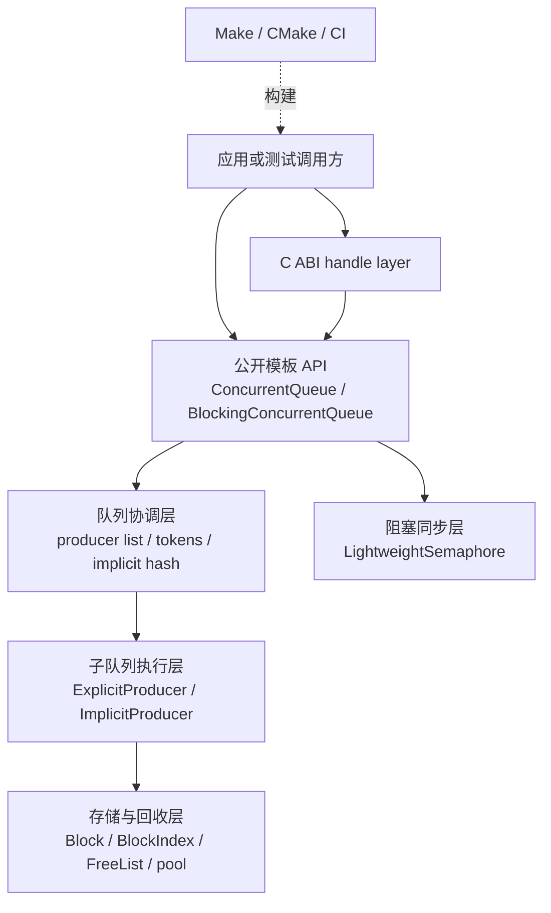
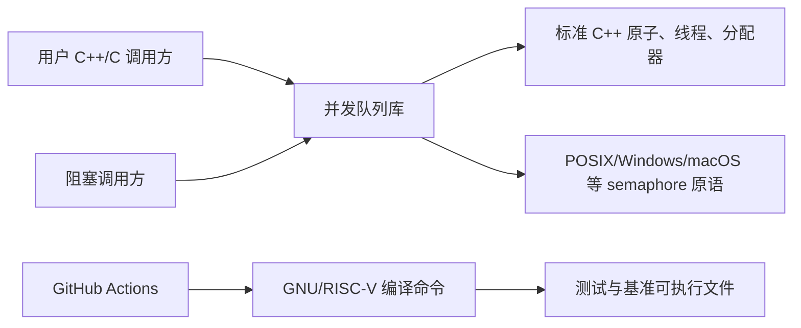

# 总体架构

- 文档目的：把公开 API、内部算法、同步、验证和交付边界串成一张总图。
- 适用范围：M01–M07，当前 Git HEAD。
- 对应源码版本：source/concurrency-queue HEAD 683b9e3（2026-09-15 只读确认）。
- 证据状态：主调用关系已确认；模块抽象层级是文档化推断。
- 最后更新：2026-09-10
- 前置阅读：[项目概览](project-overview.md)
- 后续阅读：[M01 实现](../01-modules/M01-core-queue/implementation.md)、[系统串联](../90-cross-module/system-wiring.md)
## 结论摘要

项目采用“header-only 算法层 + 可选阻塞/ABI 适配层 + 独立验证/基准 + 两套交付构建”的结构。运行时没有中心调度器：producer 直接写自己的子队列，consumer 遍历 producer 链表并用每个子队列的 head/tail 原子协议领取元素。

## 分层

节点对应：L1 `concurrentqueue.h:786-1420` 和 `blockingconcurrentqueue.h:23-548`；L2/L3/L4 `concurrentqueue.h:1421-3550`；L5 `lightweightsemaphore.h:280-437`；L6 `c_api/*`；B `build/makefile`、`CMakeLists.txt`、`.github/workflows/ci.yml`。

## 系统上下文

箭头表示调用或构建依赖。平台 semaphore 的具体实现由预处理分支选择，见 M03；服务、网络、数据库和 GPU 设备在本项目中不适用。

## 关键架构关系

1. `ConcurrentQueue` 自身拥有初始块池、free list、producer list 和 implicit hash。[../../../concurrentqueue.h:3678-3708](../../source/concurrency-queue/concurrentqueue.h#L3678-L3708)
2. `ProducerToken` 绑定 explicit producer；token 销毁仅将 producer 标记为 inactive，使其可以回收复用。[../../../concurrentqueue.h:671-733](../../source/concurrency-queue/concurrentqueue.h#L671-L733)
3. 普通 `enqueue` 通过当前线程 ID 查找 implicit producer；显式 token 路径直接进入 `ExplicitProducer`。[../../../concurrentqueue.h:1395-1418](../../source/concurrency-queue/concurrentqueue.h#L1395-L1418)、[../../../concurrentqueue.h:3712-3719](../../source/concurrency-queue/concurrentqueue.h#L3712-L3719)
4. `BlockingConcurrentQueue` 把 inner queue 作为第一个成员，并在成功入队后 signal；等待接口最终依赖 semaphore 的计数和平台等待。[../../../blockingconcurrentqueue.h:23-70](../../source/concurrency-queue/blockingconcurrentqueue.h#L23-L70)、[../../../blockingconcurrentqueue.h:117-203](../../source/concurrency-queue/blockingconcurrentqueue.h#L117-L203)

## 设计取舍

- 块和子队列降低元素级分配，但带来 block index、回收和生命周期复杂度。
- 弱内存序和 optimistic dequeue 换取吞吐，但调用方必须理解“近似为空”和可见性约束。
- header-only 方便集成和模板优化，但编译时间、ABI 稳定性和跨编译单元宏一致性由使用方承担。

## 相关文档

- [设计原则](design-principles.md)
- [全局数据流](global-data-flow.md)
- [依赖地图](dependency-map.md)

## 源码证据摘要

`ConcurrentQueue::try_dequeue` 的 producer 选择和回退路径见 [../../../concurrentqueue.h:1149-1185](../../source/concurrency-queue/concurrentqueue.h#L1149-L1185)；子队列 dispatch 见 [../../../concurrentqueue.h:1742-1761](../../source/concurrency-queue/concurrentqueue.h#L1742-L1761)。

## 未解决问题

无法仅靠静态源码给出所有平台 semaphore 的实际系统调用路径和性能边界；需要目标平台编译/调试。

## 下一步阅读建议

阅读 [M01 call-chains](../01-modules/M01-core-queue/call-chains.md) 追踪一条完整 enqueue/dequeue 路径。
