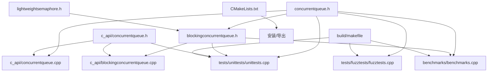

# 依赖地图

- 文档目的：记录真实文件依赖和维护边界。
- 证据状态：构建入口和主要 include 已确认；第三方库内部不展开。
- 最后更新：2026-09-10
- 前置阅读：[总体架构](architecture.md)
- 后续阅读：[模块注册表](../01-modules/module-registry.md)

## 维护边界

| 变更 | 直接影响 | 必须复核 |
|---|---|---|
| 原子协议/producer/block | M01 | M05 unit、Relacy/CDSChecker、目标架构 |
| 等待计数或 signal | M02/M03 | timed/bulk tests、平台分支 |
| C handle 签名 | M04 | C++ 实现、C API tests、ABI 文档 |
| Make/CMake/CI | M07 | native、RISC-V、安装导出 |
| benchmark adapter | M06 | benchmark 编译和结果解析 |

## 构建依赖

根 `CMakeLists.txt` 仅生成 `INTERFACE` target；legacy `build/makefile` 才定义测试和 benchmark 的编译链接。因而“CMake 配置成功”不等价于“测试可执行文件已生成”。详见 [build-and-deploy](build-and-deploy.md)。

## 未知

此图没有把 Boost、dlib、TBB、Relacy 和 CDSChecker 的内部调用展开，因为它们是仓库外部或 vendored 验证依赖；仅记录项目对其构建/运行入口的依赖。

## 下一步

修改公共头文件后，使用 [变更影响图](../90-cross-module/change-impact-map.md) 而不是只编译单个示例。
