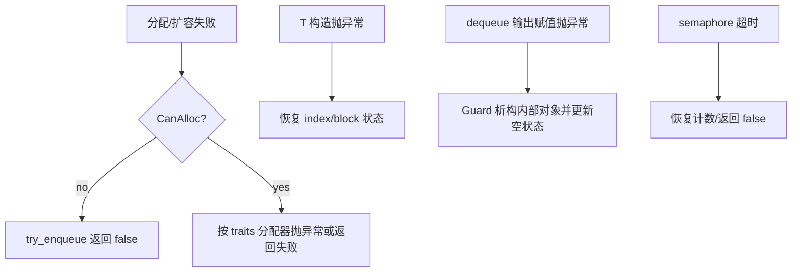

# 全局数据流

- 文档目的：以数据、控制、错误和资源四条线描述核心运行路径。
- 证据状态：主路径已确认；跨平台动态分支为未知。
- 最后更新：2026-09-10
- 前置阅读：[总体架构](architecture.md)
- 后续阅读：[M01 调用链](../01-modules/M01-core-queue/call-chains.md)

## 数据流

```mermaid
flowchart LR
  E[enqueue(item)] --> P[producer 子队列]
  P --> C[placement-new 到 block 槽位]
  C --> T[release tailIndex]
  T --> V[consumer acquire 看到元素]
  V --> H[领取 headIndex]
  H --> M[move assignment]
  M --> D[显式析构]
  D --> X[empty counter/flags]
  X --> F[free list 或 producer 持有]
```

`tailIndex` 的发布发生在元素构造后；消费者先通过 producer 的索引协议领取槽位，再读取元素。实现位置为 `concurrentqueue.h:1877-2081` 和 `2515-2648`。箭头代表数据可见性或所有权转移，不表示全局线性化顺序。

## 控制流

- 普通入队选择 implicit producer；token 入队绕过 thread-id hash，直接使用 explicit producer。[`concurrentqueue.h:1395-1418`](../../source/concurrency-queue/concurrentqueue.h#L1395-L1418)
- 普通出队扫描 producer 链表，以近似 size 选择候选并失败回退；该启发式不改变元素所属 producer。[`concurrentqueue.h:1149-1185`](../../source/concurrency-queue/concurrentqueue.h#L1149-L1185)
- blocking 出队先消费 semaphore permit，再尝试核心队列；permit 与元素数量由 blocking wrapper 的成功入队路径配对。[`blockingconcurrentqueue.h:117-203`](../../source/concurrency-queue/blockingconcurrentqueue.h#L117-L203)

## 错误流



错误不会自动转成统一错误码：核心模板以 `bool`、异常和对象类型语义表达；C ABI 另有整数成功/失败返回值。具体边界见 [global-error-model](global-error-model.md) 和 M04。

## 资源流

初始 block pool → producer 使用 → block 完全为空 → parent free list → 新 producer/block 再请求；producer list 和 hash table 的节点由 queue 持有，直到 queue 析构或 producer 被回收。queue 析构必须在所有访问者退出后执行。[`concurrentqueue.h:875-919`](../../source/concurrency-queue/concurrentqueue.h#L875-L919)、[`concurrentqueue.h:3068-3143`](../../source/concurrency-queue/concurrentqueue.h#L3068-L3143)

## 未解决问题

- 各平台 semaphore 具体系统调用及超时精度需要目标平台运行确认。
- 静态源码不能证明所有 interleaving 下的线性化性质；模型检查和压力测试承担这项验证。

## 下一步

对实现修改先沿 [change-impact-map](../90-cross-module/change-impact-map.md) 检查数据、错误和资源流是否仍闭合。
