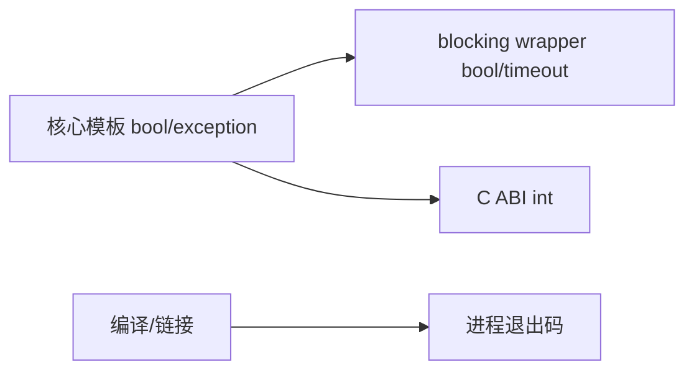

# 全局错误模型

- 文档目的：统一说明核心模板、阻塞包装、C ABI 和构建层的失败语义。
- 证据状态：静态 API 和异常路径已确认；空句柄与平台失败仍需运行验证。
- 最后更新：2026-09-10
- 前置阅读：[全局数据流](global-data-flow.md)
- 后续阅读：[M04 C API](../01-modules/M04-c-api/README.md)

## 错误类别

| 类别 | 来源 | 表现 | 调用方动作 |
|---|---|---|---|
| 容量不足 | `try_enqueue`/`CannotAlloc` | `false` | 重试、扩容策略或报告失败 |
| 内存/构造异常 | block/index/T 构造 | C++ exception | 保持对象生命周期，按异常协议处理 |
| 空队列 | `try_dequeue` | `false` | 轮询或使用 blocking API |
| 等待超时 | `wait_dequeue_timed` | `false` | 选择超时后的业务路径 |
| C ABI 失败 | create/enqueue/dequeue | 整数 0/1 | 检查返回码，不把值指针当所有权转移 |
| 构建失败 | Make/CMake/toolchain | 非零退出 | 保留完整编译/链接日志 |

## 异常安全

入队先在 block 槽位构造对象，成功后发布 tail；构造失败时回滚 block index 状态。出队将内部元素 move-assign 到调用方对象，并通过局部 Guard 确保即使赋值抛出，内部对象仍析构、槽位仍被标记为空。[`concurrentqueue.h:1877-2081`](../../../concurrentqueue.h#L1877-L2081)

## 阻塞边界

信号量 count 和平台 semaphore 必须在超时/唤醒失败路径保持一致；`LightweightSemaphore::waitWithPartialSpinning` 和 `waitManyWithPartialSpinning` 会在必要时恢复计数。阻塞 queue 的销毁不允许与等待者并发。[`lightweightsemaphore.h:290-360`](../../../lightweightsemaphore.h#L290-L360)、[../../../README.md:166-180](../../../README.md#L166-L180)

## C ABI 未决项

当前静态分析已确认 C ABI 使用 `void*` opaque handle 和 `void*` value，但以下行为必须由运行测试或 API 约定补充：空 handle、空 value 指针、`new` 失败时异常是否可穿过 C 边界、value 的释放责任、跨编译器 ABI 兼容性。

## 错误传播图

适配层不应静默吞掉核心异常或把 timeout 误报为成功。新增接口时必须明确每个失败分支的返回值、异常和资源状态。

## 下一步

先阅读 [M05 exception tests](../01-modules/M05-verification/test-matrix.md)，再修改错误路径。
