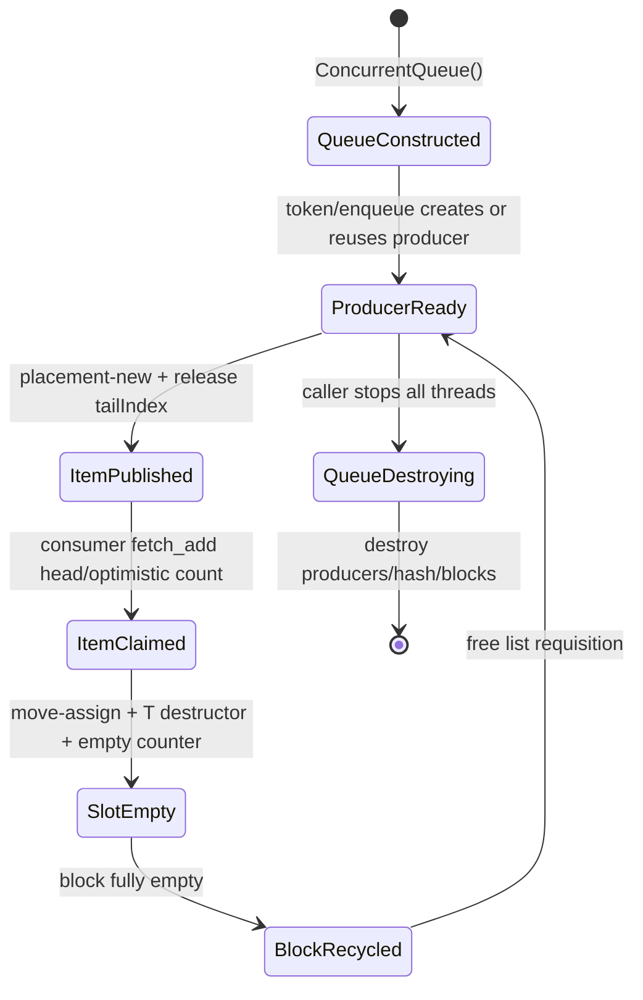

# 运行时模型与资源生命周期

- 文档目的：说明队列对象、producer、block、token、semaphore 的创建、使用和销毁。
- 适用范围：M01–M03；不适用于服务进程启动/部署。
- 证据状态：静态生命周期已确认；跨线程可见性由调用方负责。
- 最后更新：2026-09-10
- 前置阅读：[架构](architecture.md)
- 后续阅读：[M01 execution flows](../01-modules/M01-core-queue/execution-flows.md)

## 结论摘要

运行时从调用方构造 queue 开始，没有库级“start”阶段。构造函数准备 implicit hash 和初始 block pool；第一次显式 token 或隐式 enqueue 可能创建 producer；每次 enqueue 在 producer 的 block 中 placement-new 对象并 release 发布 tail；dequeue 通过 acquire 读取可见对象、移动赋值、显式析构并标记槽位为空；析构要求无并发访问，遍历 producer、hash、free list 和初始 pool 释放资源。

## 生命周期图

状态节点对应 `ConcurrentQueue` 构造/析构（`concurrentqueue.h:833-919`）、producer 入队/出队（`1877-2081`、`2515-2648`）和回收（`3068-3143`）。箭头是生命周期关系，不是线程事件。

## 创建与所有权

| 对象 | 创建者 | 所有者 | 释放者 | 关键约束 |
|---|---|---|---|---|
| queue | 调用方 | 调用方 | 调用方 | 析构不能与访问并发 |
| explicit producer | `ProducerToken` 构造 | queue producer list；token 关联 | queue 析构；token 仅标 inactive | token 非线程安全 |
| implicit producer | `get_or_add_implicit_producer` | queue producer list/hash | queue 析构或线程退出后的复用 | 依赖 thread id/TLS 分支 |
| Block | 初始 pool/free list/allocator | producer 或 free list | queue/traits allocator | block 归还前对象必须析构 |
| token | 调用方栈/堆 | 调用方 | 调用方 | move 后旧 token 无效或状态转移 |
| semaphore | blocking queue 构造 | blocking queue | blocking queue 析构 | 等待者必须先停止 |

## 启动、运行、停止

1. 先由单线程构造 queue 和 token；通过外部线程启动同步让工作线程看到构造结果。
2. 工作线程调用 enqueue/dequeue；库只负责内部原子同步，不负责业务 shutdown 协议。
3. 阻塞调用方必须有明确的终止条件，避免永远 wait；README 的 blocking caveat 说明销毁等待队列是未定义行为。[../../../README.md:166-180](../../source/concurrency-queue/README.md#L166-L180)
4. 所有 producer/consumer join 后再销毁 queue；析构遍历剩余元素并回收块。

## 相关文档

- [全局数据流](global-data-flow.md)
- [全局错误模型](global-error-model.md)
- [M01 数据生命周期](../01-modules/M01-core-queue/data-structures.md)

## 源码证据摘要

[../../../concurrentqueue.h:875-919](../../source/concurrency-queue/concurrentqueue.h#L875-L919) 明确析构非线程安全并释放 producer/hash/free list/initial pool；[../../../concurrentqueue.h:715-721](../../source/concurrency-queue/concurrentqueue.h#L715-L721) 说明 token 析构对 producer 的 inactive 标记。

## 未解决问题

线程退出通知在不同编译器上的具体 TLS 行为需要按宏分支和目标平台运行验证。

## 下一步阅读建议

进入 [M01 execution-flows](../01-modules/M01-core-queue/execution-flows.md)。
