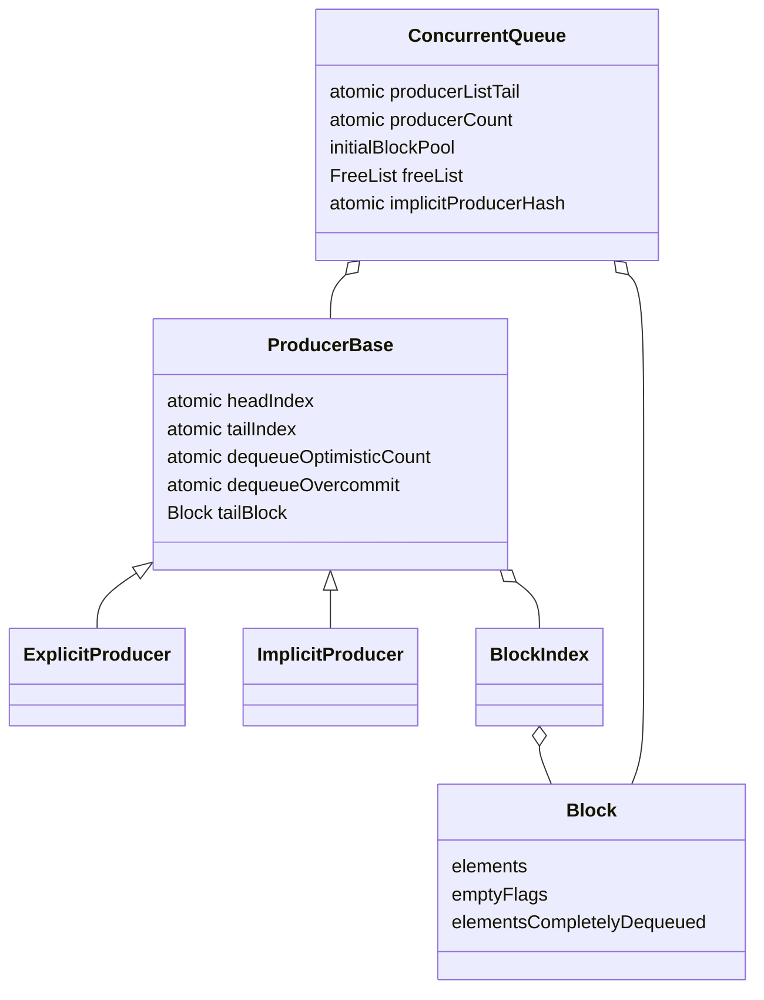

# M01 数据结构与所有权

- 文档目的：把核心字段映射到算法职责。
- 适用范围：本页及其直接关联的源码、测试和配置；第三方、生成物与动态结果仅在有证据时纳入。
- 对应源码版本：source/concurrency-queue HEAD 683b9e3（2026-09-15 只读确认）。
- 证据状态：字段和主要用途已确认。
- 最后更新：2026-09-10
- 前置阅读：[M01 README](README.md)
- 后续阅读：[实现](implementation.md)
## 结论摘要

本页聚焦 01-modules/M01-core-queue/data-structures.md；具体事实以正文引用的目标源码版本为准，未执行的构建、运行和硬件行为保持未验证。

## 结构图

## 所有权表

| 资源 | 正常持有者 | 转移条件 | 释放条件 |
|---|---|---|---|
| producer 节点 | queue producer list | inactive producer 被重新激活 | queue 析构 |
| explicit token 关联 | token + producer | token move/析构 | token 析构只标 inactive |
| implicit hash entry | queue hash | thread-id 查找/扩容 | queue 析构/旧表链清理 |
| block | producer 或初始池/free list | requisition/recycle | allocator destroy |
| T 对象 | block 槽位 | placement-new 后发布 | dequeue 或 producer 析构 |

## 状态表

| 状态 | 进入 | 退出 | 必须保持 |
|---|---|---|---|
| 未发布槽位 | placement-new 尚未 release tail | tail 发布 | consumer 不可读取 |
| 已发布 | tail 可见 | head 领取 | T 存活 |
| 已领取 | head/optimistic 协议成功 | move + destructor | 不再被第二消费者处理 |
| 空槽位 | destructor + empty 标记 | block 回收/重用 | 不存在活对象 |
| 可回收 block | 所有槽位为空 | free list 或 producer 重用 | index entry 生命周期正确 |

## 线程上下文

| 操作 | 典型线程 | 共享状态 |
|---|---|---|
| explicit enqueue | 绑定 producer 的 producer 线程 | tail、block index（producer 侧） |
| implicit enqueue | 拥有 thread-id entry 的线程 | hash、producer list 建立阶段 |
| dequeue | 任意 consumer | head、optimistic counters、empty flags |
| queue 析构 | 停止所有 worker 后的 owner | 全部资源 |

## 相关文档
- [项目入口](../../README.md)
- [分析状态](../../00-overview/analysis-state.md)
- [源码证据索引](../../00-overview/evidence-index.md)

## 源码证据摘要
本页结论所需的源码路径和行号以 [源码证据索引](../../00-overview/evidence-index.md) 及正文引用为准；本页不把未执行的构建、运行或硬件行为写成已验证事实。

## 未解决问题

源码说明了数据结构，但不提供独立的形式化不变量证明；修改 atomic memory order 必须配合模型检查和压力测试。

## 下一步阅读建议
先阅读 [分析状态](../../00-overview/analysis-state.md)，再沿本页已有链接进入对应模块、Demo 或跨模块流程。
