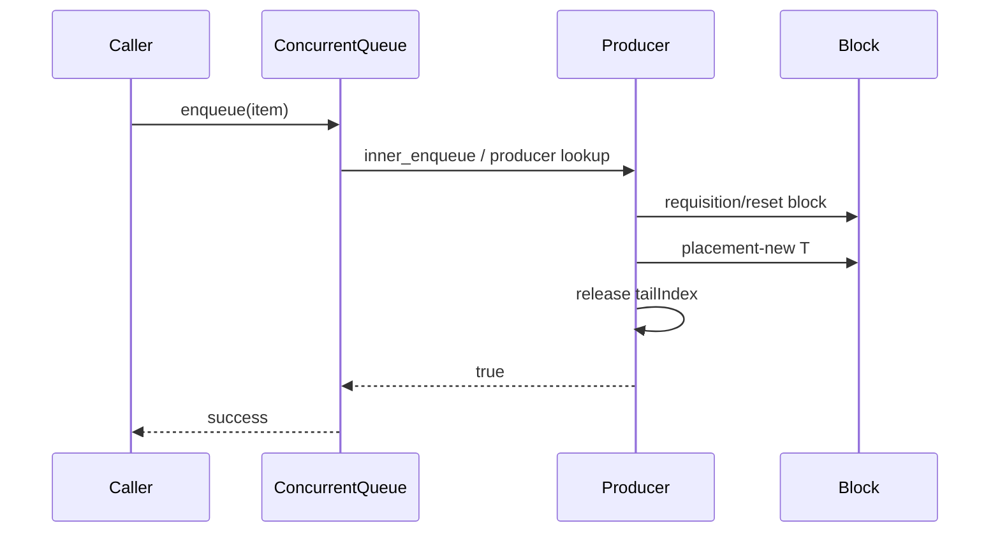
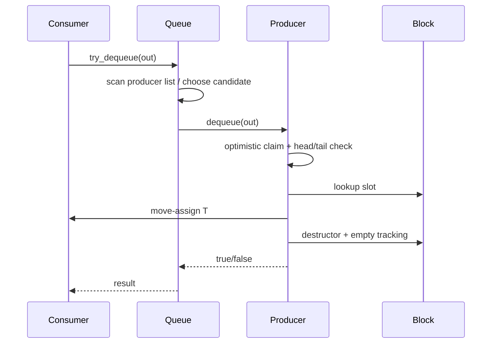

# M01 执行流程

- 文档目的：用时序图表达 enqueue、dequeue、回收和析构。
- 证据状态：静态调用关系已确认。
- 最后更新：2026-09-10
- 前置阅读：[实现](implementation.md)
- 后续阅读：[调用链](call-chains.md)

## 入队时序

`tailIndex` 发布必须在 placement-new 之后；这是消费者获得对象可见性的关键边界。

## 出队时序

## 回收时序

block 只有在其槽位全部为空后才可从 producer 的 index 中移除并归还 parent free list。producer 重新请求时优先尝试初始 pool，再尝试 free list，最后按 `CanAlloc` 创建。

## shutdown

库没有 start/stop API。应用必须停止生产消费线程、解除等待并 join，然后才允许析构 queue；阻塞等待者仍存在时析构是未定义边界。[../../../../README.md:122-180](../../../source/concurrency-queue/README.md#L122-L180)
