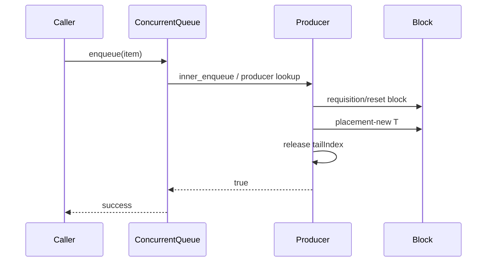
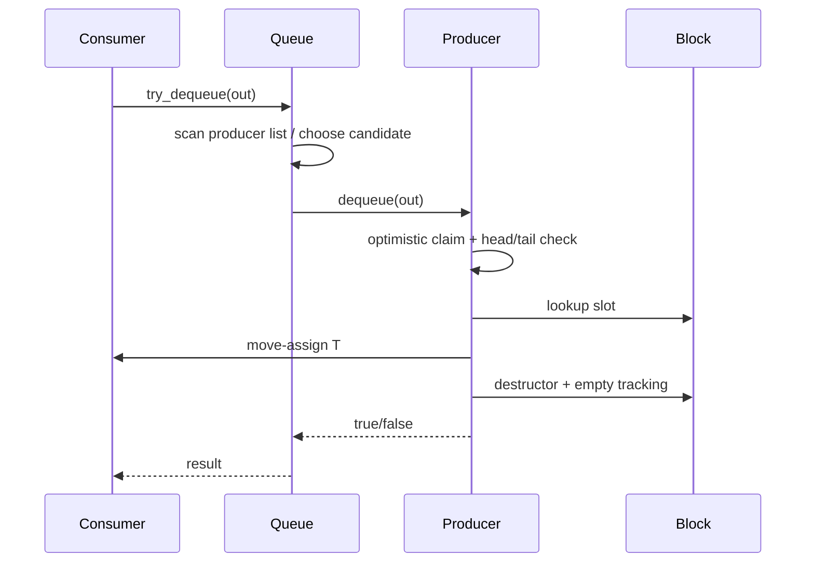

# M01 执行流程

- 文档目的：用时序图表达 enqueue、dequeue、回收和析构。
- 适用范围：本页及其直接关联的源码、测试和配置；第三方、生成物与动态结果仅在有证据时纳入。
- 对应源码版本：source/concurrency-queue HEAD 683b9e3（2026-09-15 只读确认）。
- 证据状态：静态调用关系已确认。
- 最后更新：2026-09-10
- 前置阅读：[实现](implementation.md)
- 后续阅读：[调用链](call-chains.md)
## 结论摘要

本页聚焦 01-modules/M01-core-queue/execution-flows.md；具体事实以正文引用的目标源码版本为准，未执行的构建、运行和硬件行为保持未验证。

## 入队时序

`tailIndex` 发布必须在 placement-new 之后；这是消费者获得对象可见性的关键边界。

## 出队时序

## 回收时序

block 只有在其槽位全部为空后才可从 producer 的 index 中移除并归还 parent free list。producer 重新请求时优先尝试初始 pool，再尝试 free list，最后按 `CanAlloc` 创建。

## shutdown

库没有 start/stop API。应用必须停止生产消费线程、解除等待并 join，然后才允许析构 queue；阻塞等待者仍存在时析构是未定义边界。[../../../../README.md:122-180](../../../source/concurrency-queue/README.md#L122-L180)

## 相关文档
- [项目入口](../../README.md)
- [分析状态](../../00-overview/analysis-state.md)
- [源码证据索引](../../00-overview/evidence-index.md)

## 源码证据摘要
本页结论所需的源码路径和行号以 [源码证据索引](../../00-overview/evidence-index.md) 及正文引用为准；本页不把未执行的构建、运行或硬件行为写成已验证事实。

## 未解决问题
目标环境、动态构建/运行、硬件和外部依赖行为未在本轮执行；缺少直接证据的结论仍标记为未知或未验证。

## 下一步阅读建议
先阅读 [分析状态](../../00-overview/analysis-state.md)，再沿本页已有链接进入对应模块、Demo 或跨模块流程。
