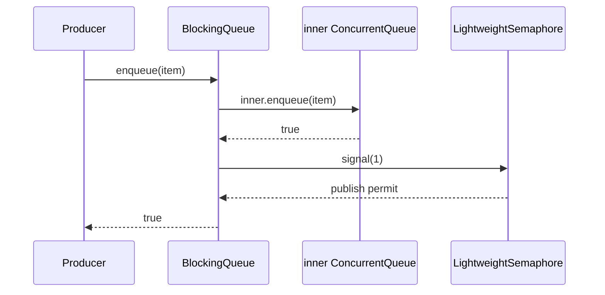
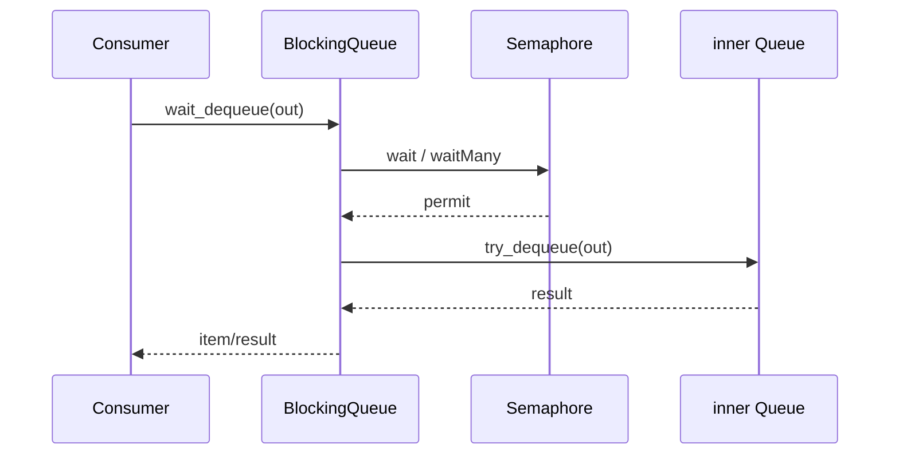

# M02 执行流程

- 文档目的：追踪阻塞 wrapper 到 semaphore 和核心 queue 的真实调用。
- 适用范围：本页及其直接关联的源码、测试和配置；第三方、生成物与动态结果仅在有证据时纳入。
- 对应源码版本：source/concurrency-queue HEAD 683b9e3（2026-09-15 只读确认）。
- 证据状态：静态调用链已确认。
- 最后更新：2026-09-10
- 前置阅读：[M02 README](README.md)
- 后续阅读：[M03 信号量](../M03-semaphore-and-platform/README.md)
## 结论摘要

本页聚焦 01-modules/M02-blocking-queue/execution-flows.md；具体事实以正文引用的目标源码版本为准，未执行的构建、运行和硬件行为保持未验证。

## 入队与 signal

bulk enqueue 仅在核心 bulk 成功后按 count signal；包装层不应先 signal 再入队。

## wait dequeue

timeout 路径在 semaphore 层返回失败；bulk wait 返回实际取得并成功 dequeue 的数量，具体细节必须结合当前源码版本复核。

## 生命周期

构造时先构造 `inner`，再创建 semaphore；销毁时两者由 wrapper 管理，但调用方负责确保无等待线程。这个 shutdown 协议不是 wrapper 自动提供的。

## 相关文档
- [项目入口](../../README.md)
- [分析状态](../../00-overview/analysis-state.md)
- [源码证据索引](../../00-overview/evidence-index.md)

## 源码证据摘要
本页结论所需的源码路径和行号以 [源码证据索引](../../00-overview/evidence-index.md) 及正文引用为准；本页不把未执行的构建、运行或硬件行为写成已验证事实。

## 未解决问题
目标环境、动态构建/运行、硬件和外部依赖行为未在本轮执行；缺少直接证据的结论仍标记为未知或未验证。

## 下一步阅读建议
先阅读 [分析状态](../../00-overview/analysis-state.md)，再沿本页已有链接进入对应模块、Demo 或跨模块流程。
