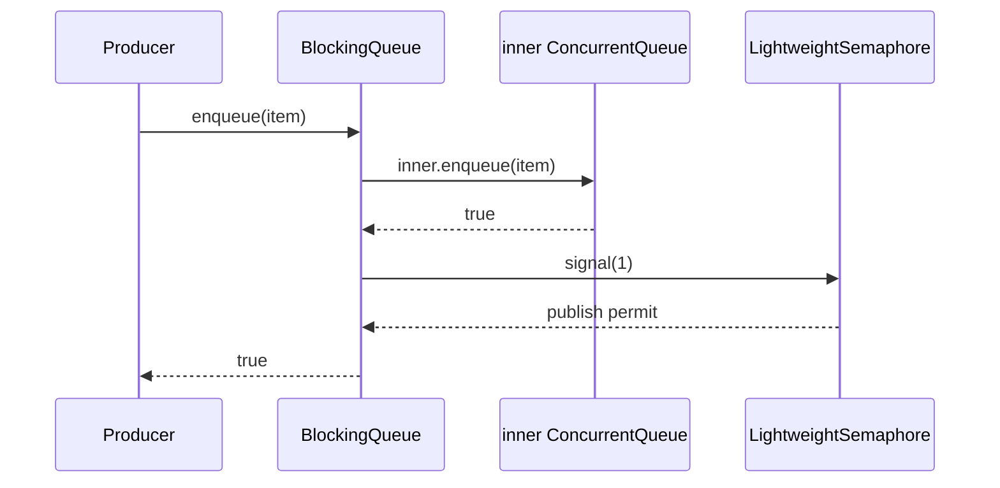
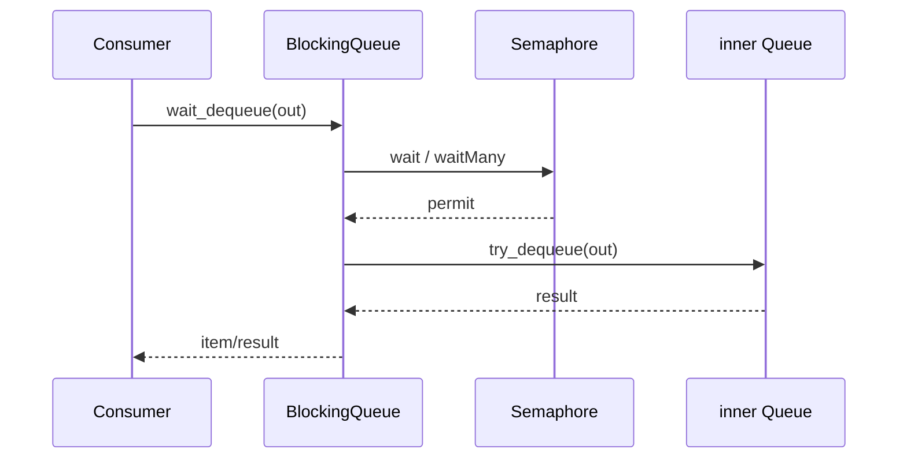

# M02 执行流程

- 文档目的：追踪阻塞 wrapper 到 semaphore 和核心 queue 的真实调用。
- 证据状态：静态调用链已确认。
- 最后更新：2026-09-10
- 前置阅读：[M02 README](README.md)
- 后续阅读：[M03 信号量](../M03-semaphore-and-platform/README.md)

## 入队与 signal

bulk enqueue 仅在核心 bulk 成功后按 count signal；包装层不应先 signal 再入队。

## wait dequeue

timeout 路径在 semaphore 层返回失败；bulk wait 返回实际取得并成功 dequeue 的数量，具体细节必须结合当前源码版本复核。

## 生命周期

构造时先构造 `inner`，再创建 semaphore；销毁时两者由 wrapper 管理，但调用方负责确保无等待线程。这个 shutdown 协议不是 wrapper 自动提供的。
