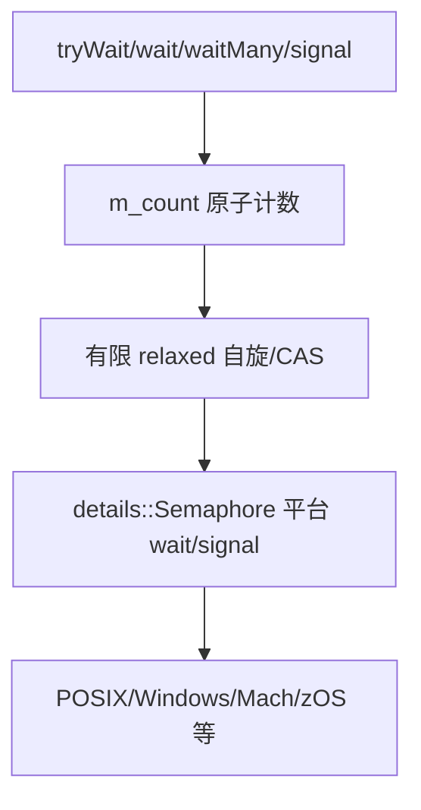

# M03 信号量与平台适配

- 文档目的：解释 `LightweightSemaphore` 的计数、自旋、超时和平台等待分层。
- 适用范围：本页及其直接关联的源码、测试和配置；第三方、生成物与动态结果仅在有证据时纳入。
- 对应源码版本：source/concurrency-queue HEAD 683b9e3（2026-09-15 只读确认）。
- 证据状态：静态主路径已确认；具体系统调用路径依赖宏和目标平台。
- 最后更新：2026-09-10
- 前置阅读：[模块注册表](../module-registry.md)
- 后续阅读：[行级审计](line-level-analysis.md)
## 结论摘要

本页聚焦 01-modules/M03-semaphore-and-platform/README.md；具体事实以正文引用的目标源码版本为准，未执行的构建、运行和硬件行为保持未验证。

## 分层

`LightweightSemaphore::waitWithPartialSpinning`（约 `290-323`）先尝试从 count 获取许可，失败后把 count 减到等待状态，再进入平台 semaphore。`waitManyWithPartialSpinning`（`326-360`）在至少取得一个许可后继续尽量批量取得。`signal`（`421-430`）release 增加 count，并唤醒相应数量的底层等待者。

## 状态表

| 状态 | count 含义 | 后续 |
|---|---|---|
| 正值 | 可直接取得的许可 | relaxed/CAS 快路径 |
| 非正 | 存在或可能存在等待者 | fetch_sub 后平台等待 |
| timeout | 未取得许可 | 恢复必要计数并返回 false |
| signal | 新增许可 | release count，按需唤醒 |

## 审计卡片

| 维度 | 结论 |
|---|---|
| 所有权 | blocking queue 持有 semaphore |
| 共享状态 | `m_count`、平台 semaphore |
| 异常/失败 | timeout、平台 wait 失败、构造资源失败 |
| 平台 | POSIX、Windows、Mach、z/OS 分支存在；具体选项依宏 |
| 未知 | 公平性、精确时钟和系统调用成本 |

## 文档元数据（规范补充）

- 文档目的：说明 `01-modules/M03-semaphore-and-platform/README.md` 的源码分析范围、结论和维护入口。
- 适用范围：当前项目对应模块/入口的静态源码与测试分析。
- 对应源码版本：以本项目 `00-overview/analysis-state.md` 或同页版本字段为准。
- 证据状态：静态源码证据；未执行的构建、测试、GPU、网络或多进程行为保持“未验证”。
- 最后更新：2026-09-15
- 前置阅读：本项目根 README 与 `00-overview/analysis-state.md`。
- 后续阅读：本模块/示例的实现、测试和风险页面。

## 深度审计

| 分析对象 | 入口落地 | 正常路径 | 分支 | 异常 | 清理 | 数据生命周期 | 执行上下文 | 行级证据 | Demo 映射 | 状态/缺口 |
|---|---|---|---|---|---|---|---|---|---|---|
| concurrency-queue/01-modules/M03-semaphore-and-platform/README.md | 已定位 | 已追踪代表路径 | 部分完成 | 部分完成 | 部分完成 | 部分完成 | 已标注 | 已引用或待补 | 已映射或无专用 Demo | 部分完成：动态构建、运行和硬件边界仍未验证 |

## 相关文档
- [项目入口](../../README.md)
- [分析状态](../../00-overview/analysis-state.md)
- [源码证据索引](../../00-overview/evidence-index.md)

## 源码证据摘要
本页结论所需的源码路径和行号以 [源码证据索引](../../00-overview/evidence-index.md) 及正文引用为准；本页不把未执行的构建、运行或硬件行为写成已验证事实。

## 未解决问题
目标环境、动态构建/运行、硬件和外部依赖行为未在本轮执行；缺少直接证据的结论仍标记为未知或未验证。

## 下一步阅读建议
先阅读 [分析状态](../../00-overview/analysis-state.md)，再沿本页已有链接进入对应模块、Demo 或跨模块流程。
