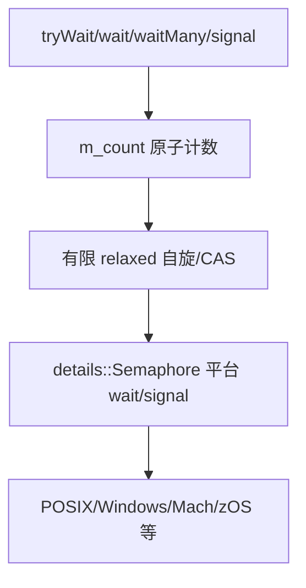

# M03 信号量与平台适配

- 文档目的：解释 `LightweightSemaphore` 的计数、自旋、超时和平台等待分层。
- 证据状态：静态主路径已确认；具体系统调用路径依赖宏和目标平台。
- 最后更新：2026-09-10
- 前置阅读：[模块注册表](../module-registry.md)
- 后续阅读：[行级审计](line-level-analysis.md)

## 分层

`LightweightSemaphore::waitWithPartialSpinning`（约 `290-323`）先尝试从 count 获取许可，失败后把 count 减到等待状态，再进入平台 semaphore。`waitManyWithPartialSpinning`（`326-360`）在至少取得一个许可后继续尽量批量取得。`signal`（`421-430`）release 增加 count，并唤醒相应数量的底层等待者。

## 状态表

| 状态 | count 含义 | 后续 |
|---|---|---|
| 正值 | 可直接取得的许可 | relaxed/CAS 快路径 |
| 非正 | 存在或可能存在等待者 | fetch_sub 后平台等待 |
| timeout | 未取得许可 | 恢复必要计数并返回 false |
| signal | 新增许可 | release count，按需唤醒 |

## 审计卡片

| 维度 | 结论 |
|---|---|
| 所有权 | blocking queue 持有 semaphore |
| 共享状态 | `m_count`、平台 semaphore |
| 异常/失败 | timeout、平台 wait 失败、构造资源失败 |
| 平台 | POSIX、Windows、Mach、z/OS 分支存在；具体选项依宏 |
| 未知 | 公平性、精确时钟和系统调用成本 |
