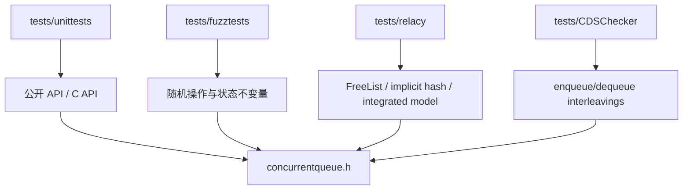

# M05 验证模块

- 文档目的：说明单元、fuzz、线程压力和模型检查如何覆盖核心协议。
- 适用范围：本页及其直接关联的源码、测试和配置；第三方、生成物与动态结果仅在有证据时纳入。
- 对应源码版本：source/concurrency-queue HEAD 683b9e3（2026-09-15 只读确认）。
- 证据状态：目录、构建入口和测试注册机制已确认；本次未执行。
- 最后更新：2026-09-10
- 前置阅读：[模块注册表](../module-registry.md)
- 后续阅读：[测试矩阵](test-matrix.md)
## 结论摘要

本页聚焦 01-modules/M05-verification/README.md；具体事实以正文引用的目标源码版本为准，未执行的构建、运行和硬件行为保持未验证。

## 验证层次

## Unit test

`tests/unittests/unittests.cpp` 使用自定义 `minitest`，注册单项、bulk、threaded、异常、C API 和内部 free-list/hash 测试。主程序支持 `--help`、`--disable-prompt`、`--run TEST`、`--iterations N`。tracking allocator 和 `postTest` 检查测试后资源是否归零。

## 其他层

fuzz tests 探索更广操作序列；Relacy 和 CDSChecker 针对并发状态空间，但各自依赖外部/专用构建环境。它们是验证 harness，不是运行时组件。

## 验证状态

本知识库没有运行测试，因此只记录命令来源，不声称通过。

## 子页

- [test-matrix](test-matrix.md)
- [failure-triage](failure-triage.md)

## 文档元数据（规范补充）

- 文档目的：说明 `01-modules/M05-verification/README.md` 的源码分析范围、结论和维护入口。
- 适用范围：当前项目对应模块/入口的静态源码与测试分析。
- 对应源码版本：以本项目 `00-overview/analysis-state.md` 或同页版本字段为准。
- 证据状态：静态源码证据；未执行的构建、测试、GPU、网络或多进程行为保持“未验证”。
- 最后更新：2026-09-15
- 前置阅读：本项目根 README 与 `00-overview/analysis-state.md`。
- 后续阅读：本模块/示例的实现、测试和风险页面。

## 深度审计

| 分析对象 | 入口落地 | 正常路径 | 分支 | 异常 | 清理 | 数据生命周期 | 执行上下文 | 行级证据 | Demo 映射 | 状态/缺口 |
|---|---|---|---|---|---|---|---|---|---|---|
| `01-modules/M05-verification/README.md` | 已完成 | 部分完成 | 部分完成 | 部分完成 | 部分完成 | 部分完成 | 部分完成 | 部分完成 | 已映射或不适用 | 部分完成：动态行为、边界或专用变体仍需验证 |

## 相关文档
- [项目入口](../../README.md)
- [分析状态](../../00-overview/analysis-state.md)
- [源码证据索引](../../00-overview/evidence-index.md)

## 源码证据摘要
本页结论所需的源码路径和行号以 [源码证据索引](../../00-overview/evidence-index.md) 及正文引用为准；本页不把未执行的构建、运行或硬件行为写成已验证事实。

## 未解决问题
目标环境、动态构建/运行、硬件和外部依赖行为未在本轮执行；缺少直接证据的结论仍标记为未知或未验证。

## 下一步阅读建议
先阅读 [分析状态](../../00-overview/analysis-state.md)，再沿本页已有链接进入对应模块、Demo 或跨模块流程。
